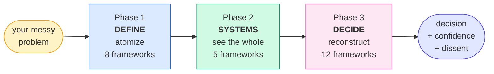
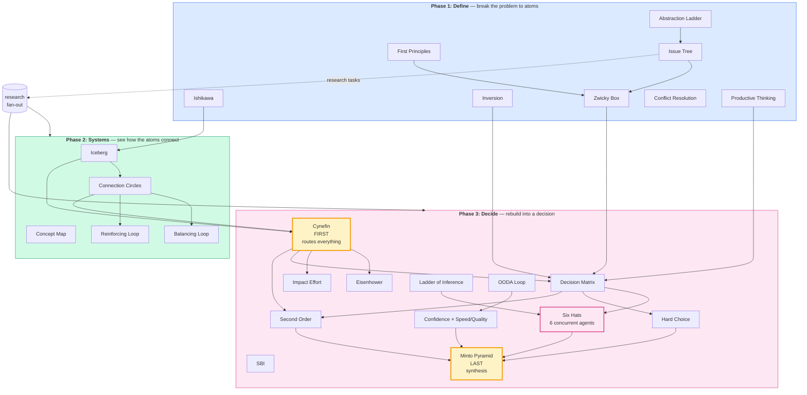
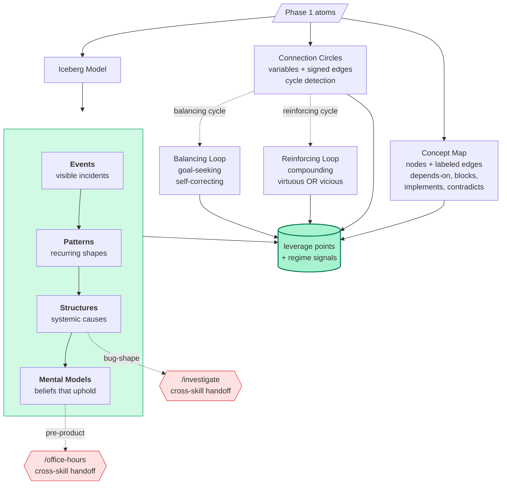
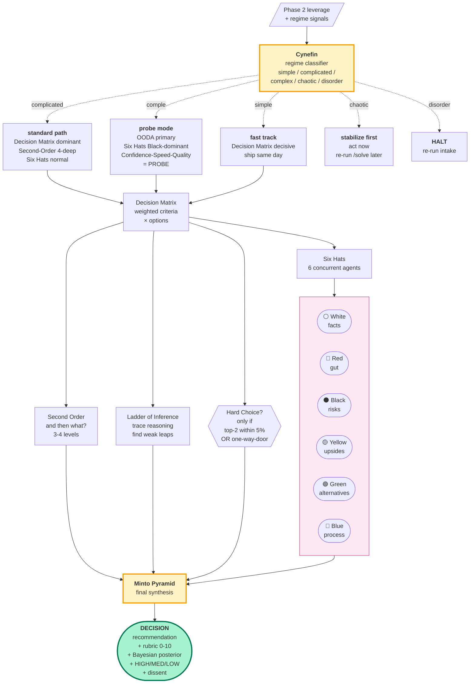
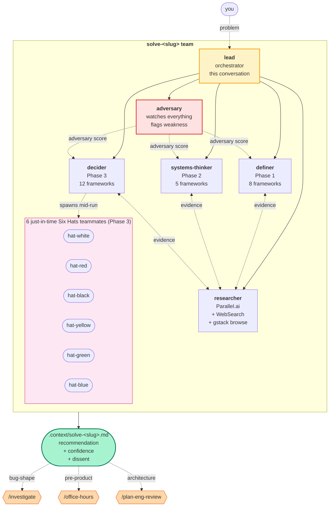
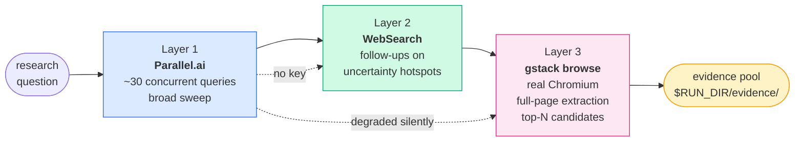

# `solve`

> Take any problem. Atomize it down to first principles. See the system around it. Rebuild it as a decision you can defend, with explicit confidence math and a built-in adversary.

[](https://github.com/bajpainaman/solve)
[](frameworks/)
[](https://code.claude.com/docs/en/agent-teams)
[]()

```bash
bash <(curl -fsSL https://raw.githubusercontent.com/bajpainaman/solve/main/install)
```

After install, type `solve "your problem"` in any terminal. Claude Code spins up a 5-agent team that runs 25 thinking frameworks across 3 phases and produces a decision you can ship.

---

## The idea

Most decisions fail because we skip the deconstruction. We jump from "we have a problem" to "let's pick an option" without ever atomizing what the problem actually is. `solve` forces the deconstruction, then the systems view, then the rebuild.



Three phases. 25 frameworks. One agent team. One decision document.

---

## Why this works

A bad decision usually comes from one of three failures:

1. **Wrong problem** — you solved the symptom, not the cause. `solve` Phase 1 atomizes ruthlessly via Issue Tree, First Principles, Ishikawa, Inversion, Abstraction Ladder, Zwicky, Conflict Resolution, and Productive Thinking. Each framework attacks the framing from a different angle.

2. **Right problem, wrong system view** — you missed how the parts interact. `solve` Phase 2 maps the system via Iceberg, Connection Circles, Concept Map, plus Balancing and Reinforcing feedback loops. You see the whole before you cut anything.

3. **Right system, wrong execution mode** — you picked an option but committed under the wrong confidence regime. `solve` Phase 3 routes via Cynefin, scores via Decision Matrix, stress-tests via Six Hats (6 concurrent roleplays), looks 4 levels deep via Second-Order, and synthesizes via Minto. Confidence is rubric + Bayesian + bucket, not vibes.

A continuous adversary watches every framework's output and flags weakness in real time. The dissent section in your final report is what they couldn't break.

---

## How the 25 frameworks fit together



Cynefin and Minto are the load-bearing frameworks. Cynefin routes the rest of Phase 3 based on regime (simple / complicated / complex / chaotic / disorder). Minto consumes everything and produces the pyramid synthesis at the end.

Each framework lives at [`frameworks/<name>.md`](frameworks/) with ~800 lines covering: entry predicate (formal logic), operating principles, response posture, anti-sycophancy rules, pushback patterns with BAD/GOOD examples, method, output schema, decision hook, cross-framework triggers, failure modes, jargon glossary, completeness scoring, and a worked example on a canonical problem.

---

## Phase 1 zoomed: deconstruct to atoms

```mermaid
flowchart TD
    Problem(["your problem<br/>vague + emotional"])

    Problem --> AL[Abstraction Ladder<br/><i>climb up: why?</i><br/><i>climb down: what specifically?</i>]
    Problem --> FP[First Principles<br/><i>strip every assumption</i><br/><i>find atomic truths</i>]
    Problem --> IT[Issue Tree<br/><i>MECE decomposition</i><br/><i>3-4 levels deep</i>]
    Problem --> ISH[Ishikawa<br/><i>6 cause categories</i><br/><i>fishbone diagram</i>]
    Problem --> INV[Inversion<br/><i>how could this fail?</i><br/><i>derive constraints</i>]
    Problem --> PT[Productive Thinking<br/><i>6-step Hurson model</i><br/><i>question → answers → forge</i>]

    AL --> Atom([("atomic truths<br/>about the problem")])
    FP --> Atom
    IT --> Atom
    ISH --> Atom
    INV --> Atom
    PT --> Atom

    Atom --> ZW[Zwicky Box<br/><i>combinatorial matrix</i><br/><i>generate archetypes</i>]
    Atom --> CRD[Conflict Resolution<br/><i>only if stakeholders disagree</i><br/><i>find evaporating assumption</i>]

    ZW --> Archetypes([("named solution<br/>archetypes")])
    CRD --> Archetypes

    style Problem fill:#fef3c7,stroke:#f59e0b
    style Atom fill:#fed7aa,stroke:#ea580c,stroke-width:2px
    style Archetypes fill:#bfdbfe,stroke:#1d4ed8,stroke-width:2px
```

By the end of Phase 1, the problem has been attacked from 8 angles. You have a list of atomic truths, a tree of sub-questions (some confirmed, some flagged for research), candidate failure paths converted to constraints, and a set of named solution archetypes ready to score in Phase 3.

---

## Phase 2 zoomed: systems



Phase 2 finds where in the system to act. High-leverage points are at the structures and mental-models layers, not the events layer. Reinforcing cycles compound (good or bad). Balancing cycles resist change. If iceberg surfaces a bug-shape mid-phase, `solve` auto-handoffs to `/investigate` without asking. If it surfaces a pre-product gap, it auto-handoffs to `/office-hours`.

---

## Phase 3 zoomed: rebuild with confidence



Cynefin runs first because it routes everything. Minto runs last because it synthesizes everything. Six Hats fans out to 6 concurrent teammates so each perspective is genuinely independent (the Black Hat can't be diluted by the Yellow Hat sharing a context window).

---

## Confidence math

Three views, computed from framework outputs:

```
RUBRIC (0-10, additive)
  +2  if Cynefin = simple OR complicated
  +2  if Decision Matrix top option ≥ 1.5× second
  +2  if Six Hats agreement ≥ 4 of 6 hats
  +2  if adversary max score ≤ 4 (hard to break)
  +2  if Second-Order shows no catastrophic downside
  ────
  cap at 10

BAYESIAN POSTERIOR
  P(decision correct | evidence)
  prior from research base rates
  likelihood from framework agreement

BUCKET
  HIGH    = rubric ≥ 8 AND posterior ≥ 0.75
  MEDIUM  = rubric 5-7 OR posterior 0.55-0.75
  LOW     = otherwise
```

The bucket determines execution mode (Confidence × Reversibility):

| | Reversible | One-way-door |
|---|---|---|
| **HIGH** | SPEED — ship MVP, iterate | QUALITY — careful build, then ship |
| **LOW** | PROBE — smallest experiment | DEFER — gather evidence first |

If you land in DEFER, the recommendation is "do not decide yet" with a list of what to learn first.

---

## The agent team

`solve` is the first user of Claude Code's [agent teams](https://code.claude.com/docs/en/agent-teams) feature for adversarial reasoning. Subagents only report back to the lead, but agent teams share a task list and message peers directly, so the adversary can challenge the definer in real time and Six Hats can disagree with each other.



Each teammate runs in its own context window, claims tasks from the shared task list (`~/.claude/tasks/solve-<slug>/`), and writes its outputs to `.context/solve/<slug>/frameworks/<name>.md`. The lead computes confidence math, renders the report, and tears down the team.

The continuous adversary is the secret sauce. It reads every framework file as it's written and appends adversarial findings to `adversary.jsonl`. Frameworks scoring ≥ 7 (easily breakable) get sent back to their owner for revision before Minto consumes them.

---

## Worked example: should we migrate to OFTv2?

Real run on the canonical example. Same problem walks through all 25 frameworks. Each framework's `worked example` section in [`frameworks/`](frameworks/) shows what THAT framework specifically produces.

```mermaid
flowchart TB
    Q([Should we migrate our<br/>$12M LayerZero OFTv1<br/>deployment to OFTv2?])

    Q --> Intake[Pre-flight intake:<br/>stakeholders=small-team<br/>time=this-month<br/>reversibility=costly]

    Intake --> P1[<b>Phase 1: Define</b>]
    P1 --> P1Out[atomic truths:<br/>bridges must transfer value,<br/>users must not lose funds,<br/>gas must be predictable<br/><br/>4 archetypes:<br/>big-bang, dual-deploy+drain,<br/>wrapped legacy,<br/>separate token]

    P1Out --> P2[<b>Phase 2: Systems</b>]
    P2 --> P2Out[iceberg.structures:<br/>cross-chain mempool dynamics<br/><br/>connection-circles:<br/>1 reinforcing cycle<br/>volume → fees → liquidity<br/>1 balancing cycle<br/>gas → eagerness → trades]

    P2Out --> P3[<b>Phase 3: Decide</b>]
    P3 --> Cy[Cynefin: <b>complicated</b><br/>sum 9, runner-up complex 7]
    Cy --> Route[routing:<br/>Decision Matrix dominant,<br/>weight reversibility ≥ 7,<br/>OODA secondary,<br/>Six Hats normal]
    Route --> Result[Decision Matrix winner:<br/><b>dual-deploy + drain</b><br/>score 8.2 vs 6.7<br/><br/>Six Hats: 5 of 6 agree<br/>Adversary score: 6/10]
    Result --> Conf[Confidence:<br/>rubric 9/10<br/>posterior 0.82<br/>bucket <b>HIGH</b><br/>mode QUALITY]

    Conf --> Final([<b>Recommendation</b><br/>Migrate via dual-deploy + drain<br/>over 6 weeks<br/>with external audit consult<br/><br/><b>Dissent</b><br/>auditor not yet engaged<br/>mempool dynamics during gas spike<br/>"newer is better" assumption])

    style Q fill:#fef3c7,stroke:#f59e0b
    style P1 fill:#dbeafe,stroke:#2563eb
    style P2 fill:#d1fae5,stroke:#059669
    style P3 fill:#fce7f3,stroke:#db2777
    style Cy fill:#fef3c7,stroke:#f59e0b,stroke-width:2px
    style Final fill:#a7f3d0,stroke:#047857,stroke-width:3px
```

The full chain in `.context/solve-should-we-migrate-to-oftv2.md` is ~30 pages of evidence, mermaid diagrams, scored matrices, dissent attacks, and Minto pyramid synthesis. You can stop reading at any level and have a coherent answer.

---

## Install

One line:

```bash
bash <(curl -fsSL https://raw.githubusercontent.com/bajpainaman/solve/main/install)
```

Or clone:

```bash
git clone https://github.com/bajpainaman/solve.git
cd solve && ./install
```

The installer:

1. Verifies `claude --version` ≥ 2.1.32 (agent-teams floor)
2. Symlinks the skill to `~/.claude/skills/solve` so it loads in every project
3. Drops a `solve` CLI shim at `~/.local/bin/solve` and ensures `~/.local/bin` is on PATH (edits `~/.zshrc` / `~/.bashrc`)
4. Sets `CLAUDE_CODE_EXPERIMENTAL_AGENT_TEAMS=1` in `~/.claude/settings.json` AND in your shell rc (triple-redundant: env + settings + shim self-export)
5. Walks through Parallel.ai API key setup interactively (skippable)
6. Smoke-tests every helper script

Idempotent. Re-run any time: `solve --update`. Remove cleanly: `solve --uninstall`.

---

## Usage

After install, `solve` is a real shell command:

```bash
solve                              # interactive intake
solve "should we migrate to OFTv2" # one-line problem
solve docs/problem.md              # path to written brief
```

Inside a running Claude Code session, the slash form works:

```
/solve "should we migrate to OFTv2"
```

Output lands at `.context/solve-<slug>.md` in the current project.

### Output formats (you pick at run start)

| Format | Order |
|---|---|
| **pyramid** (recommended) | Decision → Confidence → Dissent → Synthesis → Phases (top-down Minto) |
| **build-up** | Problem → Phases → Synthesis → Decision (bottom-up) |
| **tldr** | 3 bullets → Decision → Phases → Appendix |

---

## The 25 frameworks at a glance

| Phase | # | Framework | Run condition | Length |
|---|---|---|---|---|
| Define | 1 | [Abstraction Ladder](frameworks/abstraction-ladder.md) | always | ~770 |
| Define | 2 | [First Principles](frameworks/first-principles.md) | always | ~855 |
| Define | 3 | [Issue Tree](frameworks/issue-tree.md) | always | ~866 |
| Define | 4 | [Ishikawa](frameworks/ishikawa.md) | always (eng/product) | ~700 |
| Define | 5 | [Inversion](frameworks/inversion-define.md) | always | ~700 |
| Define | 6 | [Zwicky Box](frameworks/zwicky-box.md) | ≥ 2 design dimensions | ~764 |
| Define | 7 | [Conflict Resolution Diagram](frameworks/conflict-resolution-diagram.md) | stakeholders ≠ single | ~770 |
| Define | 8 | [Productive Thinking](frameworks/productive-thinking.md) | always | ~793 |
| Systems | 9 | [Iceberg](frameworks/iceberg.md) | always | ~700 |
| Systems | 10 | [Connection Circles](frameworks/connection-circles.md) | always | ~700 |
| Systems | 11 | [Concept Map](frameworks/concept-map.md) | always | ~923 |
| Systems | 12 | [Balancing Loop](frameworks/balancing-loop.md) | ∃ balancing cycle | ~734 |
| Systems | 13 | [Reinforcing Loop](frameworks/reinforcing-loop.md) | ∃ reinforcing cycle | ~811 |
| Decide | 14 | [Cynefin](frameworks/cynefin.md) | always (FIRST) | ~788 |
| Decide | 15 | [Eisenhower](frameworks/eisenhower.md) | time pressure | ~700 |
| Decide | 16 | [Impact-Effort](frameworks/impact-effort.md) | options ≥ 2 | ~700 |
| Decide | 17 | [Decision Matrix](frameworks/decision-matrix.md) | options ≥ 2 | ~983 |
| Decide | 18 | [Second-Order](frameworks/second-order.md) | always | ~900 |
| Decide | 19 | [Ladder of Inference](frameworks/ladder-of-inference.md) | always | ~700 |
| Decide | 20 | [OODA Loop](frameworks/ooda-loop.md) | time pressure OR Cynefin=complex | ~700 |
| Decide | 21 | [Hard Choice](frameworks/hard-choice.md) | one-way-door OR top-2 ≤ 5% | ~700 |
| Decide | 22 | [Confidence-Speed-Quality](frameworks/confidence-speed-quality.md) | always | ~964 |
| Decide | 23 | [SBI](frameworks/sbi.md) | interpersonal conflict | ~833 |
| Decide | 24 | [Six Hats](frameworks/six-hats.md) | always (6-agent fan-out) | ~700 |
| Decide | 25 | [Minto Pyramid](frameworks/minto.md) | always (LAST) | ~700 |

Each framework file is ~600-1000 lines covering: entry predicate (formal logic), operating principles, response posture, anti-sycophancy rules, BAD/GOOD pushback patterns, method, output schema (mermaid + tables), decision hook, cross-framework triggers, failure modes, jargon glossary, completeness scoring (0-10 rubric), and a worked example on the OFTv2 migration problem.

---

## Research stack (layered)



If `PARALLEL_API_KEY` is unset, Layer 1 is skipped silently and Layers 2 + 3 carry the load. Soft-warns at $5 spend, asks before continuing.

### Setup Parallel.ai

The installer walks you through this. To manage manually:

```bash
~/.claude/skills/solve/bin/parallel-setup           # silent paste prompt
~/.claude/skills/solve/bin/parallel-setup --key "sk-..."   # one-liner
pbpaste | ~/.claude/skills/solve/bin/parallel-setup --stdin  # pipe from clipboard
op item get parallel-ai --field credential | ~/.claude/skills/solve/bin/parallel-setup --stdin
~/.claude/skills/solve/bin/parallel-setup --status  # masked preview
~/.claude/skills/solve/bin/parallel-setup --check   # probes the API
~/.claude/skills/solve/bin/parallel-setup --remove
```

Stored at `~/.gstack/parallel-api-key` (mode 0600). The setup script probes the API before storing — if validation fails it asks before saving an unverified key.

---

## Cross-skill auto-handoffs

If during the run a teammate detects one of these triggers, the lead invokes the corresponding skill **mid-run** without asking:

| Trigger | Auto-invoked skill | Why |
|---|---|---|
| `iceberg.structures` reveals named bug-shape | [`/investigate`](https://github.com/bajpainaman/gstack) | Root-cause analysis dominates |
| `iceberg.mental_models` reveals pre-product framing | [`/office-hours`](https://github.com/bajpainaman/gstack) | The decision is upstream of `/solve` |
| `state.PLAN_ENG_REVIEW_AT_END = true` | [`/plan-eng-review`](https://github.com/bajpainaman/gstack) | Architecture validation needed |

End-of-run handoffs (suggested, not auto-invoked):

- Decide phase output is a ship-ready feature → suggest `/ship`
- Confidence is LOW → suggest re-running `/solve` with refined intake
- Want to persist the run → suggest `/context-save`

---

## Resume / state

If interrupted, re-invoke `/solve` with the same problem; lead asks resume-or-restart. State at `.context/solve/<slug>/state.json` survives Claude session resume.

> **Limitation:** Claude Code `/resume` and `/rewind` do not restore in-process teammates. After Claude session resume, the lead re-spawns teammates from scratch. The on-disk state and partially-written framework files survive, so work is not lost.

---

## File layout

```
~/.claude/skills/solve/                  ← global install (symlink)
~/code/solve/                            ← canonical source
~/.local/bin/solve                       ← CLI shim on PATH
~/.gstack/parallel-api-key               ← API key (mode 0600)
~/.claude/settings.json                  ← agent-teams flag
~/.claude/teams/solve-<slug>/            ← runtime team config
~/.claude/tasks/solve-<slug>/            ← shared task list
.context/solve-<slug>.md                 ← final report (per-project)
.context/solve/<slug>/state.json         ← resume state
.context/solve/<slug>/frameworks/*.md    ← per-framework outputs
.context/solve/<slug>/evidence/*.md      ← research evidence
.context/solve/<slug>/diagrams/*         ← rendered mermaid + PNG
.context/solve/<slug>/adversary.jsonl    ← continuous adversary findings
.context/solve/<slug>/handoffs.jsonl     ← cross-skill auto-handoff log
```

---

## Voice

Builder-to-builder. No filler. Names files, frameworks, and commands explicitly.

No em dashes. No AI vocabulary (delve, crucial, robust, comprehensive, nuanced, multifaceted, furthermore, moreover, additionally, pivotal, landscape, tapestry, underscore, foster, showcase, intricate, vibrant, fundamental, significant). The adversary teammate's job is partly to enforce this on the rest of the team's outputs.

**Good:** "Cynefin = complex means cause-effect is only knowable in retrospect. Probe with 3-5 small experiments before committing the architecture. Don't let Decision Matrix bully you into a choice the data can't support yet."

**Bad:** "It is important to note that complex problems require careful consideration of multiple factors and a nuanced approach to decision-making."

---

## Why agent teams (not subagents)

`solve` does adversarial reasoning. Framework outputs need to challenge each other. The adversary needs to flag weakness in real time. Six Hats roleplays need to disagree.

[Subagents](https://code.claude.com/docs/en/sub-agents) only report back to the lead — they can't argue with each other. [Agent teams](https://code.claude.com/docs/en/agent-teams) share a task list and message peers directly, which is the right primitive for "investigate with competing hypotheses." That's why this skill uses teams exclusively.

---

## Self-management

```bash
solve                       # run the skill
solve --help                # usage
solve --update              # re-run installer (refreshes from upstream)
solve --uninstall           # removes skill, shim, rc edits (keeps Parallel.ai key)
```

---

## Contributing

The framework files in `frameworks/` are the meat. Each follows the spine in [`frameworks/_TEMPLATE.md`](frameworks/_TEMPLATE.md). [`frameworks/cynefin.md`](frameworks/cynefin.md) is the canonical exemplar at the right depth.

If you want to add a 26th framework, write it following the template, add it to the routing table in `SKILL.md`, and update the table above.

If you want to fork for a domain-specific variant (`/solve-legal`, `/solve-medical`, `/solve-product`), keep the orchestrator and replace the framework files. Domain auto-detect makes this clean.

---

## Built on

- [Claude Code](https://docs.claude.com/claude-code) (>= 2.1.32) for the agent runtime
- [Agent Teams](https://code.claude.com/docs/en/agent-teams) (experimental) for orchestration
- [Parallel.ai](https://parallel.ai) for breadth research
- [gstack](https://github.com/bajpainaman/gstack) for telemetry, learnings, browse, and cross-skill handoffs
- [untools.co](https://untools.co/) for the original framework definitions

---

## License

MIT. See [`LICENSE`](LICENSE) (coming).

---

**One last thing.** The point of `solve` isn't to give you the answer. It's to make sure that when you commit to an answer, you've atomized the problem, seen the system, and rebuilt it with explicit confidence and an adversary in the room. The decision is yours. The work is the deconstruction.
