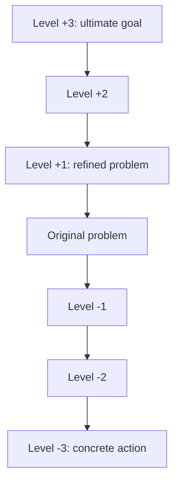

# Abstraction Ladder

**Phase:** Define · **Source:** https://untools.co/abstraction-laddering

## Entry Predicate
`always_run` — every problem benefits from re-framing at multiple levels.

## Inputs
- `intake.problem_refined`
- `intake.success_criteria`

## Method
1. **Climb up** (broader why): "Why are we solving this?" → ask 3 levels up.
2. **Climb down** (concrete how): "What specifically would solve this?" → ask 3 levels down.
3. Identify the **right rung** for action: too high = unactionable, too low = local optimum.

## Output Schema (mermaid)

## Decision Hook
Mark which rung is the **target rung** for the decide phase. Other frameworks downstream use this rung as the canonical problem level.

## What This Means For The Decision
The "right" rung is where the team can act and the action moves the high-level goal. Solving below the right rung is busy-work; solving above it is wishful thinking.
