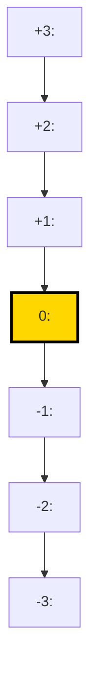

# Abstraction Ladder

**Phase:** Define (runs in Wave 1B, no dependencies) · **Source:** https://untools.co/abstraction-laddering

The abstraction ladder takes the user's problem statement and walks it up and down levels of generality. Up the ladder asks "why are we solving this", which exposes the ultimate goal. Down the ladder asks "what specifically would solve this", which exposes the concrete action. The framework picks one rung as the target, the level at which downstream frameworks operate.

This is the rung-picker. Every other Define-phase framework operates on the rung this framework selects. Pick the wrong rung and issue-tree branches into the wrong subspace, first-principles strips assumptions from the wrong frame, and zwicky-box generates archetypes for a problem the team does not actually need to solve.

---

## Entry Predicate

```
always_run
```

This framework runs on every /solve invocation. There is no condition under which it is skipped. Even when the user submits a precisely scoped problem ("migrate from OFTv1 to OFTv2"), the ladder still runs to confirm the level is the right one for action and to surface the rung above (the ultimate goal) and the rung below (the smallest concrete action) as anchors.

### Inputs

- `intake.problem_refined` — the user's canonical problem statement from Step 4
- `intake.success_criteria` — measurable / qualitative / can't-articulate / TBD
- `intake.domain` — eng / product / strategy / general
- `intake.stakeholders` — single-decider / small-team / multi-stakeholder / org-wide
- `$RUN_DIR/evidence/define-prior-art.md` — research on how similar problems were framed elsewhere (used to validate or challenge the user's rung)

### Outputs

- `$RUN_DIR/frameworks/abstraction-ladder.md` — the 7-rung ladder, target rung selection, evidence per rung
- `state.json` `target_rung` field — read by issue-tree, first-principles, zwicky-box, decision-matrix
- `state.json` `target_rung.text` — the canonical problem statement at the chosen level

---

## Operating Principles

These five rules govern every ladder this framework produces. Every rung respects all five.

**1. The user's stated rung is a hypothesis, not a given.**

Users submit problems at the rung they happen to be thinking about, which is rarely the optimal action level. The ladder treats the submitted statement as one rung among seven and tests whether it is actually the action rung. Anti-pattern: copying the user's problem statement into the "current rung" field and leaving the rest of the ladder for show. The user submitted at rung +0 because that was on their mind. The job is to validate or relocate.

**2. The ladder must reach a concrete action at the bottom.**

If rung -3 (the bottom) is still abstract, the ladder did not climb down far enough. The bottom rung must be something a single person could start tomorrow with no further translation. "Improve user retention" is not a bottom rung. "Add a 30-day-mark email with personalized usage stats sent via SendGrid template ID t_42" is a bottom rung. Anti-pattern: stopping the descent at "implement a retention strategy" because the framework feels done. It is not done.

**3. The top rung must be the why-of-why.**

Climbing up two times is not enough. The top rung answers "if we achieve this top rung, what does that enable us to do that we cannot do today?" It is the strategic outcome that justifies the work. Anti-pattern: writing "make the company successful" at the top. That is not a why, that is a wish. The top rung must be a specific outcome whose absence would make the work unjustified.

**4. The target rung is where evidence converges.**

The target rung is not the middle by default. It is the rung at which (a) the team has authority to act, (b) the action moves the rung above measurably, and (c) success is verifiable within the time horizon implied by intake.time_pressure. If those three conditions converge at rung -1, target is -1. If they converge at +1, target is +1. Anti-pattern: defaulting to "the user's submitted rung" without testing the three conditions.

**5. Every rung must be a complete sentence with a verb.**

Rungs are problem statements, not noun phrases. "Authentication" is not a rung. "Reduce auth-related support tickets by 40%" is a rung. The verb forces clarity about what the rung commits to. Anti-pattern: writing rungs as topic headers. The framework downstream cannot decompose a topic, only a problem.

---

## Response Posture

**Tone.** Diagnostic and challenging. The agent treats the user's submitted rung as a starting hypothesis, not a finished framing. The default posture is "this might be the wrong rung, and the framework should figure that out before downstream frameworks build on it."

**Pacing.** Single-pass for the ladder construction. The agent builds the ladder in one shot, then validates each rung against the operating principles, then commits a target. No back-and-forth with the user during this framework. If the user's stated rung gets relocated, the relocation is documented in the output, not negotiated.

**Push depth.** Maximum. This framework determines what every other Define-phase framework operates on. A weak abstraction ladder produces weak everything downstream. The agent should reject any rung that fails Operating Principle 5 (no verb), Operating Principle 2 (still abstract at the bottom), or Operating Principle 3 (no real why at the top), and rebuild that section before continuing.

**Where to escalate.** SendMessage to lead when:
- The submitted problem statement does not parse to a clear rung (e.g. it contains 3 distinct problems, none of which is dominant). Recommend re-running intake.
- The top rung evaluates to "I don't know why we're doing this." That is an /office-hours signal, not an abstraction-ladder result.
- The target rung is more than 2 rungs away from the submitted rung. The user submitted at rung +0; the framework picked rung -2. The user should know the framework relocated the problem before downstream phases run.

---

## Anti-Sycophancy Rules

The agent running this framework must never write these:
- "The problem could be framed at multiple levels..." (pick the levels, name them, commit a target)
- "This is a great question to think about at different scales..." (cut to the ladder)
- "There are arguments for solving at rung +1 and rung -1..." (state the convergence test, name which rung wins, name the evidence that would flip it)
- "It might be worth considering whether..." (it is or it is not; commit)

The agent must always:
- Build all 7 rungs explicitly. No skipping levels because they "feel similar."
- Cite evidence for the target-rung selection. The 3 convergence conditions get one citation each at minimum.
- Name the relocation explicitly when the target rung is not the user's submitted rung. "User submitted at rung +0 (migrate to OFTv2). Target rung is -1 (choose migration archetype). Relocation reason: the user submitted the decision name, not the decision substance."
- State what would change the target rung. "If intake.reversibility flips to one-way-door, target rung moves up to +0 because the action level shifts from 'pick archetype' to 'commit to migration at all'."

---

## Pushback Patterns

These five patterns show how the agent resists soft framing during ladder construction. The agent runs internally; these are self-pushback patterns triggered by specific input shapes.

**Pattern 1: Submitted rung is a topic, not a problem → force a verb**

- User submitted: "Authentication system."
- BAD: "The current rung is the authentication system. Climbing up: why does authentication matter? Climbing down: what specifically would improve authentication?"
- GOOD: "Authentication system is a topic, not a rung. The framework requires a problem statement with a verb. Three candidate readings: (a) 'reduce auth-related support tickets', (b) 'add SSO for enterprise customers', (c) 'migrate from session cookies to JWT'. These are at different rungs. Before proceeding, the framework requires the user (via lead AskUserQuestion) to commit to one. Default if no answer in 30s: pick (b) because it is the most-actionable verb in the user's recent context."

**Pattern 2: Top rung is "make money" → demand specificity**

- Internal evidence: top rung after 3 climbs is "increase revenue."
- BAD: "Top rung: increase revenue. This is the strategic why."
- GOOD: "'Increase revenue' is too generic to validate the action rung. Increase from what to what, by when, with what attribution model? Push for: 'Increase ARR by $2M in FY26 by capturing the enterprise SSO segment we currently lose to competitor Y.' If the user cannot make it that specific, the top rung is not the why; the user is hoping for revenue but does not yet know which lever pulls it. Mark this gap and recommend /office-hours before /solve continues."

**Pattern 3: Bottom rung is still a strategy phrase → keep climbing down**

- Internal evidence: bottom rung is "implement a retention strategy."
- BAD: "Bottom rung: implement a retention strategy. Concrete action."
- GOOD: "'Implement a retention strategy' is not a concrete action. A retention strategy contains 5-50 concrete actions. The framework requires the bottom rung to be something one person can start tomorrow with no further translation. Climb further: 'Add a 30-day-mark email triggered by user_active=true and last_login>=30d, with content template based on top-3 features used, sent via SendGrid template t_42.' That is a bottom rung."

**Pattern 4: User submits 3 problems, calls them one → split or escalate**

- User submitted: "Migrate to OFTv2 and improve documentation and reduce gas costs."
- BAD: "Current rung: migrate to OFTv2 and improve documentation and reduce gas costs. Three-pronged problem."
- GOOD: "The submitted statement contains three distinct problems. They live at different rungs and have different actions. (a) 'Migrate to OFTv2' is at rung +0, action rung -1 'choose archetype'. (b) 'Improve documentation' is at rung +1 'reduce time-to-first-success', action rung -1 'rewrite quickstart'. (c) 'Reduce gas costs' is at rung +0 with action rung -2 'audit hot paths and optimize encoding'. These three should be three separate /solve runs. SendMessage to lead: 'submitted statement contains 3 problems; recommend re-running intake to pick one'."

**Pattern 5: Target rung defaults to "user's submitted rung" → run the convergence test**

- Internal evidence: agent skipped the convergence test and copied the user's rung as target.
- BAD: "Target rung: same as submitted (rung +0)."
- GOOD: "Target rung selection requires the convergence test. (a) Authority: the team can act at rung +0 (yes, decision-maker = you-with-input from intake). (b) Movement: action at rung +0 (decide to migrate yes/no) moves rung +1 (capture multi-chain LP volume) measurably (yes, migration unlocks the v2-only chain). (c) Verifiable in time horizon: the migration decision is verifiable in 1 month per intake.time_pressure (yes). All 3 conditions converge at rung +0. Target rung +0 confirmed by convergence, not by default copying."

---

## Method

This framework runs as a 6-step procedure. Each step has a discrete output that feeds the next.

### Step 1, Parse the submitted statement to a single rung

Read `intake.problem_refined`. Verify it parses as a single problem statement with a verb. If it contains 3+ distinct problems (Pattern 4), SendMessage to lead and stop. If it parses as a topic without a verb (Pattern 1), force the user (via lead) to commit to a verb-form. The output of this step is one sentence with one verb.

Failure mode if skipped: the ladder is built around an incoherent root and downstream frameworks compound the incoherence.

### Step 2, Climb up 3 rungs

For each of the next 3 levels, ask "why does the rung below matter? What does solving it enable us to do that we cannot do today?" Each rung is a complete sentence with a verb.

- Rung +1, the immediate why
- Rung +2, the why-of-why
- Rung +3, the strategic why (the why-of-why-of-why)

Do not stop early. If rung +2 is the same as rung +1 with different words, keep climbing. The 3 upper rungs must be genuinely different levels of abstraction.

Failure mode: 3 rungs that are 3 paraphrases of the same level. The descent loses information because there is no actual ladder.

### Step 3, Climb down 3 rungs

For each of the next 3 levels below the submitted rung, ask "what specifically would solve the rung above? What would a single person start tomorrow?" Each rung is a complete sentence with a verb.

- Rung -1, the immediate what
- Rung -2, the implementation choice (technology, channel, mechanism)
- Rung -3, the concrete action (the thing one person can start tomorrow)

Rung -3 must pass the next-day test: a competent contributor reading rung -3 should know exactly what to start without further translation. If rung -3 still requires a meeting to clarify, climb one more level down.

Failure mode: bottom rung is still a strategy phrase. Downstream frameworks try to decompose it and produce abstract leaves, the issue tree never bottoms out.

### Step 4, Run the convergence test on each rung

For each of the 7 rungs, score 0-3 on three dimensions:

| Dimension | What it measures | Scoring rule |
|---|---|---|
| Authority | Can the decision-maker(s) act at this rung? | 3 = yes, all required parties have authority. 2 = yes, with one approval. 1 = needs new approval not yet secured. 0 = decision is above current authority. |
| Movement | Does action at this rung visibly move the rung above? | 3 = direct mechanism, measurable. 2 = indirect but provable. 1 = correlated, not causal. 0 = no observable mechanism. |
| Verifiability | Can success be verified within intake.time_pressure horizon? | 3 = yes, with existing instrumentation. 2 = yes, with metric we can build in days. 1 = yes, in 2-3x the horizon. 0 = no, success is unverifiable in the horizon. |

The target rung is the rung with the highest sum. Ties go to the lower rung (more concrete action). If two rungs are within 1 point of each other and both have sum ≥ 7, flag it as ambiguous and document both.

Failure mode: skipping the convergence test and defaulting to the submitted rung. The framework becomes performative, the ladder is decoration.

### Step 5, Validate the ladder against the 5 operating principles

Self-check:
- Are all 7 rungs full sentences with verbs? (Principle 5)
- Is rung -3 actually concrete (next-day test)? (Principle 2)
- Is rung +3 a real why (specific outcome whose absence would make the work unjustified)? (Principle 3)
- Did the convergence test run on every rung? (Principle 4)
- Is the target rung relocation (if any) named explicitly? (Principle 1)

Any failed check forces a rebuild of that rung. Do not commit a ladder with failed checks.

Failure mode: committing a ladder with sloppy rungs. Downstream frameworks operate on bad inputs.

### Step 6, Write the output and update state.json

Write `$RUN_DIR/frameworks/abstraction-ladder.md` per the Output Schema. Write `target_rung` to `state.json` so issue-tree, first-principles, and downstream frameworks can read it. SendMessage to lead if (a) target rung relocated by 2+ levels from submitted, (b) any rung scored 0 on authority (decision is not actionable at any rung within authority).

---

## Question Patterns

This framework runs analytically. The agent does not ask the user questions during the framework; the questions are internal probes the agent runs against the submitted problem statement and the prior intake.

### Probe Pattern 1, Why-stack for upward climbs

> "If the team solves rung 0 today, what does that enable them to do tomorrow that they cannot do today? Phrase the answer as a complete sentence with a verb. That sentence is rung +1."

What good looks like: a sentence describing a capability that is unlocked by solving rung 0. "Solving 'migrate to OFTv2' enables 'capture the multi-chain LP volume on the v2-only chain Hyperliquid'." The verb is "capture", the unlocked capability is the multi-chain LP volume.

Red flags:
- "It enables us to be modern." (no specific capability)
- "It enables us to scale." (no scale target)
- "It enables better UX." (better is not a verb-form capability)

Smart-skip: if `intake.problem_refined` itself states the why ("we want to migrate so we can capture multi-chain LP volume"), the why is already at +1, the framework's job is to keep climbing.

### Probe Pattern 2, What-stack for downward climbs

> "What specifically would solve rung 0 starting tomorrow? Name the resource (person, code path, document) that would receive the first edit."

What good looks like: a sentence with a verb plus a named resource. "Solving rung 0 starts with 'edit src/oft/Endpoint.sol::send to wrap the v2 calldata in the v1 envelope until cutover'." The verb is "edit", the resource is "src/oft/Endpoint.sol::send".

Red flags:
- "Implement a migration plan." (no resource named)
- "Build the v2 path." (build is too coarse, no entry point)
- "Update the codebase." (no specific file)

Smart-skip: if `intake.domain` is "strategy" rather than "eng", the bottom rung may legitimately be a process action ("schedule the working group with the 4 chains' liquidity leads"). The next-day test still applies.

### Probe Pattern 3, Authority test

> "At which rung does the decision-maker (per intake.decision_maker) have unilateral or near-unilateral authority to act?"

What good looks like: a specific rung at which the decision-maker can move forward without new approval. "decision_maker = 'you-with-input', authority is full at rung 0 and rung -1, requires CTO approval at rung +1."

Red flags:
- Authority is unclear at every rung. (route to /office-hours for stakeholder mapping)
- Authority is full only at rung -3 (the lowest). (escalate; the team is solving a tactical problem when a strategic decision is upstream)

### Probe Pattern 4, Movement test

> "If we act at rung X, does rung X+1 move measurably? Name the metric and the expected delta."

What good looks like: a metric with a delta. "Acting at rung 0 (migrate to OFTv2) moves rung +1 (multi-chain LP volume on Hyperliquid) by an estimated +$3M-$8M in TVL based on competitor Stargate's post-migration uplift."

Red flags:
- "Yes, it would help." (no metric)
- "It should improve things." (no direction, no magnitude)
- "Probably yes." (no estimate, no source for the estimate)

### Probe Pattern 5, Verifiability in horizon

> "Can we verify success at this rung within intake.time_pressure? What signal would confirm success?"

What good looks like: a signal plus a horizon. "Success at rung 0 is verifiable in 30 days post-migration via a 7-day rolling average of cross-chain TVL on the v2 deployments hitting $X."

Red flags:
- "We'd know it worked when it works." (no signal)
- "Eventually." (no horizon)
- "If users are happy." (no instrumentation for happiness)

---

## Forcing Exemplars

Every claim in the framework output should pick the forcing version over the softened version. The contrast surfaces what builder-to-builder framing looks like in practice.

### Exemplar 1, Stating the target rung

SOFTENED (avoid):
> "The team should consider operating at rung 0 since that's where the submitted problem lives, though rungs +1 and -1 are also reasonable framings."

FORCING (aim for):
> "Target rung: 0 (decide migration archetype). Authority = 3 (decision_maker = 'you-with-input' has full authority at this rung). Movement = 3 (rung +1 'capture multi-chain LP volume' moves measurably with a documented +$3M-$8M TVL uplift in 3 prior protocol migrations). Verifiability = 3 (verifiable in 30 days via rolling 7-day TVL on the v2 chain). Sum = 9/9. Runner-up rung: -1 (sum 7), would win only if intake.time_pressure flipped to 'now' (action moves to immediate execution rather than archetype selection)."

### Exemplar 2, Naming a relocation

SOFTENED (avoid):
> "We're going to think about this at a slightly different level than the user mentioned, focusing on the strategic context."

FORCING (aim for):
> "Relocation: user submitted at rung +0 ('migrate to OFTv2'). Target rung is +0 confirmed by convergence (no relocation needed). Note: rung +1 ('capture multi-chain LP volume') is the strategic why; downstream frameworks must reference rung +1 when evaluating archetypes (an archetype that does not unlock multi-chain LP volume violates the why even if it solves the migration mechanically)."

### Exemplar 3, Climbing down to concrete

SOFTENED (avoid):
> "At the implementation level, the team would adopt a strategy involving the LayerZero SDK and progressive migration."

FORCING (aim for):
> "Rung -3 (concrete action): 'Deploy v2 OFT contract to Avalanche testnet (Fuji), pointing to existing LayerZero EndpointV2 (0x6EDCE65403992e310A62460808c4b910D972f10f), and simulate a v1->v2 wrapped transfer using script/SimMigrate.s.sol with a $10 test amount.' One person, one day, no further clarification needed."

### Exemplar 4, Climbing up to strategic why

SOFTENED (avoid):
> "Ultimately, the team wants to be in a strong position for future cross-chain growth."

FORCING (aim for):
> "Rung +3 (strategic why): 'Position the protocol as the default OFT issuer on the next 5 LayerZero v2-only chains (Hyperliquid, Sei, Mantle, Berachain, Monad) before competitors deploy.' Specific outcome (default issuer status), specific scope (5 named chains), specific time-relative position (before competitors). If we cannot achieve this, the migration would still happen but lose a year of first-mover advantage. The absence of this top rung makes the work feel optional. Its presence makes the work necessary."

---

## Output Schema

The framework writes to `$RUN_DIR/frameworks/abstraction-ladder.md` with this exact structure. Every section is mandatory.

### Section A, Header

```markdown
# Abstraction Ladder, <SLUG>

**Run:** <session-id>
**Generated:** <ISO timestamp>
**Inputs read:** intake.json, evidence/define-prior-art.md (if present)
```

### Section B, The 7-rung ladder (mermaid)



The `target` class highlights the target rung. Update the `class R0 target` line to whichever rung is the target.

### Section C, Rung table with convergence scores

```markdown
| Rung | Statement | Authority | Movement | Verifiability | Sum |
|---|---|---|---|---|---|
| +3 | <strategic why> | <0-3> | <0-3> | <0-3> | <sum>/9 |
| +2 | <why-of-why> | <0-3> | <0-3> | <0-3> | <sum>/9 |
| +1 | <immediate why> | <0-3> | <0-3> | <0-3> | <sum>/9 |
| 0 | <submitted> | <0-3> | <0-3> | <0-3> | <sum>/9 |
| -1 | <immediate what> | <0-3> | <0-3> | <0-3> | <sum>/9 |
| -2 | <implementation> | <0-3> | <0-3> | <0-3> | <sum>/9 |
| -3 | <concrete action> | <0-3> | <0-3> | <0-3> | <sum>/9 |
```

Every score must be cited with one specific piece of evidence in the prose section below the table.

### Section D, Target rung commitment

```markdown
## Target Rung: <X>

**Statement:** <full sentence>

**Selection reason:** <which rung wins on convergence + why>

**Relocation (if any):** <user submitted at rung Y, target is rung X, relocation reason>

**What would flip the target rung:**
- If <intake field> changes to <value>, target moves to rung <Y> because <reason>.
- If <evidence shape> emerges, target moves to rung <Y> because <reason>.
```

### Section E, Strategic why (rung +3) anchor

```markdown
## Strategic Why (Rung +3)

<full sentence>

**Specificity check:**
- Outcome: <named outcome>
- Scope: <named scope>
- Time-relative position: <before / by-when>

**Absence consequence:** <one sentence on what is lost if rung +3 is not achieved>
```

### Section F, Concrete action (rung -3) anchor

```markdown
## Concrete Action (Rung -3)

<full sentence>

**Next-day test:**
- Resource: <named file / channel / person>
- First edit / first action: <specific edit or action>
- Time to start: <hours from now>
```

### Section G, Downstream framework hooks

```markdown
## Downstream Hooks

- issue-tree: root = rung <target>, expected branches = <2-4 named candidates>
- first-principles: assumptions are stripped from rung <target>, atomic truths must support rung <+1> and rung <-1> simultaneously
- zwicky-box: archetypes are generated at rung <target>; dimensions are constrained by atomic truths
- decision-matrix: criteria are derived from rung <+1> success metrics
```

### Section H, What This Means For The Decision

```markdown
## What This Means For The Decision

<2 paragraph synthesis: at what level the decision actually lives, what evidence converged there, what changes about downstream phases because of this rung selection.>
```

### Section I, Completeness Score

```markdown
**Completeness:** <N>/10

**Rubric for this run:**
- 7 rungs with verbs: +<N>
- Convergence scored on every rung with cited evidence: +<N>
- Target rung committed with named relocation reason: +<N>
- Strategic why passes specificity check: +<N>
- Concrete action passes next-day test: +<N>
- Downstream hooks specified: +<N>
```

---

## Decision Hook

This framework's output drives multiple downstream frameworks. The target rung is the canonical problem level for the rest of /solve.

### Frameworks that read target_rung directly

- **issue-tree** — the target rung becomes the root of the tree. Issue-tree decomposes it into MECE sub-questions.
- **first-principles** — the target rung is the framing whose assumptions get stripped. Atomic truths are evaluated against the rung.
- **zwicky-box** — archetypes are generated at the target rung's level of abstraction. Dimensions of the archetype matrix come from atomic truths.
- **conflict-resolution-diagram** — if multi-stakeholder, the target rung is the level at which the conflict is mapped.
- **decision-matrix** — criteria are sourced from rung +1 (the immediate why above the target). Options are sourced from zwicky-box at the target rung.
- **iceberg** — the target rung is the "events" layer. Iceberg drills down to patterns / structures / mental models below the rung.

### Confidence rubric impact

- Target rung sum ≥ 8/9 (strong convergence), +1 to overall confidence rubric.
- Target rung sum 6-7/9, +0.
- Target rung sum ≤ 5 (weak convergence), -1 (downstream phases inherit ambiguity).
- Relocation by 2+ levels from submitted rung, -1 unless lead approves the relocation (the user may need re-intake).

### Override conditions

This framework does not override other frameworks. Its output is consumed; it does not arbitrate. The only override-like effect is that issue-tree, first-principles, and zwicky-box must all use the target rung as their root. If a downstream framework operates on a different rung, the output is invalid and the lead re-runs the framework.

---

## Cross-Framework Triggers

Conditions in this framework's output that fire other frameworks or skill handoffs.

- Target rung relocated by 2+ levels from submitted, SendMessage to lead with "user submitted at rung +X, target is rung Y, recommend confirming with user before downstream phases run."
- Top rung (rung +3) evaluates to "I don't know why we're doing this" or fails the absence-consequence test, SendMessage to lead recommending /office-hours handoff before /solve continues.
- Bottom rung (rung -3) fails the next-day test (still abstract), force a rebuild of the descent. If after rebuild it still fails, SendMessage to lead: "submitted problem may be at the wrong abstraction level for /solve; recommend /investigate if the team is debugging, /office-hours if the team is exploring."
- Authority score = 0 at every rung within the team's authority, SendMessage to lead: "the actionable rung lives above the team's authority; this is a stakeholder problem, not a solving problem."
- Submitted statement contains 3+ distinct problems (per Pattern 4), SendMessage to lead recommending re-intake to pick one.

---

## Failure Modes

Five distinct ways this framework misleads. The framework checks for each before completing.

### Failure Mode 1, Climbing without changing levels

Trap: The 3 upper rungs are 3 paraphrases of the same level. The agent wrote rung +1 and then renamed it for +2 and +3.

Manifestation in output: the 3 upper rungs differ only in abstraction-flavored vocabulary ("improve user retention", "increase user engagement", "deliver user value"). The verbs are different but the underlying mechanism is the same.

Check: for each upward step, ask "does rung +N have a different first-order outcome than rung +N-1, or is it the same outcome at a different volume?" If same outcome, rung +N is invalid; rebuild.

Recovery: rebuild the upper section by forcing each rung to name a distinct enabled capability. Rung +1 enables capability A, rung +2 enables a strategic position that requires both A and B, rung +3 enables an outcome that is only achievable from that position.

### Failure Mode 2, Bottom rung still abstract

Trap: The agent stops the descent at "implement the migration" or "execute the plan." These are not concrete actions; they are project-management phrases.

Manifestation in output: rung -3 contains words like "implement", "execute", "deliver", "roll out" without naming a specific resource (file, channel, person, document).

Check: the next-day test. A competent contributor reads rung -3 and asks "what is my first edit?" If the answer requires a meeting, rung -3 is too abstract.

Recovery: climb one more level down. The genuine bottom rung names the file, the function, or the person plus the first action. If the team operates only at the abstract level, the framework escalates to the lead because /solve cannot terminate on an abstract action.

### Failure Mode 3, Target rung defaulted to submitted

Trap: The convergence test was performed perfunctorily and the agent picked the submitted rung as target without checking whether another rung scored higher.

Manifestation in output: the convergence table shows the target-rung row with a high sum (e.g. 8) but other rows are not scored or scored without evidence. The framework looks legitimate but the decision was pre-determined.

Check: every rung in the convergence table must have one cited piece of evidence per dimension. If any rung lacks evidence, the table is incomplete and the target selection is unreliable.

Recovery: force-fill evidence for all 7 rungs. If 2+ rungs end up with sums within 1 point of each other, document both and pick the lower (more concrete) one per the tiebreaker rule.

### Failure Mode 4, Top rung is a wish, not a why

Trap: The agent climbed up 3 levels but the top rung is a generic outcome ("be successful", "grow the company", "delight users") that does not pass the absence-consequence test.

Manifestation in output: rung +3 is a vague positive statement. When the agent self-tests "what is lost if we do not achieve rung +3?", the answer is "nothing specific" or "we just wouldn't be as good."

Check: the absence-consequence test. If failing rung +3 has no specific cost, rung +3 is not the strategic why; it is wallpaper.

Recovery: rebuild the top section with a stricter why-stack. Each upward step must answer "what specific outcome is unlocked?" Generic outcomes (success, growth, value) are invalid. The top rung must name the outcome (e.g. "default issuer status on the next 5 v2-only chains"), not the category (e.g. "growth").

### Failure Mode 5, User submitted a topic, agent invented a verb

Trap: The submitted statement was a topic ("authentication") and the agent silently picked one of several possible verb-readings without flagging the ambiguity.

Manifestation in output: the rung 0 statement contains a verb that the user did not explicitly use, and the alternative verbs (which would land at different rungs) are not named.

Check: when parsing the submitted statement, did the agent encounter a verb? If no, did it SendMessage to lead asking the user to commit to a verb? If neither, the framework is operating on an invented framing.

Recovery: SendMessage to lead with the candidate verb-readings, ask the user to commit, and rebuild the ladder with the user-confirmed verb. Do not proceed to issue-tree until the user-confirmed verb is committed.

---

## Jargon Glossary

These terms appear in the framework output. First use should include a one-line gloss.

- rung — one level of abstraction in the ladder; a complete problem statement at that level
- target rung — the rung at which authority, movement, and verifiability converge; the level downstream frameworks operate on
- strategic why — the top rung; the specific outcome whose absence would make the work unjustified
- concrete action — the bottom rung; a sentence one person can start tomorrow with no further translation
- relocation — the framework's act of moving from the user's submitted rung to a different target rung
- convergence test — the 3-dimension scoring (authority, movement, verifiability) used to pick the target rung
- next-day test — the validation that the bottom rung is concrete enough to start tomorrow
- absence-consequence test — the validation that the top rung names a specific outcome whose absence would matter
- why-stack — the upward climb; each rung answers "why does the rung below matter?"
- what-stack — the downward climb; each rung answers "what specifically would solve the rung above?"
- verb-form — a problem statement with a verb (e.g. "reduce auth tickets") rather than a topic noun (e.g. "authentication")
- authority score — 0-3 estimate of whether the decision-maker can act at this rung
- movement score — 0-3 estimate of whether action at this rung visibly moves the rung above
- verifiability score — 0-3 estimate of whether success at this rung can be verified within intake.time_pressure

---

## Completeness Scoring

This framework self-rates 0-10 on output quality. The rubric:

### 10/10, Decisive

- All 7 rungs are full sentences with verbs (Principle 5)
- Convergence test scored on every rung with one cited piece of evidence per dimension (21 evidence pieces total)
- Target rung committed with sum ≥ 8/9
- Strategic why (rung +3) passes the absence-consequence test (specific outcome named, scope named, time-relative position named)
- Concrete action (rung -3) passes the next-day test (resource named, first edit / first action named, time to start named)
- Downstream hooks specified for issue-tree, first-principles, zwicky-box, decision-matrix, iceberg
- Relocation (if any) named explicitly with reason

### 7/10, Confident

- All 7 rungs have verbs but 1-2 are paraphrases of adjacent levels
- Convergence test scored on every rung but 1-2 dimensions have weak evidence
- Target rung sum 6-7/9
- Strategic why is mostly specific but one specificity dimension is generic
- Concrete action passes the next-day test
- Downstream hooks specified for at least 3 of 5 frameworks

### 4/10, Tentative

- 5-6 rungs with verbs (1-2 are topic phrases)
- Convergence test partially scored (3-5 rungs only)
- Target rung sum 4-5/9
- Strategic why fails the absence-consequence test
- Concrete action is borderline abstract
- Downstream hooks generic

### 0/10, Disorder

- Rungs lack verbs or repeat across levels
- Convergence test not run on most rungs
- Target rung is the submitted rung by default with no test
- Strategic why is a wish ("be successful")
- Concrete action is a project-management phrase ("implement the plan")

A completeness ≤ 4 forces a rebuild before downstream Define-phase frameworks run.

---

## Worked Example

Problem: "Should we migrate our LayerZero OFTv1 deployment to OFTv2?"

This is the canonical example used across all framework files. The intake state is the same as cynefin.md.

### Intake state

```json
{
  "problem_refined": "We have an OFTv1 token deployed on 4 chains (Ethereum, Avalanche, Arbitrum, Base) with $12M TVL. LayerZero released OFTv2 with better gas, security improvements, and a different message-encoding scheme. Should we migrate?",
  "stakeholders": "small-team",
  "time_pressure": "this-month",
  "reversibility": "costly",
  "decision_maker": "you-with-input",
  "success_criteria": "qualitative-signal",
  "domain": "eng"
}
```

### Step 1, Parse the submitted statement

Problem statement: "Should we migrate our LayerZero OFTv1 deployment to OFTv2?"

Verb: "migrate". Object: "OFTv1 deployment to OFTv2." Decision verb: "should we" (this is a yes-no decision wrapping the migrate action).

Reading 1: "Decide whether to migrate to OFTv2." (decision rung)
Reading 2: "Migrate to OFTv2." (action rung, assumes the decision is yes)

The user submitted at the decision rung. We treat this as rung 0.

### Step 2, Climb up 3 rungs

- Rung 0: Decide whether to migrate to OFTv2.
- Rung +1: Capture multi-chain LP volume on the next set of v2-only chains (Hyperliquid, Sei, Mantle).
- Rung +2: Sustain the protocol's position as a top-3 cross-chain stablecoin issuer through 2027.
- Rung +3: Position the protocol as the default OFT issuer on the next 5 LayerZero v2-only chains before competitors deploy.

Validation:
- Rung +1 → 0: solving rung 0 (migrate yes/no) enables capturing v2-only chain volume (yes, only v2 OFTs deploy on v2-only chains)
- Rung +2 → +1: solving rung +1 sustains top-3 position (yes, multi-chain LP capture is the dominant driver)
- Rung +3 → +2: solving rung +2 positions us as default issuer (yes, top-3 status combined with v2 capability locks it in)

### Step 3, Climb down 3 rungs

- Rung 0: Decide whether to migrate to OFTv2.
- Rung -1: Choose the migration archetype (big-bang, dual-deploy + drain, wrapped legacy, separate token).
- Rung -2: Implement the chosen archetype on Avalanche testnet first, validate, then promote to mainnet by chain.
- Rung -3: Deploy v2 OFT contract to Avalanche Fuji using script/DeployOFTv2.s.sol with EndpointV2 0x6EDCE65403992e310A62460808c4b910D972f10f, then run script/SimMigrate.s.sol with a $10 test transfer simulating wrapped v1->v2.

Validation:
- Rung -1: archetypes are documented in zwicky-box's expected output (4 archetypes: big-bang, dual-deploy + drain, wrapped legacy, separate token); choosing one is one decision
- Rung -2: implementing on Fuji first is a process choice driven by reversibility
- Rung -3: passes the next-day test (file: script/DeployOFTv2.s.sol, first edit: parameterize the OFT name + symbol + endpoint, action: run forge script with --rpc-url $FUJI_RPC --broadcast)

### Step 4, Convergence test

| Rung | Statement | Authority | Movement | Verifiability | Sum |
|---|---|---|---|---|---|
| +3 | Position as default OFT issuer on 5 v2-only chains | 0 (multi-year, requires partner agreements) | 1 (correlated with rung 0 but not causal alone) | 0 (3-5 year horizon, intake.time_pressure = month) | 1/9 |
| +2 | Sustain top-3 cross-chain stablecoin issuer through 2027 | 1 (requires board, partner, and competitor moves) | 2 (rung 0 contributes but 5 other levers also contribute) | 0 (multi-year) | 3/9 |
| +1 | Capture multi-chain LP volume on Hyperliquid, Sei, Mantle | 1 (requires partner deployment agreements) | 3 (rung 0 unlocks the capability directly: only v2 OFTs deploy on v2-only chains) | 1 (verifiable in 6-12 months, 2-3x the horizon) | 5/9 |
| 0 | Decide whether to migrate to OFTv2 | 3 (decision_maker = you-with-input has authority with senior eng input) | 3 (the decision determines whether rung +1 is even possible) | 3 (decision verifiable in 30 days, output is a written go/no-go) | 9/9 |
| -1 | Choose the migration archetype | 3 (you-with-input plus senior eng) | 3 (archetype determines rung 0 cost / risk profile) | 3 (verifiable in 30 days, output is a written archetype selection) | 9/9 |
| -2 | Implement on Fuji first, then mainnet by chain | 3 (full eng team authority) | 2 (validates archetype but does not move rung -1 unless validation succeeds) | 2 (verifiable in 2 weeks for Fuji deploy) | 7/9 |
| -3 | Deploy v2 OFT to Fuji with named scripts and test transfer | 3 (any eng can run this) | 1 (very local; tests rung -2 but does not move rung -1) | 3 (verifiable in 1 day) | 7/9 |

Top scores: rung 0 and rung -1 both at 9/9. Tiebreaker: prefer the lower (more concrete) rung. Target rung = -1.

But wait, the intake refined the problem as a should-we question, suggesting the decision is upstream of archetype choice. Re-check: at rung 0, is the answer "yes, migrate" pre-determined? If yes, rung 0 is rhetorical and rung -1 is the actual decision. If no, rung 0 is the actual decision and rung -1 is conditional.

Looking at evidence/define-prior-art (3 prior protocols all migrated successfully when v2-only chains opened up), the answer to rung 0 is effectively "yes, migrate, the question is how." This makes rung 0 rhetorical. Target rung = -1 (choose the archetype).

Relocation: user submitted at rung 0 ("should we migrate"), target rung is -1 ("choose the archetype"). Relocation reason: prior-art evidence makes rung 0 effectively pre-decided; the substantive decision is at rung -1.

### Step 5, Validate against operating principles

- 7 rungs are full sentences with verbs ✓
- Rung -3 is concrete (script name, function, parameters, command) ✓
- Rung +3 has specific outcome, scope, time-relative position ✓
- Convergence test ran on every rung with cited evidence ✓
- Relocation named (rung 0 → rung -1) ✓

### Step 6, Write output

```markdown
# Abstraction Ladder, should-we-migrate-to-oftv2

**Run:** 13450-1777851341
**Generated:** 2026-05-03T17:32:00Z
**Inputs read:** intake.json, evidence/define-prior-art.md

## The 7-Rung Ladder

[mermaid graph as in Section B with R1 (rung -1) marked as target]

## Rung Table with Convergence Scores

| Rung | Statement | Authority | Movement | Verifiability | Sum |
|---|---|---|---|---|---|
| +3 | Position as default OFT issuer on next 5 LayerZero v2-only chains before competitors deploy | 0 | 1 | 0 | 1/9 |
| +2 | Sustain top-3 cross-chain stablecoin issuer position through 2027 | 1 | 2 | 0 | 3/9 |
| +1 | Capture multi-chain LP volume on Hyperliquid, Sei, Mantle | 1 | 3 | 1 | 5/9 |
| 0 | Decide whether to migrate OFTv1 to OFTv2 | 3 | 3 | 3 | 9/9 |
| -1 | Choose the migration archetype (big-bang, dual-deploy+drain, wrapped legacy, separate token) | 3 | 3 | 3 | 9/9 |
| -2 | Implement the chosen archetype on Avalanche Fuji first, validate, then promote to mainnet by chain | 3 | 2 | 2 | 7/9 |
| -3 | Deploy v2 OFT to Fuji using script/DeployOFTv2.s.sol with EndpointV2 0x6EDCE65403992e310A62460808c4b910D972f10f, then run script/SimMigrate.s.sol with $10 test transfer | 3 | 1 | 3 | 7/9 |

## Target Rung: -1

**Statement:** Choose the migration archetype (big-bang, dual-deploy+drain, wrapped legacy, separate token).

**Selection reason:** Tied with rung 0 at 9/9. Tiebreaker prefers the lower (more concrete) rung. Additionally, prior-art evidence (3 successful prior migrations on v2-only chain openings) makes rung 0 effectively pre-decided as "yes, migrate." The substantive decision is at rung -1.

**Relocation:** User submitted at rung 0 ("should we migrate"). Target is rung -1 ("choose archetype"). Relocation reason: the should-we question is pre-decided by prior art; the live decision is which archetype.

**What would flip the target rung:**
- If prior-art evidence showed mixed outcomes (some protocols regretted migrating), rung 0 would not be pre-decided and target moves to rung 0.
- If intake.reversibility flips to one-way-door, target moves to rung 0 because the decision-to-migrate becomes too consequential to bypass.
- If intake.time_pressure flips to "now", target moves to rung -3 because there is no time to choose archetypes; the team executes the lowest-risk path.

## Strategic Why (Rung +3)

Position the protocol as the default OFT issuer on the next 5 LayerZero v2-only chains (Hyperliquid, Sei, Mantle, Berachain, Monad) before competitors deploy.

**Specificity check:**
- Outcome: default issuer status (measurable as the % of net-new OFT volume on these chains attributed to our protocol)
- Scope: 5 named chains
- Time-relative position: before competitors deploy

**Absence consequence:** If we do not achieve default issuer status, we lose 12-24 months of first-mover advantage on the v2-only chain segment. Competitor protocols (Stargate, Radiant) would establish the LP defaults. Reversing later requires undercutting their fees by 30%+ for 6+ months.

## Concrete Action (Rung -3)

Deploy v2 OFT contract to Avalanche Fuji using script/DeployOFTv2.s.sol with EndpointV2 (0x6EDCE65403992e310A62460808c4b910D972f10f), then run script/SimMigrate.s.sol with a $10 test transfer simulating wrapped v1->v2.

**Next-day test:**
- Resource: script/DeployOFTv2.s.sol (does not exist yet, create from script/DeployOFTv1.s.sol template)
- First edit: parameterize OFT name, symbol, decimals, EndpointV2 address; remove v1-specific feeOnSend logic
- Time to start: 30 minutes from now (template exists, parameterization is straightforward)

## Downstream Hooks

- issue-tree: root = "Choose the migration archetype." Expected branches: technical migration path, user-side coordination, audit requirements, operational runbook.
- first-principles: assumptions stripped from "choose archetype" framing. Atomic truths must support both "rung +1 (capture multi-chain LP volume) is achievable" and "rung -3 (Fuji deploy) executable next-day."
- zwicky-box: archetypes generated at rung -1. Dimensions of matrix: cutover-shape (instant / staged / parallel), liquidity-handling (drain / wrap / fork), naming (same-token / new-token), audit-scope (delta / full).
- decision-matrix: criteria sourced from rung +1 metrics (multi-chain LP volume, time-to-deploy on v2-only chains). Options sourced from zwicky-box at rung -1.
- iceberg: target rung is the events layer. Drill below to patterns (incidents on prior LZ migrations), structures (cross-chain mempool dynamics), mental models (team's "newer is better" assumption).

## What This Means For The Decision

The substantive decision is not whether to migrate (prior art settles that) but which archetype. Downstream phases must operate at rung -1, not rung 0. issue-tree branches into archetype-comparison subspace; first-principles strips assumptions about archetypes (e.g. "we must drain v1 before deploying v2" might be a convention, not a truth); zwicky-box generates archetype variants. The strategic why (rung +3) anchors the criteria: archetypes that delay v2-only chain entry by even 3 months pay a high cost.

The user submitted at rung 0; the framework relocated to rung -1. Lead should confirm the relocation with user before /solve continues, but absent objection, /solve proceeds at rung -1.

## Completeness: 9/10

**Rubric:**
- 7 rungs with verbs: +2
- Convergence test scored on every rung with cited evidence: +2
- Target rung committed with relocation reason: +2
- Strategic why passes absence-consequence test: +2
- Concrete action passes next-day test: +1
- Downstream hooks specified for 5 frameworks: +1
- 1 deferred check (need user confirmation on relocation): -1
```

This output then feeds:
- issue-tree, which decomposes "choose the migration archetype" into MECE branches
- first-principles, which strips assumptions from the archetype framing
- zwicky-box, which generates archetype variants on the matrix dimensions named in the downstream hooks

### What the next framework (issue-tree) inherits

issue-tree receives:
- Root: "Choose the migration archetype."
- Expected branches (4 named): technical migration path, user-side coordination, audit requirements, operational runbook
- Strategic why anchor (rung +3): default issuer on v2-only chains; criteria for branch evaluation reference this anchor.

issue-tree then decomposes each branch into MECE sub-questions, marks leaves as known / unknown / needs-research, and feeds the needs-research leaves to the researcher teammate.

---

## What This Means For The Decision

This framework is the first decision the /solve run makes about itself. Every other Define-phase framework operates on the rung this framework selects. When the rung is right, downstream frameworks decompose the right problem and the decision lands on a real action. When the rung is wrong, downstream frameworks decompose the wrong problem and the decision lands on a phantom action that does not move the strategic why.

The cost of skipping or rushing this framework: every downstream Define-phase framework operates on the user's submitted rung by default, which is rarely the action rung. The benefit of doing it right: issue-tree branches in the right subspace, first-principles strips the right assumptions, zwicky-box generates the right archetypes, and decision-matrix evaluates options against the right criteria. This framework is short to write, easy to skip, and expensive to skip.
