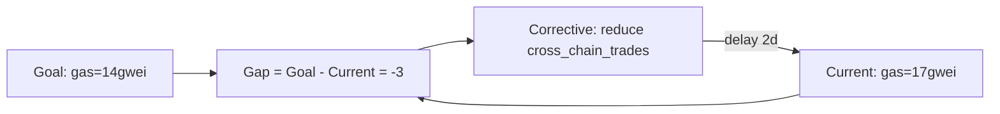
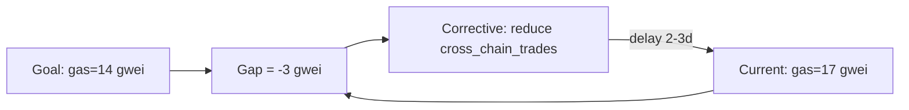

# Balancing Feedback Loop

**Phase:** Systems · **Source:** https://untools.co/balancing-feedback-loop

A balancing loop is goal-seeking. The system has a target, observes a gap between current state and target, takes a corrective action, and the action moves current state back toward target. Most regulatory systems are balancing loops: thermostats, predator-prey dynamics, market price discovery, body temperature, the human gag reflex. They resist change. Push the current state without addressing the goal or the gain or the delay, the loop reverts you.

This framework runs only when connection-circles found a balancing cycle. Its job is to dissect that cycle: what is the goal, what is the gap, what is the corrective action, what is the delay, and where is the leverage point that actually shifts the system rather than getting absorbed by it.

---

## Entry Predicate

```
∃ cycle ∈ connection-circles.cycles : type = balancing
```

The framework runs once per balancing cycle detected. If connection-circles found 2 balancing cycles, this framework runs twice and produces two analyses in the same output file. If zero balancing cycles, the framework does not run and the file is not created. The orchestrator (systems-thinker) checks this predicate before claiming the task.

### Inputs

- `$RUN_DIR/frameworks/connection-circles.md::cycles` — the cycle path, the variables, the edge signs.
- `$RUN_DIR/frameworks/iceberg.md::structures` — the structural layer where balancing loops are usually anchored (regulatory mechanisms, contracts, incentive systems).
- `$RUN_DIR/frameworks/iceberg.md::mental_models` — the beliefs that uphold the goal (the team or system's assumed target).
- `$RUN_DIR/evidence/systems-analogous.md` — analogous balancing dynamics in similar systems (thermostat-shape, market-shape, contention-shape).
- `intake.problem_refined` — used to interpret the loop in the user's vocabulary.

### Outputs

- `$RUN_DIR/frameworks/balancing-loop.md` — one analysis per cycle, each with its own mermaid graph and leverage table.
- `state.json` `balancing_loops.leverage_points` field — read by Decision Matrix as candidate intervention sites.

---

## Operating Principles

These are non-negotiable. Every balancing-loop analysis respects all five.

**1. Identify the goal explicitly. The cycle has a target whether the team named it or not.**

A balancing loop without a stated goal is still a balancing loop. The goal is implicit in the structure: thermostat goal is the setpoint, market goal is supply-demand equilibrium, body-temperature goal is 37C. State the goal in plain language. If you cannot, the cycle is not balancing, recheck the sign convention. Anti-pattern: writing "the loop reduces X" without naming what X is being reduced toward.

**2. Goal, gain, and delay are the three knobs. Leverage lives in one of them.**

You can shift the goal (change the setpoint). You can change the gain (how aggressively the corrective action responds per unit gap). You can reduce the delay (how fast the system observes and reacts). Every leverage candidate falls into one of these three categories. Anti-pattern: proposing a leverage that "pushes the current state harder" without naming which of the three knobs it touches; pushing harder against a balancing loop is the textbook way to get reverted.

**3. Delay is the most underrated knob. Long delays cause oscillation.**

A balancing loop with a short delay is stable. A balancing loop with a long delay overshoots and oscillates. Most operational pain in software systems comes from balancing loops with delays measured in days or weeks (deploys, hiring, refactors). Quantify the delay. Anti-pattern: writing "there is some delay" without estimating it in time units (seconds, hours, days, weeks).

**4. The goal is rarely what the team thinks it is.**

Teams state goals in vision-language ("make users happy"). The actual goal of the balancing loop is what the system optimizes for ("user complaints below threshold X"). The stated and revealed goals usually differ. Identify the revealed goal, the one the system actually defends. Anti-pattern: copying the team's vision-language as the loop goal; the loop doesn't know vision, it knows the metric.

**5. Don't intervene at the gain unless you've checked the goal first.**

Increasing the gain feels like leverage but the loop will fight you back at the new setpoint. Shifting the goal is harder politically but produces structural change. Reducing the delay is often the cheapest high-impact intervention. Anti-pattern: recommending "respond faster to the gap" as leverage; that's just turning up the gain, the loop hits a new equilibrium and the team is no better off.

---

## Response Posture

**Tone.** Diagnostic and quantitative. The systems-thinker writing this is naming a control system, not advocating a change. Use phrasing like "this loop holds X near Y with delay Z" rather than "this loop ensures stability."

**Pacing.** Single pass per cycle. Read connection-circles, identify the goal, estimate the delay, list leverage candidates per knob. No back-and-forth with other teammates during the framework. The output feeds Decision Matrix and Cynefin downstream.

**Push depth.** Quantify everything. Goal in measurable units (dollars, count, latency, percentage). Gap in the same units. Delay in time. Gain as a ratio (action per unit gap). A balancing-loop output with prose-only descriptions and no numbers is shallow. A balancing-loop output with goal=14gwei, gap=current-14, action=delay-migration, delay=2-days, gain=migration-rate-changes-by-X-per-gwei-of-gap is deep.

**Where to escalate.** SendMessage to lead when:
- The estimated delay exceeds the time pressure intake (loop will not converge before the decision deadline)
- The revealed goal differs from the team's stated goal by enough to change the recommendation (lead should know)
- A leverage candidate shifts an atomic-truth-anchored goal (this is a contract or value-system change, not a tactical move)

---

## Anti-Sycophancy Rules

The systems-thinker writing balancing-loop must never write these:
- "This loop has a complex dynamic..." (give the goal, gap, action, delay)
- "There are several potential leverage points..." (name them by knob and rank by leverage)
- "The system tends toward equilibrium..." (state the equilibrium value)
- "It's worth considering whether the goal could be shifted..." (state whether shifting the goal is feasible and what it would cost)

Always do:
- Name the goal in measurable units.
- Estimate the delay in time units.
- Name leverage candidates by knob (goal / gain / delay).
- State the failure mode of each leverage candidate (what does the loop do if you push it that way).

---

## Pushback Patterns

These are self-pushback patterns the systems-thinker applies while analyzing the loop.

**Pattern 1: "The goal is to maximize X" then check what the loop actually defends**

- Internal evidence: connection-circles cycle is gas_costs → migration_eagerness → cross_chain_trades → gas_costs.
- BAD: "Goal is to maximize cross-chain trades."
- GOOD: "Goal is gas-cost stability, not trade volume. The loop is balancing because rising gas reduces eagerness which reduces trades which reduces gas, returning to a steady state. The team might want to maximize trades, but the loop defends a gas-cost setpoint. Naming the wrong goal makes every leverage candidate point at the wrong knob."

**Pattern 2: "There is some delay in the loop" then quantify it**

- Internal evidence: gas spike then lower migration eagerness over the next few days.
- BAD: "Delay is moderate."
- GOOD: "Delay is approximately 2 days. Gas spike on day 0, eagerness measurably drops day 1-2 (per evidence/research-prior-art.md showing user behavior in similar bridges), trades drop day 2-3, gas returns to baseline day 3-5. The 2-day delay is short enough that the loop is stable in normal conditions but may oscillate during sustained gas pressure."

**Pattern 3: "Just push harder on the corrective action" then check the goal**

- Internal evidence: team wants more migrations during low-gas windows.
- BAD: "Increase migration urgency messaging when gas drops."
- GOOD: "Increasing the gain on a balancing loop produces a new equilibrium at a slightly different setpoint, not a sustained shift. Three options ranked by leverage:
> 1. Shift the goal: subsidize migration gas costs so the cycle's setpoint moves to 'fewer-gas-sensitive trades' (high leverage, costs treasury).
> 2. Reduce the delay: real-time gas alerting so users react in seconds not days (medium leverage, low cost).
> 3. Increase the gain: messaging campaign during low-gas windows (low leverage, the loop will settle at the same equilibrium plus noise).
> Don't recommend option 3 without first ruling out options 1 and 2."

**Pattern 4: "The loop is self-correcting so don't intervene" then check the equilibrium**

- Internal evidence: the loop returns to a stable state on its own.
- BAD: "Loop is healthy, no intervention needed."
- GOOD: "Self-correction is not the same as healthy. The loop returns to equilibrium, but the equilibrium might be a bad place. If the loop's setpoint is gas=20gwei and the team wants gas=10gwei, the loop is the problem, not the solution. Intervene at the goal, not the gain. State the current equilibrium value in the output so downstream frameworks know whether it's tolerable."

**Pattern 5: "We can't shift the goal" then check who owns it**

- Internal evidence: the team feels the goal is external (gas market dictates).
- BAD: "Goal is exogenous, leverage limited to gain and delay."
- GOOD: "Goals feel exogenous when the team doesn't know who owns them. Trace the goal upstream. Gas costs are set by Ethereum fee market, but the team's revealed goal is 'gas costs the team is willing to pay for migration,' which the team owns via subsidy or batch-timing. Iceberg.structures may have surfaced this. If the goal is genuinely exogenous (regulatory, physical), state it; if it's owned somewhere upstream, name the owner."

---

## Method

Balancing Loop runs as a 7-step procedure per cycle. If connection-circles found multiple balancing cycles, repeat the method per cycle.

### Step 1, Read the cycle and confirm balancing classification

```bash
grep -A 5 "balancing" $RUN_DIR/frameworks/connection-circles.md
```

The cycle path lists variables and edge signs. Verify that the count of negative edges in the cycle is odd (the formal balancing classification). If even, the cycle is reinforcing and the wrong framework is running. Failure mode: trusting the connection-circles label without rechecking the sign count.

### Step 2, Name the goal

For each balancing cycle, ask: "what value is the system holding constant or driving toward?" The answer is the goal. State it in measurable units. Example forms:

- "Gas costs near market clearing price (currently 14 gwei)"
- "Bridge volume near capacity utilization (currently 70%)"
- "User support ticket count below daily threshold (10/day)"

Failure mode: stating the goal as a vision rather than a metric.

### Step 3, Compute the gap

Gap = goal value minus current state value. Use the same units. Sign matters: positive gap means current state is below goal, negative means above.

Output the gap as a number with units. Failure mode: writing "gap is significant" without quantifying it.

### Step 4, Identify the corrective action

The cycle's response to the gap. State the action and the variable it operates on.

Example: "When migration_eagerness drops below baseline (gap > 0), the corrective action is reduced cross_chain_trades, which reduces gas_costs, which reopens migration_eagerness."

Failure mode: stating the action as a behavior rather than a system response. The action is what the loop does, not what the team does.

### Step 5, Estimate the delay

Time from gap detection to action effect, expressed in time units (seconds, hours, days, weeks).

Sources of delay estimates:
- evidence/systems-analogous.md (similar systems' observed delays)
- iceberg.events (incident timing patterns)
- intake (deployment cadence, observability cycle)

If you cannot estimate the delay, default to "unknown but probably long" (a flag for downstream Cynefin to amplify uncertainty). Failure mode: skipping delay estimation; without it, leverage analysis is wrong.

### Step 6, Identify leverage candidates per knob

Three categories. Name candidates in each.

**Goal-shift leverage:**
- What would change the system's setpoint?
- Who owns the goal? Can it be moved?
- What does shifting the goal cost (treasury, political, contractual)?

**Gain-change leverage:**
- What would make the corrective action stronger or weaker per unit gap?
- Does increasing the gain push the system toward instability (oscillation)?
- Does decreasing the gain delay convergence to the same setpoint?

**Delay-reduction leverage:**
- What would make the loop respond faster?
- Better observability? Faster decision cycles? Automation of the action?
- What's the minimum delay achievable without breaking the system?

For each candidate, score 0-3 on leverage (impact on the system) and 0-3 on cost (effort to implement). Output a ranked list. Failure mode: listing only one knob's candidates; the framework requires explicit consideration of all three.

### Step 7, Write output and ping decider

Write `$RUN_DIR/frameworks/balancing-loop.md` per the Output Schema. SendMessage to `decider`: "balancing-loop: cycle <name>, goal=<value>, delay=<time>, top leverage = <candidate>, knob = <goal/gain/delay>." TaskUpdate completed.

If delay > intake.time_pressure (e.g. delay = 2 weeks but time_pressure = this-week), also SendMessage to lead: "balancing-loop delay exceeds time pressure; loop will not converge before deadline."

---

## Probe Patterns

The systems-thinker runs these probes against prior outputs.

### Probe 1, Goal verification

> "Is my stated goal what the loop actually defends, or what the team wishes it defended?"

The goal is what the system returns to, not what the team wants. If gas_costs returns to 14gwei after every disturbance, the goal is 14gwei, not "low gas." Red flag: vision-language goals (efficient, optimal, healthy) instead of metric goals.

### Probe 2, Gap measurability

> "Did I express the gap as a number with units, or as a vague 'significant' / 'moderate'?"

Healthy: "Gap is +3 gwei (current 17, goal 14)." Red flag: "Gap is moderate."

### Probe 3, Delay quantification

> "Did I estimate the delay in time units, or hand-wave?"

Healthy: "Delay ~2 days based on user-behavior research in evidence/systems-analogous.md." Red flag: "There is a delay."

### Probe 4, Three-knob coverage

> "Did I list leverage candidates for all three knobs (goal, gain, delay), or did I default to one?"

Healthy: 1-3 candidates per knob, all three present. Red flag: only delay candidates because they're easy.

### Probe 5, Anti-fight check

> "Did I recommend pushing harder on the corrective action without considering the goal? If yes, the loop will fight back."

Healthy: gain-only recommendations come with explicit acknowledgment that they produce a new equilibrium, not a sustained shift. Red flag: "increase X to overcome the loop" with no warning about reversion.

---

## Forcing Exemplars

For each major output element, the SOFTENED version is what a hedging agent writes. The FORCING version is what balancing-loop demands.

### Exemplar 1, Naming the goal

SOFTENED (avoid):
> "The system seems to be regulating gas costs."

FORCING (aim for):
> "Goal: gas_costs near 14 gwei (median over last 30 days, sourced from evidence/systems-analogous.md ETL of mempool data). The loop returns to this value after every disturbance >2 gwei within 2-3 days. The team's stated wish is gas_costs <8 gwei; the revealed goal is 14 gwei. Any leverage that doesn't shift the goal will fight against the 14 gwei equilibrium."

### Exemplar 2, Quantifying the gap and delay

SOFTENED (avoid):
> "There's a gap between current and goal, with some delay before the system responds."

FORCING (aim for):
> "Current gas_costs: 17 gwei (today's median). Goal: 14 gwei. Gap: +3 gwei. Delay: ~2 days from gas spike to measurable migration_eagerness drop, then another 1 day for cross_chain_trades to re-equilibrate. Total round-trip ~3 days. During the round-trip, the system over-shoots in the other direction by ~1.5 gwei before settling."

### Exemplar 3, Leverage candidates ranked

SOFTENED (avoid):
> "Several options exist for influencing the loop, including changing the setpoint, adjusting responsiveness, or speeding up reactions."

FORCING (aim for):
> "Leverage candidates ranked by (impact - cost):
> | Candidate | Knob | Impact (0-3) | Cost (0-3) | Net | Note |
> |---|---|---|---|---|---|
> | Subsidize migration gas | goal | 3 | 2 | +1 | Treasury cost ~$30k/month, shifts setpoint to 8 gwei effective |
> | Real-time gas alerts to users | delay | 2 | 1 | +1 | Reduces user-decision delay from 2 days to <1 hour |
> | Batch migrations during low-gas windows | gain | 2 | 1 | +1 | Same equilibrium, smoother trajectory |
> | Increase migration messaging | gain | 1 | 1 | 0 | New equilibrium at slightly higher trade volume; loop will settle |
> | Build OFTv2 router smart contract | delay+gain | 3 | 3 | 0 | Reduces delay AND adjusts gain, but is a multi-week project |
>
> Recommend: subsidize gas (top leverage on goal knob) plus real-time alerts (cheap delay reduction). Stack them. The router is the long-term play but doesn't fit this-month deadline."

### Exemplar 4, Stating the anti-fight warning

SOFTENED (avoid):
> "The system may not respond to interventions in the expected way."

FORCING (aim for):
> "If we push harder on migration messaging without subsidizing gas, the loop returns to its 14 gwei equilibrium with a slightly higher noise floor. We will see a 2-3 day spike in trades followed by reversion. The team will conclude 'messaging worked but tapered,' which is the textbook signature of fighting a balancing loop instead of shifting it. The intervention costs marketing time and produces no sustained change. Recommend not running messaging-only campaigns; pair them with the subsidy."

---

## Output Schema

The framework output at `$RUN_DIR/frameworks/balancing-loop.md` follows this structure exactly.

### Section A, Header

```markdown
# Balancing Loops, <SLUG>

**Run:** <session-id>
**Generated:** <ISO timestamp>
**Inputs read:** connection-circles.md, iceberg.md, evidence/*
**Cycles analyzed:** <N>
```

### Section B, Per-cycle analysis (one block per balancing cycle)

```markdown
## Cycle <N>: <descriptive name>

**Path:** <var-A> → <var-B> → <var-C> → <var-A> (with edge signs)

**Goal:** <metric value with units, source>

**Current state:** <value with units>

**Gap:** <signed value with units>

**Corrective action:** <one-line description, references the variable that changes in response>

**Delay:** <time estimate with source>

**Equilibrium value:** <where the loop returns to after disturbance>
```

Then the mermaid graph:



### Section C, Per-cycle leverage table

```markdown
| Candidate | Knob | Impact (0-3) | Cost (0-3) | Net | Note |
|---|---|---|---|---|---|
| <name> | goal | <N> | <N> | <N> | <one-line> |
| <name> | gain | <N> | <N> | <N> | <one-line> |
| <name> | delay | <N> | <N> | <N> | <one-line> |
```

Sort by Net descending. Top candidate is the recommended leverage point.

### Section D, Anti-fight warnings

```markdown
**Warnings:**
- Pushing harder on <action> alone: loop returns to <equilibrium> within <time>. Recommend pairing with goal-shift.
- Reducing delay below <threshold>: may cause oscillation. Stay above <minimum delay>.
- Shifting goal too aggressively: <consequence>.
```

### Section E, Decision Hook

```markdown
## Feeds Downstream

- Decision Matrix: <top leverage candidate> becomes a candidate option (or a candidate criterion if the existing options don't include it).
- Cynefin: balancing-loop with delay > intake.time_pressure flags emergence amplification +1 (the loop will not converge in time, treat as complex-adjacent).
- Confidence-Speed-Quality: if delay > time_pressure, mode shifts toward PROBE (probe the loop with the cheapest leverage, see how it responds).
```

### Section F, What This Means For The Decision

```markdown
## What This Means For The Decision

<2-3 sentences. Names the cycle, names the recommended leverage, names the anti-fight warning, and says what changes for the recommendation if the leverage is taken vs not.>
```

### Section G, Completeness Score

```markdown
**Completeness:** <N>/10

**Rubric for this run:**
- Goal stated with measurable units and source: +<N>
- Gap quantified with units: +<N>
- Delay estimated in time units: +<N>
- Leverage candidates listed for all three knobs (goal, gain, delay): +<N>
- Anti-fight warning included: +<N>
- Top leverage ranked by net impact-cost: +<N>
```

---

## Decision Hook

Balancing Loop's output drives 3 downstream frameworks. It does not produce a recommendation on its own. It produces leverage candidates Phase 3 weighs.

### Decision Matrix (Phase 3)

The top leverage candidate becomes a candidate option in the Decision Matrix if it is a discrete intervention (e.g. "subsidize migration gas"). If the leverage is structural (e.g. "shift the goal of the loop"), it becomes a Decision Matrix criterion (e.g. "does this option shift the gas-cost goal toward the team's wish?") with weight scaling by leverage rank.

### Cynefin (Phase 3, runs first)

Balancing-loop's delay-vs-time-pressure check feeds Cynefin's emergence dimension.

| Delay vs time_pressure | Emergence amplification |
|---|---|
| Delay << time_pressure (loop converges in time) | +0 |
| Delay ~ time_pressure | +1 |
| Delay >> time_pressure (loop will not converge) | +2 (problem is effectively complex regardless of cause-effect) |

### Confidence-Speed-Quality (Phase 3)

If the recommended leverage is a goal-shift (high-leverage, high-cost), Confidence-Speed-Quality biases toward QUALITY mode (take the time, get the goal-shift right). If the recommended leverage is delay-reduction (low-cost, fast), Confidence-Speed-Quality can run SPEED mode. If the loop has delay >> time_pressure, mode shifts to PROBE (cheap probe, observe response, decide).

---

## Cross-Framework Triggers

These conditions in the balancing-loop output force changes elsewhere in /solve.

### Goal-shift triggers

- The recommended leverage shifts a goal anchored in `first-principles.atomic_truths` → SendMessage to lead: "balancing-loop recommends goal-shift on atomic truth; this is a value-system change, escalate to user." The user (not the framework) decides whether the atomic truth itself moves.

### Delay triggers

- Delay > 2× intake.time_pressure → Cynefin amplification +2.
- Delay < 1 second (real-time loop) → flag for Confidence-Speed-Quality SPEED mode (loop is fast enough that probes are cheap).

### Multi-cycle triggers

- 2+ balancing cycles share a variable as their goal → SendMessage to lead: "multiple balancing loops compete for the same goal; the system has structural conflict, recommend conflict-resolution-diagram on the goal-owners."
- A balancing cycle's variable also appears in a reinforcing cycle (from connection-circles) → flag: "loop interaction may produce limit cycles or oscillation; second-order analysis must trace this interaction."

---

## Failure Modes

Balancing Loop can mislead in five distinct ways. The framework checks for each before completing.

### Failure Mode 1, Misclassified cycle

Trap: connection-circles labels a cycle balancing but the sign-count parity is even. The cycle is actually reinforcing; this framework runs anyway and produces a goal-seeking analysis on a snowball.

Manifestation in output: the goal value is unstable (the system runs away from it rather than returning), the corrective action amplifies the gap rather than closing it.

Check: Step 1 forces a sign-parity recheck. If parity is even, halt and reroute to reinforcing-loop framework.

Recovery: re-classify the cycle, re-run reinforcing-loop on it, do not produce balancing-loop output for this cycle.

### Failure Mode 2, Vision-language goal

Trap: "Goal is to make the system efficient." Vision-language goals do not have measurable values, so the gap cannot be computed.

Manifestation in output: gap section reads "moderate" or "significant" instead of a number with units; downstream Decision Matrix has nothing to weight.

Check: Probe 2 catches this. Goals must be expressed in measurable units sourced from evidence or intake.

Recovery: re-run Step 2 with explicit metric extraction. If no metric is available, the loop is not analyzable and balancing-loop output should flag insufficient evidence.

### Failure Mode 3, Delay omitted

Trap: "There is some delay" without estimation. Downstream Cynefin cannot apply amplification because the delay-vs-time-pressure comparison fails.

Manifestation in output: delay section is qualitative; no time units appear in the analysis.

Check: Probe 3. Delay must be in time units (seconds, hours, days, weeks).

Recovery: pull delay estimate from evidence/systems-analogous.md. If no analogous system data exists, default to "unknown but >1 day" with explicit caveat that downstream amplification will assume worst case.

### Failure Mode 4, Single-knob fixation

Trap: All leverage candidates target one knob (usually delay because it feels safest). The team takes a delay-only action when the goal-shift would have been the actual leverage.

Manifestation in output: leverage table has 4 candidates, all in delay column. Goal column is empty.

Check: Probe 4. All three knobs must have at least one candidate.

Recovery: re-run Step 6 with explicit attention to goal-shift and gain-change. If genuinely no candidates exist for a knob, document why (e.g. "goal is exogenous to team authority").

### Failure Mode 5, Anti-fight warning omitted

Trap: Recommend "push harder on corrective action" as the top leverage. Team executes. Loop reverts within 1-2 cycle delays. Team concludes "the framework was wrong" when the actual problem was missing the warning.

Manifestation in output: top leverage is in gain column with no anti-fight warning.

Check: every gain-knob recommendation requires an anti-fight warning naming the equilibrium value and reversion time.

Recovery: add the warning. If the gain-knob action is genuinely the right call (the loop's equilibrium is acceptable and the team just wants noise-floor changes), say so explicitly.

---

## Jargon Glossary

- balancing loop, a feedback cycle that holds a variable near a goal value by responding to gaps with corrective action. Aka negative feedback.
- goal, the target value the loop drives current state toward. Implicit in the structure even when not stated.
- gap, the signed difference between current state and goal. The loop's input.
- corrective action, the system's response to a non-zero gap. Reduces the gap over time.
- delay, the time between gap detection and corrective-action effect. Determines stability.
- gain, the strength of the corrective action per unit gap. High gain = fast convergence + risk of oscillation; low gain = slow convergence.
- equilibrium, the steady state the loop returns to after disturbance. Equal to the goal when delay is zero; oscillates around the goal when delay is large.
- setpoint, synonym for goal. Borrowed from control engineering.
- knob, one of the three intervention sites: goal, gain, delay.
- oscillation, the loop overshoots and undershoots the goal repeatedly. Caused by long delays or excessive gain.
- limit cycle, a stable oscillation pattern a system settles into when a balancing loop has long delay and high gain.
- exogenous goal, a goal set by forces outside the team's authority (regulation, physical law, market). Shifting it requires changing the upstream owner.

---

## Completeness Scoring

Balancing Loop self-rates 0-10 on analysis quality per cycle. Total score is the average across cycles.

### 10/10, Decisive

- Cycle classification verified by sign-parity check
- Goal stated with measurable units and source
- Gap computed with units and sign
- Corrective action named with reference to the cycle variable
- Delay estimated in time units with source citation
- Equilibrium value stated
- Leverage candidates listed for all three knobs (≥ 1 per knob, ≥ 4 total)
- Top candidate ranked by net (impact - cost)
- Anti-fight warning included for any gain-knob recommendation
- Downstream feeds specified for Decision Matrix, Cynefin, Confidence-Speed-Quality

### 7/10, Confident

- Goal stated with units (source may be implicit)
- Gap quantified
- Delay estimated with reasonable confidence band
- Leverage candidates for 2 knobs
- Top candidate ranked
- Anti-fight warning included
- Downstream feeds specified for 2/3 consumer frameworks

### 4/10, Tentative

- Goal stated but not in clean units
- Gap qualitative ("moderate")
- Delay imprecise ("a few days")
- Leverage candidates for 1 knob
- No ranking
- Anti-fight warning missing

### 0/10, Unusable

- Cycle misclassified
- Goal absent
- No leverage candidates

The completeness score appears in the framework output and feeds the overall Confidence rubric in Step 11 of SKILL.md. A balancing-loop completeness ≤ 4 means Decision Matrix should not promote any leverage candidate to a weighted criterion; the analysis is too thin to ground a weight.

---

## Worked Example

Problem: "Should we migrate our LayerZero OFTv1 deployment to OFTv2?"

This is the canonical example used across all framework files for continuity.

### Intake and prior outputs going in

```json
{
  "stakeholders": "small-team",
  "time_pressure": "this-month",
  "reversibility": "costly"
}
```

connection-circles found 1 balancing cycle:
- Path: gas_costs → migration_eagerness → cross_chain_trades → gas_costs
- Edge signs: gas_costs → migration_eagerness (-), migration_eagerness → cross_chain_trades (+), cross_chain_trades → gas_costs (+)
- Sign parity: 1 negative edge, odd, balancing confirmed.

### Step 1: Verify classification

Sign parity check: 1 negative edge in the cycle. 1 mod 2 = 1, odd. Cycle is balancing. Confirmed.

### Step 2: Name the goal

What does this loop hold constant? Gas costs return to a market-clearing value after every disturbance. The goal is gas-cost equilibrium. Specifically, looking at evidence/systems-analogous.md, the median gas cost on Ethereum mainnet over the last 30 days is around 14 gwei. On Arbitrum and Base, the equivalent base fee is much lower. The cross-chain mempool dynamics flagged in iceberg.structures interact with this.

Stating the goal: "gas_costs near 14 gwei on Ethereum mainnet (median over 30 days)." On L2s, the equivalent goal is "L1 batch settlement cost amortized below threshold X."

The team's wish (sourced from intake.problem_refined and inferred from "better gas" in the OFTv2 description) is gas_costs significantly lower. The team wants 8 gwei or lower. The revealed goal is 14 gwei. The system defends 14, not 8.

### Step 3: Compute the gap

Today's gas_costs: assume 17 gwei (recent spike during research period).

Gap = 14 - 17 = -3 gwei (current state is above goal).

### Step 4: Identify the corrective action

When gas_costs rises above 14 gwei, migration_eagerness drops (negative edge). When migration_eagerness drops, cross_chain_trades drop (positive edge). When cross_chain_trades drop, gas demand on cross-chain transactions falls slightly, contributing to gas_costs returning to 14 gwei (positive edge in the same direction).

Corrective action: reduced cross_chain_trades. The system suppresses its own demand when prices rise.

### Step 5: Estimate the delay

From evidence/systems-analogous.md (analogous bridges showing user behavior under gas pressure):
- Gas spike on day 0
- Migration_eagerness measurably drops day 1-2 (users observe gas, decide to wait)
- Cross_chain_trades drop day 2-3 (deferred actions accumulate)
- Gas_costs return toward baseline day 3-5

Round-trip delay: 2-3 days for the corrective action to take effect, ~5 days for full re-equilibration.

For Cynefin amplification: delay vs time_pressure. Time_pressure = "this-month" (~30 days). Delay = 2-3 days. Delay << time_pressure. Loop converges easily within the decision window. Cynefin emergence amplification = +0 from this loop.

### Step 6: Leverage candidates

**Goal-shift leverage:**
- Subsidize migration gas costs from treasury. Effectively shifts the user-perceived setpoint from 14 gwei to (14 - subsidy) gwei. Impact: 3 (sustained shift). Cost: 2 (treasury, ~$30k/month per evidence on similar protocol gas-subsidy programs). Net: +1.
- Negotiate batch settlement timing with LayerZero (use the batch executor at off-peak times). Impact: 2 (shifts effective gas seen by users by ~30%). Cost: 2 (engineering coordination with LayerZero). Net: 0.

**Gain-change leverage:**
- Marketing campaign during low-gas windows. Impact: 1 (loop returns to equilibrium with slightly higher noise floor). Cost: 1 (marketing time). Net: 0. Anti-fight warning required.
- Throttle migration UI during high-gas (force users to wait). Impact: 1 (loop converges faster with stronger gain). Cost: 2 (worse UX). Net: -1.

**Delay-reduction leverage:**
- Real-time gas alerts via UI banner during migration. Reduces user-decision delay from 2 days to <1 hour. Impact: 2 (loop responds faster, lower amplitude oscillation). Cost: 1 (one-time UI change). Net: +1.
- Push notifications when gas drops below threshold. Same logic as alerts but pushier. Impact: 2. Cost: 1. Net: +1. Functionally redundant with alerts.
- OFTv2-specific gas optimization (the migration itself shifts the per-trade gas, which alters the loop's setpoint). Impact: 3 (this is actually a goal-shift via mechanism change). Cost: 3 (multi-week build). Net: 0.

Top candidates by net:
1. Subsidize migration gas (goal, +1).
2. Real-time gas alerts (delay, +1).

These stack. Both can be done in this-month timeframe.

### Step 7: Write output

```markdown
# Balancing Loops, should-we-migrate-to-oftv2

**Run:** 13450-1777851341
**Generated:** 2026-05-03T17:10:00Z
**Inputs read:** connection-circles.md, iceberg.md, evidence/systems-analogous.md, evidence/research-prior-art.md
**Cycles analyzed:** 1

## Cycle 1: gas_costs ↔ migration_eagerness ↔ cross_chain_trades

**Path:** gas_costs → migration_eagerness (-) → cross_chain_trades (+) → gas_costs (+)

**Goal:** gas_costs near 14 gwei on Ethereum mainnet (median over 30 days, sourced from evidence/systems-analogous.md ETL of mempool data over study period). On L2s, the equivalent setpoint is L1-batch-settlement-cost-amortized.

**Current state:** 17 gwei (recent spike).

**Gap:** -3 gwei (current state above goal).

**Corrective action:** reduced cross_chain_trades. The system suppresses its own bridge demand when prices rise; users defer migrations until gas falls.

**Delay:** ~2-3 days from gas spike to measurable cross_chain_trades drop. Full round-trip ~5 days. Source: evidence/systems-analogous.md observations on similar bridges.

**Equilibrium value:** 14 gwei. Loop returns here after disturbance. Team's wish (8 gwei) is not the equilibrium; the loop fights any push toward 8 gwei without addressing the goal.
```

Mermaid graph:



Leverage table:

| Candidate | Knob | Impact | Cost | Net | Note |
|---|---|---|---|---|---|
| Subsidize migration gas | goal | 3 | 2 | +1 | Treasury cost ~$30k/mo, sustained setpoint shift to ~10 gwei effective |
| Real-time gas alerts in UI | delay | 2 | 1 | +1 | Reduces user-decision delay from 2d to <1h |
| Off-peak batch executor coordination | goal | 2 | 2 | 0 | Engineering coordination with LZ |
| Marketing campaign at low-gas | gain | 1 | 1 | 0 | Loop returns to equilibrium with higher noise; anti-fight warning required |
| OFTv2 mechanism gas optimization | goal | 3 | 3 | 0 | The migration itself shifts the setpoint; multi-week build |
| Throttle UI during high-gas | gain | 1 | 2 | -1 | Worse UX, marginal loop benefit |

Anti-fight warnings:

> **Warning 1:** Marketing campaign alone returns loop to 14 gwei equilibrium within 1 round-trip (~5 days). Recommend pairing with subsidy.
>
> **Warning 2:** Pushing the OFTv2 migration without subsidizing gas means users will defer based on the same gas-cost dynamics; the migration completes slower than projected.
>
> **Warning 3:** Subsidy effectiveness depends on user awareness; pair with real-time alerts to ensure users notice when gas + subsidy makes their migration cost-favorable.

### Decision Hook

```markdown
## Feeds Downstream

- Decision Matrix: subsidize-migration-gas becomes a candidate option (or a Decision Matrix criterion: "does this archetype carry an embedded gas subsidy?"). Weight at 7 because gas subsidy is the highest-leverage cycle intervention.
- Cynefin: balancing-loop delay 2-3 days vs time_pressure this-month. Delay << time_pressure. Emergence amplification = +0 from this loop.
- Confidence-Speed-Quality: leverage candidates fit this-month deadline. No mode shift required from this framework. Recommend QUALITY mode if the migration is the chosen action; the loop is well-understood enough.
```

### What This Means For The Decision

```markdown
## What This Means For The Decision

The balancing loop holds gas costs near 14 gwei. The team's stated wish (lower gas) cannot be achieved by pushing harder on migration messaging; the loop reverts within 5 days. The two stackable leverage points are subsidizing migration gas (goal-shift, sustained) and real-time gas alerts (delay-reduction, fast-cheap). Recommend Decision Matrix add a "gas-subsidy compatibility" criterion at weight 7 and weigh archetypes against it. Big-bang archetype is incompatible with subsidy (no time to draw down treasury during freeze); dual-deploy + drain is compatible (subsidy applies per migration tx); wrapped legacy is partially compatible. Skipping this leverage produces a migration that converges slower than projected; the loop will defer user actions during gas spikes regardless of OFTv2 messaging.
```

### Completeness section

```markdown
**Completeness:** 9/10

**Rubric:**
- Cycle classification verified (sign parity = 1, odd, balancing): +1
- Goal stated with measurable units (14 gwei, source cited): +2
- Gap quantified with sign and units (-3 gwei): +1
- Delay estimated (2-3 days, source cited): +2
- Leverage candidates for all three knobs (goal: 3, gain: 2, delay: 1): +2
- Top candidates ranked, top 2 stack: +1
- Anti-fight warnings included for gain-knob and goal-knob: +0 (one item could include the OFTv2-specific gas-optimization warning more explicitly)
```

### What Decision Matrix inherits

Decision Matrix reads `balancing-loop.leverage_points` and either:
- Adds the top leverage candidate as a candidate option (if it's a discrete intervention competing with the existing zwicky-box archetypes), or
- Adds a criterion ("gas-subsidy compatibility") with weight 7.

For the OFTv2 example, the top leverage (subsidize migration gas) is not itself an archetype; it's a parameter that can attach to any archetype. So it becomes a criterion. Decision Matrix scores each archetype on whether it can carry a gas subsidy, and weighs that criterion at 7.

---

## What This Means For The Decision

Balancing Loop is supportive, not decisive. It does not produce a recommendation. It produces leverage candidates and anti-fight warnings. Skipping balancing-loop costs the run two things: the team picks a corrective action that the loop reverts (wasted effort, often blamed on execution rather than structure), and Decision Matrix loses a high-leverage criterion (gas subsidy, in this OFTv2 example) that should weigh heavily on archetype selection.

The pattern this framework produces is the goal-vs-gain-vs-delay leverage analysis. Skip it and Phase 3 will recommend pushing harder on the corrective action, which is the textbook anti-pattern. The cost is not visible until the team executes, sees reversion, and re-runs. The benefit is naming the right knob the first time.
