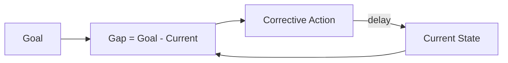

# Balancing Feedback Loop

**Phase:** Systems · **Source:** https://untools.co/balancing-feedback-loop

## Entry Predicate
`∃ cycle ∈ connection-circles.cycles : type = balancing` — only run if a balancing cycle exists.

## Inputs
- `frameworks/connection-circles.md::cycles`

## Method
For each balancing cycle:
1. Identify the **goal** (the target value the cycle drives toward).
2. Identify the **gap** (current state vs goal).
3. Identify the **corrective action** (the cycle's response).
4. Estimate the **delay** in the loop (response time).
5. Find the **leverage**: change the goal? Change the gain? Reduce the delay?

## Output Schema (mermaid + table)

| Loop | Goal | Gap | Action | Delay | Leverage |
|---|---|---|---|---|---|
| ... | ... | ... | ... | ... | ... |

## Decision Hook
Leverage point becomes a candidate intervention. Common patterns:
- **Shift the goal** = highest leverage but politically expensive
- **Reduce delay** = often cheap and high-impact
- **Change the gain** = direct but resisted by the system

## What This Means For The Decision
Balancing loops resist change. Decisions that try to push the current state without shifting the goal will be reverted by the loop. Pick interventions that change the structure, not the symptom.
