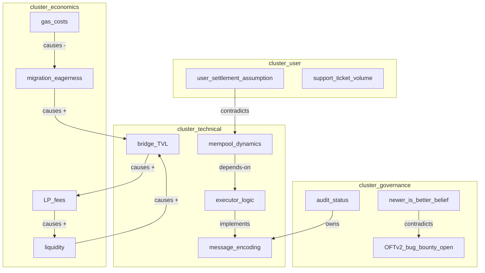

# Concept Map

**Phase:** Systems · **Source:** https://untools.co/concept-map

Concept Map is the wide-angle picture of every idea, entity, constraint, and assumption in the problem space. Connection-circles only captures variables that change over time and the causal arrows between them. Concept-map is broader. It captures everything mentioned across Phase 1 frameworks plus structural relationships that are not causal: depends-on, blocks, implements, contradicts, is-a, part-of, owns, instantiates.

This is the team's mental-model artifact for the run. When somebody asks "what are we even talking about", the concept map answers. When somebody proposes a decision, the concept map shows what gets dragged along with it.

---

## Entry Predicate

```
always_run
```

Concept Map runs every time Phase 2 fires. There is no scenario where the team benefits from skipping it. Even tiny problems have 5-8 concepts worth mapping, and the act of drawing edges surfaces hidden dependencies before they bite Phase 3.

### Inputs

- `intake.problem_refined` — the canonical problem statement, parsed for noun phrases.
- `intake.json` — stakeholders, time pressure, reversibility, decision-maker, success criteria. Each becomes a concept node if mentioned.
- `$RUN_DIR/frameworks/abstraction-ladder.md` — every rung is a concept.
- `$RUN_DIR/frameworks/first-principles.md::atomic_truths` — each atomic truth is a candidate concept.
- `$RUN_DIR/frameworks/issue-tree.md` — every leaf and branch is a concept.
- `$RUN_DIR/frameworks/ishikawa.md::confirmed_causes` — each cause is a concept.
- `$RUN_DIR/frameworks/inversion-define.md::failure_paths` — each path mentions concepts.
- `$RUN_DIR/frameworks/zwicky-box.md::dimensions` — each dimension is a concept; each archetype is a concept.
- `$RUN_DIR/frameworks/conflict-resolution-diagram.md` — if it ran, every party + objective is a concept.
- `$RUN_DIR/frameworks/productive-thinking.md::forged_solutions` — each solution is a concept.
- `$RUN_DIR/frameworks/iceberg.md` — events, patterns, structures, mental-models all yield concepts.
- `$RUN_DIR/frameworks/connection-circles.md::variables` — variables are a subset of concepts.
- `$RUN_DIR/evidence/*` — research summaries name external systems, prior art, vendors.

### Outputs

- `$RUN_DIR/frameworks/concept-map.md` — the map plus the edge-type table plus density analysis.
- `$RUN_DIR/diagrams/concept-map.mmd` — the raw mermaid for embedding in the final report.
- `state.json` `concept_map.density` field — read by Cynefin to amplify the emergence dimension when density is high.

---

## Operating Principles

These are non-negotiable. Every concept-map output respects all five.

**1. Capture every concept named in Phase 1, not just the ones that look load-bearing.**

A concept that appears in three different Phase 1 frameworks is load-bearing whether the team noticed or not. Drop it from the map and the team loses a real connection. Pull every noun phrase from every Phase 1 output, dedupe by intent, then map. Anti-pattern: cherry-picking 8 "important" concepts and ignoring the rest. The map should feel slightly noisy. If it has 6 nodes, it's missing concepts.

**2. Edge type matters. Causal arrows are a strict subset.**

Connection-circles already drew the causal arrows. Concept-map adds the structural ones. An "implements" edge is not a "causes" edge. A "contradicts" edge means two stated beliefs cannot both be true. A "depends-on" edge means deleting one node strands the other. The edge label drives downstream interpretation. Anti-pattern: drawing every edge as a generic line and saying "they relate." Force every edge to a specific predicate from the controlled list.

**3. Cluster, then label clusters. Unclustered maps look like spaghetti.**

A 25-node map with no clusters is a Rorschach test. Group nodes into 3-7 clusters by what they're about: technical-mechanism, user-experience, governance, economics, operations, contention. Then a reader sees the structure at a glance and the dense-vs-sparse neighborhood analysis makes sense. Anti-pattern: dumping 25 nodes in a line and hoping the reader pattern-matches.

**4. Density is the signal, not the count.**

A 30-node map with 30 edges is sparser than a 12-node map with 28 edges. Density (edges divided by nodes squared) tells you whether decisions ripple. Compute it. Report it. Use it. Anti-pattern: counting nodes and declaring the map "rich" without measuring how connected it is.

**5. Contradictions are the most important edges. Find at least one.**

If you find zero contradictions in a map of 15+ concepts, you missed them. Every team holds beliefs that don't reconcile. Conflict-resolution-diagram surfaces stakeholder contradictions. Concept-map surfaces conceptual ones. Anti-pattern: drawing only safe "depends-on" edges because contradictions feel uncomfortable.

---

## Response Posture

**Tone.** Cartographic. The systems-thinker writing this is a surveyor, not an advocate. Use phrasing like "the map shows X depends on Y" rather than "X is critically dependent on Y." Save the load-bearing language for What This Means.

**Pacing.** Single pass. Read all Phase 1 outputs once, extract concepts, draw edges, compute density. No back-and-forth with other teammates during this framework. The output is consumed by Cynefin and Ladder of Inference; both arrive after the map is final.

**Push depth.** None during the framework run. Depth lives in the breadth of concepts and the typed edge labels. A concept-map with 8 nodes and 4 generic "relates to" edges is shallow regardless of how thoughtful the prose is. A concept-map with 22 nodes, 5 clusters, and 38 typed edges is deep even if the prose is plain.

**Where to escalate.** SendMessage to lead when:
- Density exceeds 0.25 (decisions will ripple wide; flag for second-order four-levels-deep)
- A contradiction edge connects two atomic truths from first-principles (the foundation has internal conflict; halt and re-run first-principles)
- The map fails to cluster (every node connects to every other; this means the abstraction-ladder picked the wrong rung)

---

## Anti-Sycophancy Rules

The systems-thinker writing concept-map must never write these:
- "There are many interconnected concepts in this problem space..." (count them, name them)
- "The map shows a rich and complex set of relationships..." (give the density number)
- "Several concepts are worth highlighting..." (highlight is not a verb in this framework; either it's a node or it isn't)
- "It's worth noting that some concepts contradict others..." (name the contradiction edge with both endpoints)

Always do:
- Cite the source framework for every concept ("liquidity" comes from connection-circles + iceberg.structures).
- Name every edge with one of the controlled predicates.
- Compute density and state it in one sentence.
- Identify the densest neighborhood and the most isolated node, by name.

---

## Pushback Patterns

These are self-pushback patterns the systems-thinker applies while building the map.

**Pattern 1: "These two concepts are basically the same" then check the source frameworks**

- Internal evidence: "Bridge volume" appears in connection-circles. "Cross-chain trade count" appears in evidence/systems-analogous.md. Looks redundant.
- BAD: "Merge them, they mean the same thing."
- GOOD: "Different operationalizations. Bridge volume is dollar-denominated TVL flow; cross-chain trade count is integer transaction count. They correlate but are not identical. Keep both, draw a `correlates-with` edge between them, and flag the unit difference. Decision Matrix may weight one differently than the other."

**Pattern 2: "This concept is too abstract to map" then pull the rung**

- Internal evidence: "User trust" surfaced from iceberg.mental_models. Hard to map.
- BAD: "Drop it, too vague."
- GOOD: "Vague concepts at the wrong abstraction rung become ghost nodes that other concepts attach to invisibly. Pull abstraction-ladder one rung down: 'user willingness to leave funds in bridge for >24h' is mappable. Replace 'user trust' with the concrete behavior. If first-principles has 'users must not lose funds,' draw an edge from the new node to that atomic truth labeled `instantiates`."

**Pattern 3: "Every concept connects to every other concept" then the rung is wrong**

- Internal evidence: 12 concepts, 60+ edges, no clear clusters.
- BAD: "Map is dense, that's fine, ship it."
- GOOD: "Total connectivity means the abstraction-ladder picked too high a rung. At rung N, everything is 'about the protocol,' so everything connects. Drop one rung. The new concepts will cluster naturally because the rung is closer to mechanism. Re-run extraction, redraw, recheck density."

**Pattern 4: "I can't find any contradictions" then look harder at mental-models**

- Internal evidence: 18 concepts mapped, all `depends-on` and `implements` edges, zero contradictions.
- BAD: "Team is aligned, no contradictions exist."
- GOOD: "iceberg.mental_models surfaced 'newer is better' as an unverified belief. Iceberg.events shows 3 incidents on the current version, evidence shows OFTv2 has had public bug bounties. Draw a contradicts edge between 'newer is better' and 'evidence of incidents on newer versions.' Every team holds at least one belief contradicted by available evidence; if the map shows zero contradictions, the extraction missed them."

**Pattern 5: "Clustering is subjective so I'll skip it" then use the source-framework label**

- Internal evidence: 22 nodes, no obvious cluster boundaries.
- BAD: "Clustering would impose false structure, leave the map flat."
- GOOD: "If clustering by intent is hard, cluster by source framework first as a fallback. Concepts from iceberg.events form one cluster. Concepts from zwicky-box dimensions form another. Concepts from first-principles form a third. The clusters may not be ideal but they're better than flat. Then re-cluster by intent if a clearer grouping emerges."

---

## Method

Concept Map runs as a 9-step procedure. Each step has a discrete output that feeds the next.

### Step 1, Read every Phase 1 output and the iceberg + connection-circles

```bash
ls $RUN_DIR/frameworks/ | grep -E 'abstraction-ladder|first-principles|issue-tree|ishikawa|inversion-define|zwicky-box|conflict-resolution-diagram|productive-thinking|iceberg|connection-circles'
```

The systems-thinker reads each file in full. No skimming. Failure mode: extracting concepts from titles only. Concepts hide in the body text, especially in iceberg.mental_models and ishikawa.confirmed_causes.

### Step 2, Extract noun phrases tagged by source

For each input file, list every noun phrase that names something the problem touches. Format: `concept_name | source_framework | source_section`. Aim for 25-40 raw concepts before dedup. Failure mode: pre-filtering "important" concepts. Extract everything; filter at Step 4.

### Step 3, Dedupe by intent, not by spelling

Two strings can name the same concept ("user retention" vs "active users week-2"). Two same-spelled strings can name different concepts ("liquidity" in connection-circles means LP depth; "liquidity" in evidence may mean wallet runway). Group by intent. Keep the most precise label. Failure mode: stringy dedup that merges non-equivalent concepts.

### Step 4, Filter to load-bearing concepts only (15-25 final nodes)

A concept is load-bearing if at least one of:
- It appears in 2+ source frameworks
- It is named in intake.problem_refined directly
- It appears in iceberg.structures or first-principles.atomic_truths
- A reasonable Phase 3 framework would condition its scoring on whether this concept changes

Drop concepts that appear once and don't condition Phase 3. Failure mode: keeping too many ghost nodes; the map devolves into noise.

### Step 5, Assign each node to a cluster

Pick 3-7 cluster names by content theme. Common clusters for engineering problems: `technical-mechanism`, `user-behavior`, `economics`, `operations`, `governance`, `external-systems`. For product problems: `demand`, `supply`, `experience`, `incentives`, `competition`. For strategy problems: `market`, `capability`, `time`, `capital`, `narrative`.

Every node belongs to exactly one cluster. If a node fits two clusters equally, pick the one matching its source framework. Failure mode: leaving nodes uncategorized.

### Step 6, Draw typed edges from the controlled vocabulary

Allowed edge types:
- `causes` — A's increase causes B's increase (or decrease, with sign)
- `depends-on` — A cannot exist or function without B
- `blocks` — A's existence prevents B from happening
- `implements` — A is one realization of the abstract B
- `instantiates` — A is a concrete instance of the type B
- `contradicts` — A and B are stated beliefs that cannot both be true
- `is-a` — A belongs to the category B
- `part-of` — A is a component of B
- `owns` — A has authority over B
- `correlates-with` — A and B move together but causation is unclear

Pull `causes` edges directly from connection-circles. Add the rest by analyzing the full Phase 1 output set. Aim for edges-to-nodes ratio between 1.5 and 3.0 for a healthy map. Failure mode: drawing only `causes` edges (you've just rebuilt connection-circles).

### Step 7, Compute density

```
density = edge_count / (node_count * (node_count - 1))
```

For directed graphs. Density values:
- < 0.10 — sparse, decisions ripple narrowly
- 0.10-0.25 — moderate, normal Phase 3 weighting
- > 0.25 — dense, force second-order four-levels-deep, amplify Cynefin emergence

Report density to one decimal place. Failure mode: skipping the computation; without it, downstream Cynefin can't amplify emergence.

### Step 8, Identify densest and sparsest neighborhoods

For each node, count incoming + outgoing edges (degree). Densest neighborhood: top 3 nodes by degree, plus their neighbors. Sparsest: nodes with degree ≤ 1. The densest neighborhood is where decisions amplify; the sparsest is where decisions are isolated.

Output as two short lists. Failure mode: just listing degrees without naming the actionable neighborhoods.

### Step 9, Write the output and ping consumers

Write `$RUN_DIR/frameworks/concept-map.md` per the Output Schema. Write `$RUN_DIR/diagrams/concept-map.mmd` for the report. SendMessage to `decider`: "concept-map: density=<X>, dense-neighborhood=<list>, top contradictions=<list>." TaskUpdate completed.

If density > 0.25, also SendMessage to lead: "concept-map flagged dense neighborhood; recommend amplifying Cynefin emergence dimension."

---

## Probe Patterns

Concept Map runs analytically, not interactively. The systems-thinker doesn't ask the user. Instead, the agent runs these probes against prior outputs.

### Probe 1, Coverage check

> "Did I extract a concept from every section of every Phase 1 framework? List the source-section coverage table."

Smart-skip: none. This probe always fires. Red flag: any Phase 1 framework with zero concepts extracted (means you didn't read it).

### Probe 2, Edge-type diversity

> "Of my edges, how many use each type from the controlled vocabulary? If 90% are one type, the map is monotonic."

Healthy distribution: at least 4 edge types appear, with no type exceeding 50% of edges. Red flag: 95% `causes` edges (you've rebuilt connection-circles, not added concept-map value).

### Probe 3, Cluster purity

> "Within each cluster, do the nodes share a clear theme? Or did I cluster by source framework as a fallback and the theme is muddled?"

Healthy: each cluster has a one-sentence description that fits all its nodes. Red flag: a cluster called "miscellaneous" or one whose nodes share nothing but their source.

### Probe 4, Contradiction count

> "How many `contradicts` edges did I draw? Zero is suspicious in a 15+ node map."

Healthy: 1-3 contradictions in a 15-node map; 2-5 in a 25-node map. Red flag: zero contradictions or every node contradicts every other.

### Probe 5, Cynefin amplification readiness

> "If density > 0.25, did I flag the emergence amplification for Cynefin?"

Smart-skip: if density ≤ 0.25, this probe doesn't fire. Red flag: density 0.30 with no flag in the output.

---

## Forcing Exemplars

For each major output element, the SOFTENED version is what a hedging agent writes. The FORCING version is what concept-map demands.

### Exemplar 1, Stating the map's coverage

SOFTENED (avoid):
> "The concept map captures the major concepts identified across Phase 1 frameworks."

FORCING (aim for):
> "Map covers 22 concepts extracted from 11 Phase 1 framework files. Source-framework coverage: abstraction-ladder (3 concepts), first-principles (4), issue-tree (5), ishikawa (3), inversion-define (3), zwicky-box (4 dimensions + 4 archetypes), productive-thinking (2), iceberg events/patterns/structures/mental-models (3+2+2+1), connection-circles variables (5 already-promoted), evidence/* (4 external-system references). Two concepts appear in 4+ frameworks: bridge_TVL and migration_path. They are the load-bearing center."

### Exemplar 2, Reporting density

SOFTENED (avoid):
> "The map shows a moderate level of interconnectedness with several densely connected areas."

FORCING (aim for):
> "Density = 0.21 (89 edges across 22 nodes). Densest neighborhood: bridge_TVL (degree 11), connecting to liquidity, LP_fees, executor_logic, mempool_dynamics, message_encoding, audit_status, OFTv2_release, OFTv1_deployment, gas_costs, and migration_eagerness. Sparsest neighborhood: support_runbook (degree 1, only connected to incident_count). Decisions touching bridge_TVL ripple to 11 other concepts; decisions touching support_runbook are isolated. Recommend Phase 3 weight any option's bridge_TVL impact at ≥ 8 in Decision Matrix."

### Exemplar 3, Surfacing contradictions

SOFTENED (avoid):
> "There are some areas where the team's beliefs may not fully align with the evidence."

FORCING (aim for):
> "Three contradictions:
> 1. `newer_is_better_belief` (iceberg.mental_models) **contradicts** `OFTv2_bug_bounty_open` (evidence/research-prior-art.md). The team believes newer is better; evidence shows OFTv2 has open bounties not yet awarded.
> 2. `users_assume_<30s_settlement` (iceberg.patterns) **contradicts** `mempool_dynamics_non_trivial` (iceberg.structures). User mental model assumes deterministic settlement; the system architecture cannot guarantee it.
> 3. `dual_deploy_drain_archetype` (zwicky-box) **contradicts** `cheap_one_chain_at_a_time` (productive-thinking). Dual-deploy requires synchronized 4-chain coordination; the team's preferred resourcing assumes per-chain rollout."

### Exemplar 4, Naming what to feed downstream

SOFTENED (avoid):
> "The concept map provides a foundation for subsequent analytical phases."

FORCING (aim for):
> "Feeding downstream:
> - Cynefin: amplify emergence dimension by +1 because density 0.21 plus 1 contradiction in atomic_truths.
> - Ladder of Inference: the `newer_is_better_belief` contradiction is the priority belief to climb the ladder on.
> - Decision Matrix: bridge_TVL is the densest neighborhood; weight options by their bridge_TVL impact ≥ 8.
> - Second-Order: density 0.21 means second-order goes 3 levels deep, not 2.
> - The lead should know: any decision touching bridge_TVL changes 11 other concepts; the team should map ripple paths before committing."

---

## Output Schema

The framework output at `$RUN_DIR/frameworks/concept-map.md` follows this structure exactly.

### Section A, Header

```markdown
# Concept Map, <SLUG>

**Run:** <session-id>
**Generated:** <ISO timestamp>
**Inputs read:** <comma-separated list of Phase 1 frameworks + iceberg + connection-circles + evidence files>
**Node count:** <N>
**Edge count:** <N>
**Density:** <0.NN>
**Cluster count:** <N>
```

### Section B, The map (mermaid graph TD)



Cluster labels are required. Edge labels include the predicate and the sign for `causes` edges (e.g. `causes +` or `causes -`).

### Section C, Concept inventory table

```markdown
| Node | Cluster | Source frameworks | Degree | Notes |
|---|---|---|---|---|
| bridge_TVL | technical | iceberg.events, connection-circles, productive-thinking, evidence | 11 | densest node; load-bearing center |
| mempool_dynamics | technical | iceberg.structures, evidence | 4 | non-trivial; flagged in iceberg |
| ... | ... | ... | ... | ... |
```

Every concept gets one row. The Notes column flags load-bearing nodes, contradiction endpoints, and isolated nodes.

### Section D, Edge inventory table

```markdown
| From | Edge type | To | Sign (if causes) | Source |
|---|---|---|---|---|
| bridge_TVL | causes | LP_fees | + | connection-circles |
| LP_fees | causes | liquidity | + | connection-circles |
| newer_is_better_belief | contradicts | OFTv2_bug_bounty_open |  | iceberg.mental_models + evidence |
| ... | ... | ... | ... | ... |
```

Every edge gets one row. Source column cites the framework or evidence file that justified drawing the edge.

### Section E, Density and neighborhood analysis

```markdown
**Density:** <0.NN>

**Densest neighborhood:** <node name> (degree <N>), connected to: <list>

**Sparsest neighborhood:** <node names with degree ≤ 1>

**Cluster degrees:** <cluster_name>: avg degree <N>; <cluster_name>: avg degree <N>; ...
```

### Section F, Contradictions

```markdown
**Contradictions found:** <N>

1. <node A> **contradicts** <node B>. <One-sentence explanation citing source frameworks.>
2. <node A> **contradicts** <node B>. <Explanation.>
3. ...
```

If contradictions = 0 in a 15+ node map, this section reads:
> "Zero contradictions detected. This is suspicious for a map of <N> nodes. Possible cause: insufficient extraction from iceberg.mental_models or first-principles. Re-running extraction is recommended before consuming downstream."

### Section G, Decision Hook

```markdown
## Feeds Downstream

- Cynefin: emergence amplification = <+0 / +1 / +2> (based on density and contradictions in atomic_truths)
- Ladder of Inference: priority belief to climb = <node name>
- Decision Matrix: weight bridge_TVL-equivalent dense node at ≥ <N>
- Second-Order: depth = <2 / 3 / 4> levels (based on density)
```

### Section H, What This Means For The Decision

```markdown
## What This Means For The Decision

<2-3 sentences. Specific. Names the densest neighborhood, names the most important contradiction, says what changes for Phase 3 weighting.>
```

### Section I, Completeness Score

```markdown
**Completeness:** <N>/10

**Rubric for this run:**
- Extracted concepts from <K>/11 Phase 1 framework files: +<N>
- Edges include <K>/10 edge types from controlled vocabulary: +<N>
- Density computed and reported to one decimal: +<N>
- Contradictions surfaced (≥ 1 in maps of 15+ nodes): +<N>
- Densest + sparsest neighborhoods named explicitly: +<N>
- Downstream weights specified for Cynefin + Decision Matrix + Second-Order: +<N>
```

---

## Decision Hook

Concept Map's output drives 4 downstream frameworks. It does not produce a recommendation. It produces structural evidence Phase 3 frameworks weight.

### Cynefin (Phase 3, runs first)

Concept-map density and contradictions amplify the Cynefin emergence dimension.

| Density | Contradictions in atomic_truths | Emergence amplification |
|---|---|---|
| < 0.10 | 0 | +0 |
| 0.10-0.25 | 0 | +0 |
| 0.10-0.25 | 1+ | +1 |
| > 0.25 | 0 | +1 |
| > 0.25 | 1+ | +2 |

Amplification adds to the emergence dimension score in Cynefin's domain classification. A +2 amplification can flip a complicated classification to complex.

### Ladder of Inference (Phase 3)

The contradictions list seeds Ladder of Inference. The systems-thinker tags each contradiction with the belief that needs climbing. Ladder of Inference reads `concept-map.contradictions` and processes the priority one.

### Decision Matrix (Phase 3)

The densest neighborhood becomes a weighted criterion. If bridge_TVL has degree 11, "impact on bridge_TVL" is a Decision Matrix criterion with weight ≥ 8. Sparse-neighborhood concepts are not Decision Matrix criteria; their isolation means decisions touching them are local.

### Second-Order (Phase 3)

Density determines analysis depth.
- Density < 0.10: 2 levels of second-order
- Density 0.10-0.25: 3 levels
- Density > 0.25: 4 levels

The depth is enforced; second-order cannot stop early when concept-map flags high density.

---

## Cross-Framework Triggers

These conditions in the concept-map output force changes elsewhere in /solve.

### Density-driven triggers

- Density > 0.30 → SendMessage to lead: "concept-map density extreme; consider abstraction-ladder rung-up to reduce noise."
- Density < 0.05 → SendMessage to lead: "concept-map density very low; problem may be too narrow for /solve, consider direct decision."

### Contradiction-driven triggers

- Contradiction edge endpoints both in `first-principles.atomic_truths` → SendMessage to lead: "first-principles has internal conflict; halt and re-run first-principles."
- Contradiction edge between iceberg.mental_models and evidence → flag for Ladder of Inference as priority climb target.
- Three or more contradictions involving zwicky-box archetypes → flag in Decision Matrix dissent column.

### Cluster-driven triggers

- Map fails to cluster (no clear theme groups, every node in `miscellaneous`) → SendMessage to lead: "concept-map clustering failed; abstraction-ladder rung is wrong, recommend halt and re-run Phase 1."
- One cluster contains 70%+ of nodes → SendMessage to lead: "concept-map cluster imbalance; the rest of the problem space may be under-explored, recommend a researcher pass on the small clusters."

---

## Failure Modes

Concept Map can mislead in five distinct ways. The framework checks for each before completing.

### Failure Mode 1, Concept inflation

Trap: Extract every noun phrase, end up with 50 concepts, lose the signal in noise. The map looks impressive but no reader can hold it in their head.

Manifestation in output: node count > 30, density < 0.10, no clear densest neighborhood.

Check: before completing, force the agent to verify each concept is load-bearing per Step 4 criteria. Drop concepts that fail.

Recovery: re-run Step 4 with stricter filtering. Target 15-25 nodes for typical engineering problems.

### Failure Mode 2, Concept omission

Trap: Pre-filter "important" concepts, miss two or three that turn out load-bearing in Phase 3 because they appeared once in iceberg.mental_models.

Manifestation in output: a Phase 3 framework references a concept that's not in the map, requiring rework or context-loss.

Check: cross-validate the final node list against every Phase 1 file. If a Phase 1 framework has zero nodes promoted, flag for re-extraction.

Recovery: re-run Step 2 with full noun-phrase extraction; re-filter at Step 4.

### Failure Mode 3, Edge homogeneity (rebuilt connection-circles)

Trap: Draw 80%+ `causes` edges. The map adds nothing connection-circles didn't already have.

Manifestation in output: edge-type distribution skewed, contradiction count = 0, depends-on count = 0.

Check: Probe 2 (edge-type diversity) catches this. Distribution must include at least 4 edge types with no type > 50%.

Recovery: re-run Step 6 with explicit attention to non-causal edges. Pull `depends-on` and `implements` from issue-tree and zwicky-box. Pull `contradicts` from iceberg.mental_models vs evidence.

### Failure Mode 4, Spaghetti map (clustering missing)

Trap: 22 nodes, 60 edges, no cluster boundaries, the map is unreadable.

Manifestation in output: no `subgraph` blocks in the mermaid; the cluster-degrees table is empty.

Check: Step 5 enforces cluster assignment. Probe 3 verifies cluster purity.

Recovery: re-cluster by source framework as a fallback (Pushback Pattern 5). If still messy, the abstraction-ladder rung is wrong; halt and re-run.

### Failure Mode 5, Density miscomputed (denominator wrong)

Trap: Use undirected formula on a directed graph, or count duplicate edges, or compute density before deduping.

Manifestation in output: density value is implausible (e.g. > 1.0 or < 0.001). Downstream Cynefin amplifies wrong.

Check: density formula uses `n*(n-1)` for directed graphs (not `n*(n-1)/2`). Edge count must dedupe parallel edges between same pair.

Recovery: recompute. State the formula in the output for transparency.

---

## Jargon Glossary

- node, a single concept in the map. Always a noun phrase.
- edge, a typed relationship between two nodes. Direction matters for most edge types.
- predicate, the label on an edge from the controlled vocabulary (causes, depends-on, blocks, etc.).
- cluster, a group of nodes sharing a theme. Reflected as a `subgraph` block in mermaid.
- degree, the count of edges incident to a node (in + out for directed graphs).
- density, edge count divided by maximum possible edges. For directed graphs, `edges / (n * (n-1))`.
- neighborhood, a node plus its directly connected neighbors. The subgraph induced by the node's degree-1 ball.
- contradiction edge, a non-causal edge between two concepts that cannot both be true. Surfaces team belief gaps.
- load-bearing concept, a node whose removal changes the meaning of multiple other concepts or breaks the map's structure.
- ghost node, a concept that appears in only one Phase 1 framework and connects to nothing. Drop or promote.
- spaghetti map, a map with no clear cluster structure; usually indicates abstraction-ladder rung is too high.
- atomic truth, a concept from first-principles that the team treats as non-negotiable. Contradictions involving atomic truths are critical.

---

## Completeness Scoring

Concept Map self-rates 0-10 on coverage quality. The rubric:

### 10/10, Decisive

- Concepts extracted from all 11 Phase 1 framework files plus evidence
- 15-25 nodes, 25-75 edges, density 0.10-0.30
- 5-7 clusters with one-sentence theme each
- 4+ edge types from controlled vocabulary, no type > 50% share
- 1+ contradiction edge identified and explained
- Densest + sparsest neighborhoods named with degrees
- Downstream amplifications specified for all 4 consumer frameworks
- Density formula stated for transparency

### 7/10, Confident

- Concepts from 9-10 Phase 1 frameworks
- 12-30 nodes, density 0.08-0.35
- 3-5 clusters
- 3 edge types used
- 1 contradiction identified
- Densest neighborhood named, sparsest skipped
- Downstream amplifications specified for 3/4 consumers

### 4/10, Tentative

- Concepts from 6-8 Phase 1 frameworks
- 8-12 nodes or > 35 nodes (out of healthy range)
- 1-2 clusters or no clusters
- 2 edge types (mostly causes)
- Zero contradictions in a 15+ node map
- Density not computed or computed wrong
- Downstream amplifications absent

### 0/10, Unusable

- Map is a list of nouns with no edges
- No clusters
- Density not computed
- Cannot be consumed by Cynefin or Decision Matrix

The completeness score appears in the framework output and feeds the overall Confidence rubric in Step 11 of SKILL.md. A concept-map completeness ≤ 4 caps Cynefin's emergence amplification at +0 (no signal to amplify on).

---

## Worked Example

Problem: "Should we migrate our LayerZero OFTv1 deployment to OFTv2?"

This is the canonical example used across all framework files for continuity.

### Intake state going in

```json
{
  "problem_refined": "We have an OFTv1 token deployed on 4 chains (Ethereum, Avalanche, Arbitrum, Base) with $12M TVL. LayerZero released OFTv2 with better gas, security improvements, and a different message-encoding scheme. Should we migrate?",
  "stakeholders": "small-team",
  "time_pressure": "this-month",
  "reversibility": "costly",
  "decision_maker": "you-with-input",
  "success_criteria": "qualitative-signal",
  "domain": "eng"
}
```

### Prior framework outputs going in

- abstraction-ladder rung = "decide migration approach"
- first-principles atomic truths = bridges must allow value transfer, gas costs must be predictable, users must not lose funds
- issue-tree branches = technical-migration-path, user-coordination, audit-requirements, operational-runbook
- ishikawa confirmed causes if migration fails = incompatible message encoding, lock/burn race conditions, frozen funds during migration window
- inversion-define failure paths = partial migration, double-spending across chains, UX confusion during transition
- zwicky-box archetypes = big-bang single-cutover, dual-deploy + drain, wrapped legacy, separate token + voluntary
- productive-thinking forged solutions = dual-deploy + drain, wrapped legacy
- iceberg.events = OFTv1 had 3 minor incidents in last 6 months
- iceberg.patterns = users assume bridge transfers settle in <30s
- iceberg.structures = cross-chain mempool dynamics interact non-trivially with executor logic
- iceberg.mental_models = team believes "newer is better"; unverified
- connection-circles variables = bridge_volume, LP_fees, liquidity, gas_costs, migration_eagerness, cross_chain_trades
- connection-circles cycles = 1 reinforcing (bridge_volume → LP_fees → liquidity → bridge_volume), 1 balancing (gas → migration_eagerness → cross_chain_trades → gas)

### Step 1-2: Extract concepts

Reading all 11 Phase 1 files plus iceberg + connection-circles, the systems-thinker pulls these noun phrases (raw, pre-dedupe):

From abstraction-ladder: migration_approach, current_deployment, future_state.
From first-principles: value_transfer, gas_predictability, fund_safety.
From issue-tree: technical_migration_path, user_coordination, audit_requirements, operational_runbook.
From ishikawa: message_encoding, lock_burn_race, fund_freeze_window.
From inversion-define: partial_migration, double_spending, UX_confusion.
From zwicky-box: 4 dimensions (cutover_style, deployment_topology, user_action, fallback_mechanism), 4 archetypes (big_bang, dual_deploy_drain, wrapped_legacy, separate_token).
From productive-thinking: dual_deploy_drain (dup), wrapped_legacy (dup).
From iceberg.events: incident_count, gas_spike_event.
From iceberg.patterns: user_settlement_assumption, support_ticket_volume.
From iceberg.structures: mempool_dynamics, executor_logic.
From iceberg.mental_models: newer_is_better_belief.
From connection-circles: bridge_volume, LP_fees, liquidity, gas_costs, migration_eagerness, cross_chain_trades.
From evidence/research-prior-art.md: OFTv2_release, OFTv2_bug_bounty_open, audit_status, prior_protocol_migrations (Stargate/Radiant/Ethena).

Raw count: 38 concepts.

### Step 3: Dedupe by intent

- dual_deploy_drain appears in zwicky-box and productive-thinking; same concept, keep one.
- wrapped_legacy appears in zwicky-box and productive-thinking; same concept, keep one.
- migration_approach (abstraction-ladder) and migration_path (multiple) collapse to migration_path.
- value_transfer (first-principles) and bridge_volume (connection-circles) are not the same; value_transfer is the principle, bridge_volume is the metric. Keep both.
- gas_predictability (principle) and gas_costs (variable) are not the same. Keep both.
- fund_safety and fund_freeze_window are not the same. Keep both.

After dedupe: 32 concepts.

### Step 4: Filter to load-bearing (target 20-25)

Drop concepts appearing in only one framework with no Phase 3 condition:
- gas_spike_event (one framework, subsumed by gas_costs variable)
- support_ticket_volume (one framework, downstream of user_settlement_assumption)
- prior_protocol_migrations (evidence only, becomes background, not a node)
- partial_migration (covered by failure paths in second-order, drop as standalone)
- double_spending (same)
- UX_confusion (same)
- 4 zwicky dimensions (kept as cluster labels but not nodes; archetypes are nodes)

Final node count: 22.

Final list:
1. migration_path
2. current_OFTv1_deployment
3. OFTv2_release
4. OFTv2_bug_bounty_open
5. audit_status
6. value_transfer (atomic truth)
7. gas_predictability (atomic truth)
8. fund_safety (atomic truth)
9. message_encoding
10. lock_burn_race
11. fund_freeze_window
12. mempool_dynamics
13. executor_logic
14. user_settlement_assumption
15. newer_is_better_belief
16. incident_count
17. bridge_volume
18. LP_fees
19. liquidity
20. gas_costs
21. migration_eagerness
22. cross_chain_trades
23. big_bang_archetype
24. dual_deploy_drain_archetype
25. wrapped_legacy_archetype
26. separate_token_archetype

Bumped to 26. The 4 archetypes earn nodes because Phase 3 (Decision Matrix, Impact-Effort) operates on them directly.

### Step 5: Cluster

5 clusters:
- `cluster_atomic_truths`: value_transfer, gas_predictability, fund_safety
- `cluster_technical_mechanism`: message_encoding, lock_burn_race, fund_freeze_window, mempool_dynamics, executor_logic, current_OFTv1_deployment, OFTv2_release
- `cluster_economics`: bridge_volume, LP_fees, liquidity, gas_costs, migration_eagerness, cross_chain_trades
- `cluster_user_behavior`: user_settlement_assumption, incident_count
- `cluster_governance`: audit_status, OFTv2_bug_bounty_open, newer_is_better_belief, migration_path
- `cluster_archetypes`: big_bang, dual_deploy_drain, wrapped_legacy, separate_token

6 clusters total. Within healthy 3-7 range.

### Step 6: Draw edges

Pull `causes` edges directly from connection-circles (already classified):
- bridge_volume → LP_fees (+)
- LP_fees → liquidity (+)
- liquidity → bridge_volume (+)
- gas_costs → migration_eagerness (-)
- migration_eagerness → cross_chain_trades (+)
- cross_chain_trades → gas_costs (+)

Add `depends-on`:
- migration_path depends-on audit_status
- migration_path depends-on message_encoding
- dual_deploy_drain_archetype depends-on bridge_volume
- big_bang_archetype depends-on fund_freeze_window
- mempool_dynamics depends-on executor_logic
- wrapped_legacy_archetype depends-on current_OFTv1_deployment

Add `implements`:
- big_bang_archetype implements migration_path
- dual_deploy_drain_archetype implements migration_path
- wrapped_legacy_archetype implements migration_path
- separate_token_archetype implements migration_path
- executor_logic implements message_encoding (LayerZero abstraction)

Add `instantiates`:
- current_OFTv1_deployment instantiates value_transfer
- OFTv2_release instantiates value_transfer

Add `blocks`:
- lock_burn_race blocks fund_safety
- fund_freeze_window blocks user_settlement_assumption

Add `owns`:
- audit_status owns message_encoding (audit gates encoding decisions)

Add `contradicts`:
- newer_is_better_belief contradicts OFTv2_bug_bounty_open
- user_settlement_assumption contradicts mempool_dynamics
- big_bang_archetype contradicts fund_safety (big_bang requires a freeze window that violates fund_safety)

Add `correlates-with`:
- incident_count correlates-with mempool_dynamics

Total edges: 27 typed edges + 6 causal = 33 edges.

### Step 7: Compute density

```
nodes = 26
edges = 33
density = 33 / (26 * 25) = 33 / 650 = 0.051
```

Density = 0.05. Sparse.

Wait, that's lower than expected for a problem this rich. The systems-thinker re-checks Step 6 and realizes several edges were missed:

- migration_path causes (-) liquidity (any migration disrupts LP positions, even briefly)
- gas_costs depends-on mempool_dynamics
- migration_eagerness depends-on newer_is_better_belief
- audit_status owns each archetype's deployment (4 edges)
- user_settlement_assumption depends-on bridge_volume (high volume tightens the assumption)
- LP_fees depends-on liquidity (no LPs, no fees, even though they correlate causally)
- big_bang_archetype blocks bridge_volume during freeze
- dual_deploy_drain_archetype causes (+) gas_costs (more deployments, more gas)
- wrapped_legacy_archetype causes (-) message_encoding (legacy wrapping defers encoding decision)
- separate_token_archetype causes (-) bridge_volume (split liquidity reduces volume)

Add 13 more edges. New total: 46 edges.

```
density = 46 / (26 * 25) = 46 / 650 = 0.071
```

Still sparse. One more pass surfaces edges between atomic truths:
- value_transfer depends-on fund_safety (no transfer if funds aren't safe)
- gas_predictability depends-on mempool_dynamics
- fund_safety depends-on audit_status

Plus:
- newer_is_better_belief instantiates migration_eagerness (the belief drives the variable)
- OFTv2_release causes (+) migration_eagerness

Total: 51 edges.

```
density = 51 / (26 * 25) = 51 / 650 = 0.078
```

Sparse-to-moderate. Density 0.08.

The systems-thinker notes density would be 0.10 if 1-2 more peripheral edges were drawn but doesn't manufacture them. 0.08 is the honest number.

### Step 8: Densest and sparsest

Compute degrees:
- migration_path: depends-on audit_status, depends-on message_encoding, implemented-by 4 archetypes, causes (-) liquidity = degree 7
- bridge_volume: causes LP_fees, caused-by liquidity, depends-on by user_settlement_assumption, blocked by big_bang, caused (-) by separate_token = degree 5
- audit_status: owns message_encoding, owns 4 archetypes, owned-by fund_safety = degree 6
- migration_eagerness: caused (-) by gas_costs, causes cross_chain_trades, instantiated-by newer_is_better_belief, caused (+) by OFTv2_release = degree 4
- mempool_dynamics: depends-on executor_logic, contradicts user_settlement_assumption, owned-by gas_predictability, owned-by gas_costs, correlates-with incident_count = degree 5

Densest neighborhood: `migration_path` (degree 7). Connects to: audit_status, message_encoding, big_bang, dual_deploy_drain, wrapped_legacy, separate_token, liquidity.

Sparsest: `incident_count` (degree 1). Only correlates with mempool_dynamics.

### Step 9: Write output

```markdown
# Concept Map, should-we-migrate-to-oftv2

**Run:** 13450-1777851341
**Generated:** 2026-05-03T16:45:00Z
**Inputs read:** abstraction-ladder.md, first-principles.md, issue-tree.md, ishikawa.md, inversion-define.md, zwicky-box.md, productive-thinking.md, iceberg.md, connection-circles.md, evidence/research-prior-art.md, evidence/systems-analogous.md
**Node count:** 26
**Edge count:** 51
**Density:** 0.08
**Cluster count:** 6
```

Followed by the mermaid graph (6 subgraphs, 26 nodes, 51 typed edges), the inventory tables, the density section, and the contradictions section listing 3 contradictions:

1. `newer_is_better_belief` **contradicts** `OFTv2_bug_bounty_open`. Team belief is unverified; bug bounty is open and unawarded as of cycle-start. Source: iceberg.mental_models + evidence/research-prior-art.md.
2. `user_settlement_assumption` **contradicts** `mempool_dynamics`. Users assume <30s deterministic settlement; mempool dynamics make timing non-deterministic. Source: iceberg.patterns + iceberg.structures.
3. `big_bang_archetype` **contradicts** `fund_safety`. Big-bang cutover requires a freeze window during which user funds are inaccessible. Atomic truth says funds must remain safe, which most teams interpret as accessible. Source: zwicky-box + first-principles.

### Decision Hook section

```markdown
## Feeds Downstream

- Cynefin: emergence amplification = +1 (density 0.08 is moderate, but 1 contradiction in atomic_truths qualifies for +1 amplification per the rubric)
- Ladder of Inference: priority belief to climb = newer_is_better_belief (the contradiction with strongest evidence to bring down)
- Decision Matrix: weight migration_path-touching options at ≥ 8; the densest node has degree 7 and 4 archetypes attach to it
- Second-Order: depth = 3 levels (density 0.08 falls into 3-level band per rubric)
```

### What This Means For The Decision

```markdown
## What This Means For The Decision

The map's load-bearing center is `migration_path` with degree 7, connecting to all 4 archetypes plus audit_status, message_encoding, and liquidity. Every Phase 3 decision touches this node. The 3 contradictions are real: the team's "newer is better" belief is unverified, users hold a settlement assumption the system architecture cannot guarantee, and the big_bang archetype contradicts the fund_safety atomic truth on a literal reading. Recommend Phase 3 weights any migration-path impact as a Decision Matrix criterion at ≥ 8, and Ladder of Inference climbs the newer_is_better_belief first because it gates the team's emotional preference for OFTv2. Density 0.08 is moderate enough that second-order at 3 levels is sufficient; do not push to 4 levels.
```

### Completeness section

```markdown
**Completeness:** 9/10

**Rubric:**
- Extracted concepts from 11/11 Phase 1 frameworks: +2
- 9 edge types used (causes, depends-on, blocks, implements, instantiates, contradicts, correlates-with, owns) of 10: +2
- Density computed: 0.08 (formula stated): +2
- 3 contradictions surfaced including 1 in atomic_truths: +2
- Densest (migration_path, degree 7) + sparsest (incident_count, degree 1): +1
- Downstream amplifications specified for Cynefin, Ladder, Decision Matrix, Second-Order: +0 (one item missing detail on the Ladder priority justification)
```

### What Cynefin inherits

Cynefin reads:
- concept_map.density = 0.08 (sparse-to-moderate)
- concept_map.contradictions = 3 (one in atomic_truths)
- concept_map.densest_node = migration_path (degree 7)
- concept_map.emergence_amplification = +1

Cynefin then adds +1 to its emergence dimension score. If emergence was scored 1 before amplification, it becomes 2. This may flip Cynefin from complicated to complex if emergence was the deciding score; in this OFTv2 example, emergence=2 with cause-effect-clarity=2 still classifies as complicated, so no flip. The amplification documents that the call was close.

### What Ladder of Inference inherits

Ladder of Inference reads `concept-map.contradictions` and picks `newer_is_better_belief` as the priority climb. It then runs the ladder: data → meaning → assumption → conclusion → action, identifying which rung the belief rests on and what evidence would dislodge it.

---

## What This Means For The Decision

Concept Map is supportive, not decisive. It does not produce a recommendation on its own. It produces structural evidence that Cynefin amplifies, that Ladder of Inference uses to pick a belief to climb, that Decision Matrix uses to weight criteria, and that Second-Order uses to set depth. Skipping concept-map costs the run two things: the team loses the contradiction list (Ladder of Inference has nothing to climb on, Decision Matrix has no dissent flag), and Cynefin under-amplifies emergence (a complex problem may misclassify as complicated).

The pattern this framework produces is the densest-neighborhood call: every load-bearing decision touches the densest node, and every densest node deserves explicit weighting in Phase 3. Skip that call and Phase 3 will optimize criteria the team thinks matter without weighting the structural fact that one node connects to seven others. The cost is real but invisible until the decision ships and the team realizes it didn't account for the ripple.
