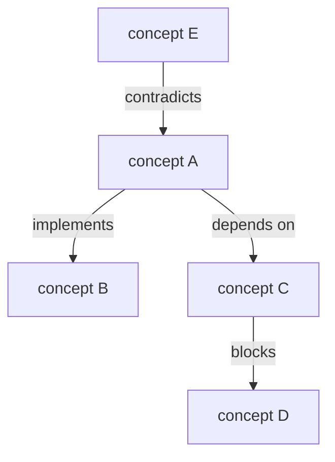

# Concept Map

**Phase:** Systems · **Source:** https://untools.co/concept-map

## Entry Predicate
`always_run` — broader than connection circles; includes non-causal relationships (is-a, part-of, depends-on).

## Inputs
- All Phase 1 outputs
- `frameworks/connection-circles.md` (subsumes its variables)

## Method
1. List **all concepts** mentioned across Phase 1 + research.
2. Cluster into 3-7 groups.
3. Draw labeled edges: each edge has a **predicate** (e.g. "depends on", "blocks", "implements", "contradicts").
4. The map covers more than causal — it captures structural relationships.

## Output Schema (mermaid)

## Decision Hook
The concept map is the **mental model artifact** for the team. Any decision that contradicts the map should require explicit justification (via Ladder of Inference in Phase 3).

## What This Means For The Decision
If the decision lives in a dense neighborhood of the map (lots of edges), implications ripple wide — second-order analysis becomes critical. Sparse neighborhoods can be moved cheaply.
