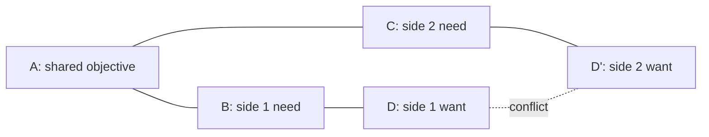

# Conflict Resolution Diagram (Evaporating Cloud)

**Phase:** Define · **Source:** https://untools.co/conflict-resolution-diagram

## Entry Predicate
`intake.stakeholders ≠ "single-decider"` — run only when ≥ 2 parties pull in different directions.

## Inputs
- `intake.stakeholders`
- `intake.problem_refined`

## Method
1. Identify the **shared objective** (A) — the thing both sides actually want.
2. Identify each side's **need** (B, C) — what the side believes it must have to reach A.
3. Identify each side's **want** (D, D') — the concrete action each side proposes; these conflict.
4. List **assumptions** linking each pair: A↔B, A↔C, B↔D, C↔D', D↔D'.
5. Find the assumption that, if false, **evaporates** the conflict.

## Output Schema (mermaid)

Plus assumption table:

| Edge | Assumption | Test |
|---|---|---|
| A→B | "side 1 needs B because..." | how could this be false? |
| D↔D' | "they truly conflict because..." | what if both could happen? |

## Decision Hook
The evaporating assumption becomes a **decision option** ("reframe so D and D' both work"). Feed to Decision Matrix.

## What This Means For The Decision
Most conflicts aren't real — they sit on a false assumption. CRD finds it. If no assumption evaporates, the conflict is structural and Hard Choice applies.
