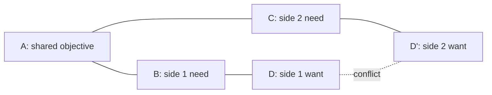

# Conflict Resolution Diagram (Evaporating Cloud)

**Phase:** Define · **Source:** https://untools.co/conflict-resolution-diagram

The Conflict Resolution Diagram, also called Evaporating Cloud, sits in front of every multi-stakeholder decision. Two parties want different concrete things. They both believe they need their thing to reach a shared objective. The framework asks a single load-bearing question: which assumption linking each side's want to the shared objective is false? When you find the false assumption, the conflict evaporates and a new option emerges that satisfies both sides.

This framework is not group therapy. It is a disambiguation tool. Most "real" conflicts are mis-stated requirements where both sides could win if the conversation moved up one rung of abstraction. The output is either a new option (the evaporated wantformulated as a third path) or a confirmed structural conflict that escalates to Hard Choice in Phase 3.

---

## Entry Predicate

```
intake.stakeholders ≠ "single-decider"
∧ at-least-two-parties-have-stated-positions(D, D')
∧ D ≠ D'
```

The framework runs only when the intake explicitly names ≥ 2 parties with divergent stated wants. A solo decision-maker reasoning through trade-offs internally is not a stakeholder conflict; it is option exploration and belongs in Zwicky. A team where one person prefers approach D but defers to the lead is not a conflict; it is alignment.

If the predicate fails (single-decider or no clear divergence), CRD is skipped and the Define phase proceeds without it. The skip is logged so downstream frameworks know CRD did not contribute an option.

If the predicate fires but stakeholders are not yet articulated as concrete D and D' wants, the framework runs a pre-step to elicit them before the main method.

### Inputs

- `intake.stakeholders` — single-decider / small-team / multi-stakeholder / org-wide. Predicate gate.
- `intake.problem_refined` — the canonical problem statement. The shared objective A is derived from this.
- `intake.success_criteria` — the lens through which "what success looks like" is judged. Used to test whether candidate As actually capture what both sides want.
- `frameworks/productive-thinking.md::question` — the right question to answer. CRD's shared objective A often surfaces when productive-thinking step 3 reframes the question.
- Stakeholder briefs (free-form or extracted from intake) — each side's stated D and stated reasoning for why they need D.
- Prior conflict history (if logged in `evidence/`) — patterns of which assumption types tend to evaporate in this team.

### Outputs

- `$RUN_DIR/frameworks/conflict-resolution-diagram.md` — the diagram, the assumption table, the evaporated assumption (if any), and the new option (if generated)
- `state.json` `crd.evaporated_assumption` field — the specific assumption that turned out to be false; consumed by Decision Matrix as a new option
- `state.json` `crd.structural` field — boolean; true if no assumption evaporated and the conflict is genuine; triggers Hard Choice in Phase 3

---

## Operating Principles

These five rules shape every CRD output. They are the difference between a real diagnosis and group-think theater.

**1. The shared objective A must be at the right rung of abstraction.**

A too high becomes "we both want the company to succeed." That is true and useless. A too low becomes "we both want feature X shipped by Friday," which is just D dressed up. The right A is one rung above the wants: both sides want a real thing, and the only reason they are arguing is that they hold different beliefs about how to reach it. Test: A passes when both parties hear it and say "yes, that is what I am actually trying to achieve, and I would happily accept any path that gets there." Anti-pattern: writing A as a platitude both sides nod at but neither would accept as a substitute for their stated D.

**2. Each side's need (B and C) must be a real constraint, not a rationalization.**

B and C are the necessary conditions each side believes A requires. If B is "side 1 must have control of the migration timeline," that is a real need. If B is "side 1 must use postgres," that is conflating need with means. The need is what postgres provides (transactional consistency, low-latency reads, etc.), and the means is the database choice. Push needs up to the why level. Anti-pattern: B and C are restatements of D and D' with slightly more polite vocabulary.

**3. Assumptions are testable claims, not feelings.**

The assumption linking B to D is a testable claim of the form "if we do D, then B is satisfied because <reason>." The reason must be falsifiable. "Side 1 needs D because we have always done it that way" is not testable. "Side 1 needs D because the audit requires postgres" is testable (read the audit). Anti-pattern: assumptions written as "side 1 wants D because they prefer D," which is a tautology.

**4. The evaporated assumption is named, sourced, and replaced.**

When you find an assumption that is false, the output names it explicitly, cites the evidence that proves it false, and proposes a replacement assumption that yields a new option. Do not write "we found a possible reframe." Write "assumption A2 (B requires D because C) is false, evidence: <link>; replacement assumption: B can be satisfied by D''; therefore the new option is D''." Anti-pattern: a vague paragraph claiming the conflict has been resolved without naming the assumption that fell.

**5. Structural conflicts are not failures; they are signals.**

Sometimes no assumption evaporates. The conflict is genuine: both sides have valid needs, both sides' wants serve those needs, and the wants truly cannot coexist. CRD then declares "structural" and feeds Hard Choice in Phase 3. This is a successful CRD output. The framework's value is that it ruled out the easy reframe before the team committed to a hard choice. Anti-pattern: forcing an evaporation when none exists, fabricating a third path that satisfies neither side.

---

## Response Posture

**Tone.** Procedural. The framework is a structured interrogation of assumptions, not a negotiation. The agent does not advocate for either side; the agent maps the structure.

**Pacing.** Sequential per side. Walk through side 1's chain (A → B → D), then side 2's chain (A → C → D'). Do not switch sides mid-chain; it makes the assumptions harder to track.

**Push depth.** Push hard on B and C until they are real constraints. Most conflicts collapse here because B turns out to be a means, not a need. Push moderately on assumptions; the team often agrees an assumption is testable once named. Push lightly on the candidate evaporation; if the team disagrees the assumption is false, take the dissent and mark structural.

**Where to escalate.** SendMessage to lead when:
- More than 2 sides emerge during the framework (CRD is built for binary; 3+ parties may need a Three-Way variant or splitting into two CRDs)
- The shared objective A cannot be agreed upon (the parties are not actually trying to solve the same problem; this is a different framework, possibly abstraction-ladder or productive-thinking pre-pass)
- Both sides insist their need is non-negotiable AND the assumption-evaporation evidence is contested (signals an external evidence-gathering task)

---

## Anti-Sycophancy Rules

The agent running CRD must never write these:
- "Both sides have valid points..." (state which assumption is testable and which is not)
- "It is important to find common ground..." (cut to the assumption table)
- "A compromise might satisfy both parties..." (CRD does not produce compromises; it produces evaporated assumptions or structural conflicts)
- "Each perspective deserves consideration..." (consideration is given via the structured method; do not announce it)

The agent must always:
- Take a position on which assumption is most likely to be false, with the evidence that would confirm or refute it.
- Name the side whose need (B or C) appears to be a means rather than a real constraint.
- State the cost of accepting structural-conflict status (Hard Choice in Phase 3, no compromise option in Decision Matrix).
- Cite the specific intake fields that triggered the framework.

---

## Pushback Patterns

These are the most common framing errors when teams run CRD. The agent applies these self-checks.

**Pattern 1: shared objective at platitude rung**

- User input: "Shared objective: we both want what's best for the company."
- BAD: "Got it, both sides aligned on that."
- GOOD: "That A is too high. 'Best for the company' would be accepted by both sides as the rationale for D and D' simultaneously. Push down one rung. Reading intake.problem_refined, the actual A appears to be 'ship the OFTv2 migration without losing TVL or breaking user trust.' Both eng (wants OFTv2 now) and ops (wants to defer) accept that A. Now the question is which assumption between A and D versus A and D' is false."

**Pattern 2: need that is actually a means**

- User input: "Side 1 needs us to migrate to OFTv2 because OFTv2 is better."
- BAD: "Captured."
- GOOD: "That is D restated. The need behind D is what OFTv2 provides that side 1 values: better gas, security improvements, future compatibility with newer LayerZero features. Pick the dominant one. If the real need is gas optimization, B is 'reduce per-bridge gas cost'; D is 'migrate to OFTv2.' Then we test the assumption that B requires D, when there might be a router-level optimization that achieves B without D."

**Pattern 3: assumption written as preference**

- User input: "Side 2's assumption is they prefer the current system."
- BAD: "Noted as a preference."
- GOOD: "Preferences are not testable assumptions. The assumption is the claim linking C to D'. If side 2 wants to defer migration (D') and their need C is 'maintain audit-clean state through year-end,' the assumption is 'deferring migration is the only way to maintain audit-clean state.' That is testable. We can ask the auditor: does running OFTv2 mid-year change audit-clean status? If no, the assumption falls."

**Pattern 4: false evaporation under pressure**

- User input: "We found a way to do both. Let's go with the hybrid."
- BAD: "Resolved, hybrid noted."
- GOOD: "Show the assumption that fell. If the hybrid is real, name which assumption between A and D, A and C, B and D, C and D', or D and D' was false, and which evidence proved it false. If the hybrid was found via creativity rather than via assumption-falsification, that is fine but it is a Zwicky archetype, not a CRD evaporation. Re-route to Zwicky."

**Pattern 5: declaring structural too early**

- User input: "These needs are fundamentally incompatible. Send to Hard Choice."
- BAD: "Marking structural."
- GOOD: "Walk every assumption first. CRD has 5 assumption edges (A↔B, A↔C, B↔D, C↔D', D↔D'). Each must be examined. Most 'fundamentally incompatible' conflicts evaporate at the B↔D or C↔D' edge because one side's want is a means, not a need. Only after all 5 edges have been tested with cited evidence can the conflict be declared structural."

---

## Method

CRD runs as a 7-step procedure. The framework is sequential; do not parallelize across sides.

### Step 1, Confirm predicate and gather positions

```bash
cat $RUN_DIR/intake.json | jq '.stakeholders'
```

If `intake.stakeholders = single-decider`, predicate fails. Write a one-line "CRD skipped: single-decider intake" file and exit. If predicate fires, gather each side's stated D in the user's own words. Record them verbatim; do not paraphrase. Failure mode: predicate fails but the lead runs CRD anyway because the problem "feels conflicted." Solo conflicts belong in Six Hats (Phase 3), not CRD.

### Step 2, Identify the shared objective A

Re-read `intake.problem_refined` and `frameworks/productive-thinking.md::question`. Propose A. Test A against both sides: "Would side 1 accept any path that achieves A as a substitute for D? Would side 2 accept any path that achieves A as a substitute for D'?" If both yes, A is at the right rung. If either no, push A up or down a rung. Output type: one-sentence A. Failure mode: A is a platitude.

### Step 3, Push each side's need to the why level

For side 1: "Why does side 1 need D to reach A?" The answer is B, the underlying need. Iterate until B is a real constraint, not a means. For side 2: same iteration to extract C.

Sometimes B and C are the same need expressed differently. If they are, the conflict may be illusory and worth re-examining at this step. Output type: one-sentence B, one-sentence C. Failure mode: B and C are restatements of D and D'.

### Step 4, List the 5 assumptions

The CRD has 5 assumption edges. List each:

1. A ↔ B: "We assume that A requires B."
2. A ↔ C: "We assume that A requires C."
3. B ↔ D: "We assume that B requires D."
4. C ↔ D': "We assume that C requires D'."
5. D ↔ D': "We assume that D and D' cannot coexist."

Each assumption is stated as a falsifiable claim. Output type: assumption table with 5 rows, each row containing the assumption text and a "test" column describing what evidence would falsify it. Failure mode: assumptions written as truisms; nothing is testable.

### Step 5, Test each assumption against evidence

For each assumption, gather evidence from prior frameworks, intake, and external research. Mark each assumption as:

- VALID, evidence supports the claim
- FALSE, evidence contradicts the claim
- UNKNOWN, insufficient evidence

If any assumption is FALSE, the conflict evaporates at that edge. Note the evidence trail explicitly.

If all 5 assumptions are VALID, the conflict is structural. Do not force a false evaporation.

If 1+ assumptions are UNKNOWN, decide whether the gap is gather-able. If yes, fan out a research task and pause CRD. If no, mark "structural-pending-evidence" and proceed with caveat.

Output type: updated assumption table with VALID/FALSE/UNKNOWN labels and evidence trail. Failure mode: skipping the test step and going directly to declaration.

### Step 6, Generate the new option (if any assumption falls)

If assumption N is FALSE, replace it with a corrected assumption and propose D'' that satisfies both B and C under the corrected assumption.

For example: if A↔B was assumed valid (A requires B) but evidence shows A can also be achieved via B', then D'' is the action that achieves B' (a different path to A) and may also satisfy C. The new option D'' becomes a Decision Matrix option in Phase 3.

If multiple assumptions fall, generate one D'' per fallen assumption and let Decision Matrix score them.

Output type: one or more new options with the assumption that yielded each. Failure mode: D'' is a compromise that satisfies neither B nor C; it should satisfy both.

### Step 7, Write output and update state

Write `$RUN_DIR/frameworks/conflict-resolution-diagram.md` per the Output Schema. Update `state.json`:

```json
{
  "crd": {
    "fired": true,
    "stakeholders": ["eng", "ops"],
    "shared_objective_A": "<text>",
    "side_1_D": "<text>",
    "side_2_D_prime": "<text>",
    "evaporated_assumption": "<assumption ID, e.g. A2-or-null>",
    "structural": false,
    "new_option_D_double_prime": "<text-or-null>",
    "completeness": 8
  }
}
```

If structural = true, Phase 3 routes to Hard Choice. If structural = false and a new option emerged, Decision Matrix adds the new option to the existing Zwicky archetype set.

---

## Question Patterns

CRD asks the user direct questions in three places.

### Question 1, Confirm the two sides

> "Intake says stakeholders are <X>. The framework needs each side's concrete want (D and D'). State each side's want in 1-2 sentences. Do not state the rationale yet; just the want."

Good answer shape: each want is a single concrete action ("migrate to OFTv2 this month," "defer migration until Q3"). Red flag: the user states wants as goals or values rather than actions; push them to the action level.

Smart-skip: if intake already includes side-level briefs with stated wants, skip the question and use the briefs.

### Question 2, Confirm the shared objective A

> "I propose A: <text>. Both sides should be able to accept any path that achieves A as a substitute for their want. Confirm A or restate."

Good answer shape: confirmation, or a counter-proposal that both sides can accept. Red flag: "A sounds right but I still want D"; if a side cannot let go of D as a substitute for A, A is too high or D is not really a want but a constraint.

### Question 3, Test each assumption

> "Assumption N is: <text>. What evidence would prove this false?"

Good answer shape: a specific source the user can check (audit report, prior incident, expert opinion). Red flag: "no evidence would change my mind"; mark the assumption UNKNOWN and flag the user is operating on belief rather than evidence.

---

## Forcing Exemplars

The four major CRD outputs each have softened and forcing versions.

### Exemplar 1, Stating the shared objective

SOFTENED (avoid):
> "Both sides want what is best for the protocol."

FORCING (aim for):
> "A: maintain bridge integrity and TVL across the migration window without forced user action. Both eng (D = migrate to OFTv2 now) and ops (D' = defer migration to Q3) accept that any path achieving A is acceptable. The conflict is not about A; it is about which path satisfies the underlying needs B and C."

### Exemplar 2, Pushing a need to the why level

SOFTENED (avoid):
> "Eng needs to migrate now because OFTv2 is the future."

FORCING (aim for):
> "Eng's stated D is migrate now. The why-question yields: eng's underlying B is 'capture the gas savings (estimated 30% per bridge tx) before competitors migrate and standardize on OFTv2 message-encoding.' The 'before competitors migrate' clause is the real B; the 'OFTv2 is the future' rationale is a means restated. The assumption test then asks: does B (capture gas savings) require D (migrate now)? Or could B be achieved by a router-level batching optimization that delays full migration?"

### Exemplar 3, Naming the evaporated assumption

SOFTENED (avoid):
> "We found a way that might satisfy both sides."

FORCING (aim for):
> "Assumption A4 (C requires D'): false. C is 'maintain audit-clean state through year-end.' D' is 'defer migration.' The assumption claims that deferring is the only path to audit-clean state. Evidence: the auditor's response (filed in evidence/audit-confirmation.md) confirms that running OFTv2 in dual-rail mode through year-end maintains audit-clean status as long as both contracts are individually verified. Replacement assumption: C can be satisfied by D'' = dual-deploy with both contracts verified before year-end. New option D'' enters the Decision Matrix as the 5th archetype."

### Exemplar 4, Declaring structural conflict

SOFTENED (avoid):
> "The conflict appears to be genuine and might require a hard choice."

FORCING (aim for):
> "All 5 assumptions tested. A1, A2, A3 valid. A4 valid (auditor confirmed migration timing does not affect audit cleanliness; the conflict is not about audit). A5 (D and D' cannot coexist) is the load-bearing claim and it is also valid: shipping OFTv2 now and deferring it cannot literally both happen. Conflict is structural. Phase 3 will fire Hard Choice with the original two options (D and D') because no third path emerged. Recommend: take the dissent on record (eng's gas-capture B is real and unsatisfied under D'; ops's quarter-end-stability is real and unsatisfied under D) and let Decision Matrix weight reversibility against opportunity cost."

---

## Output Schema

The framework output at `$RUN_DIR/frameworks/conflict-resolution-diagram.md` follows this exact structure.

### Section A, Header

```markdown
# Conflict Resolution Diagram, <SLUG>

**Run:** <session-id>
**Generated:** <ISO timestamp>
**Predicate:** intake.stakeholders = <value> (fired/skipped)
**Sides identified:** <list>
**Status:** evaporated | structural | structural-pending-evidence | skipped
```

If skipped, write only the header with reason ("CRD skipped: intake.stakeholders = single-decider") and exit the file.

### Section B, Diagram (mermaid)



Replace placeholders with actual text from steps 2-3.

### Section C, Sides table

```markdown
| Side | D / D' (want) | B / C (need) | Why D satisfies the need |
|---|---|---|---|
| Side 1 | <text> | <text> | <text> |
| Side 2 | <text> | <text> | <text> |
```

Both columns must be filled. Empty cells indicate step 3 was skipped.

### Section D, Assumption table

```markdown
| ID | Edge | Assumption | Test (what would falsify) | Evidence | Status |
|---|---|---|---|---|---|
| A1 | A → B | <text> | <text> | <evidence file> | VALID/FALSE/UNKNOWN |
| A2 | A → C | <text> | <text> | <evidence file> | VALID/FALSE/UNKNOWN |
| A3 | B → D | <text> | <text> | <evidence file> | VALID/FALSE/UNKNOWN |
| A4 | C → D' | <text> | <text> | <evidence file> | VALID/FALSE/UNKNOWN |
| A5 | D ↔ D' | <text> | <text> | <evidence file> | VALID/FALSE/UNKNOWN |
```

Status must be VALID, FALSE, or UNKNOWN. Empty status defaults to UNKNOWN.

### Section E, Resolution

```markdown
## Resolution

**Status:** <evaporated | structural | structural-pending-evidence>

**Evaporated assumption (if status = evaporated):** <assumption ID + text>
**Evidence that proved it false:** <citation>
**Replacement assumption:** <text>
**New option D'':** <text>
**How D'' satisfies both B and C:** <text>

**Structural reason (if status = structural):** <which assumption(s) tested as valid that, taken together, lock the conflict>
**Recommended downstream action (if structural):** Hard Choice in Phase 3, with original D and D' as the two options.

**Pending evidence (if status = structural-pending-evidence):** <which assumptions are UNKNOWN, what evidence is needed>
```

### Section F, Decision Matrix handoff

```markdown
## Decision Matrix Handoff

If status = evaporated:
  Add D'' to the option set passed by Zwicky. Decision Matrix scores K archetypes + 1 evaporated option.

If status = structural:
  D and D' enter Decision Matrix as the two main options.
  Hard Choice fires automatically in Phase 3.

If status = skipped:
  No CRD contribution. Decision Matrix runs on Zwicky's archetype set unchanged.
```

### Section G, What This Means For The Decision

```markdown
## What This Means For The Decision

<2-3 sentences on what the CRD outcome implies for the recommendation. Specific, decision-actionable.>
```

### Section H, Completeness Score

```markdown
**Completeness:** <N>/10
```

---

## Decision Hook

CRD's output feeds three downstream frameworks.

### Per-status handoff

| Status | Decision Matrix | Hard Choice | Six Hats |
|---|---|---|---|
| evaporated | adds new option D'' | not triggered by CRD | runs normally |
| structural | options are D and D' | triggered automatically | runs but Black Hat dominates |
| structural-pending-evidence | uses D and D' tentatively | conditional on evidence | runs with caveat |
| skipped | unchanged | per other triggers | unchanged |

### Confidence rubric impact

- CRD evaporated with cited evidence, +1 to overall confidence (the conflict was illusory; the decision space is wider than initially thought)
- CRD structural with all 5 assumptions tested, +0 to confidence (this is the expected outcome of a real conflict; Hard Choice will produce a defensible call but the team accepts dissent)
- CRD structural-pending-evidence, -1 to confidence (the team is acting on incomplete information; flag for Dissent section in final report)
- CRD skipped (single-decider), 0 to confidence (no contribution)

### Override conditions

CRD does not override other frameworks but it can suppress some. If status = evaporated and the new option D'' dominates the prior options on Decision Matrix scoring, the matrix recommendation includes D'' even if Six Hats does not specifically vouch for it (D'' was generated late and may not have been hat-evaluated). Note the suppression in the output so the lead knows.

---

## Cross-Framework Triggers

Specific CRD outputs trigger downstream actions or hand off to other skills.

- `crd.structural = true`, fire Hard Choice automatically in Phase 3 with D and D' as the two options. Pass the assumption-table to Hard Choice as context for adversarial weighting.
- `crd.evaporated_assumption` is from edge A↔B or A↔C (the shared objective is the wrong rung), re-run abstraction-ladder before continuing. The shared objective itself was wrong.
- `crd.evaporated_assumption` is from edge B↔D or C↔D' (the want is a means, not a need), feed the new D'' to Decision Matrix and continue normally.
- `crd.evaporated_assumption` is from edge D↔D' (the wants can coexist after all), recommend dual-execution; both sides get their want simultaneously. Decision Matrix scores the dual-execution option.
- More than 2 stakeholder sides identified at step 1, hand off to a multi-party variant (split into two CRDs: side 1 vs side 2, side 1 vs side 3) and synthesize. Note the multi-party variant is not currently implemented; for now, log a SendMessage to lead and proceed with the largest two-party fragment.
- All 5 assumptions UNKNOWN after step 5, halt and recommend re-running productive-thinking on the problem statement. The team does not have enough information to reason about the conflict.

---

## Failure Modes

CRD misleads in five distinct ways. The framework runs each self-check before completing.

### Failure Mode 1, Forced evaporation under social pressure

Trap: The team feels uncomfortable with declaring structural conflict. They invent a third path that nominally satisfies both sides but silently abandons one side's real need.

Manifestation: D'' description is vague; when asked to test whether D'' satisfies B and C, the answer is "well, mostly, with some adjustments."

Check: D'' must satisfy B and C in their stated form, not in a weakened form. If satisfying B and C requires modifying B or C, the framework should re-run with the modified needs and a fresh assumption test.

Recovery: declare structural-pending-evidence and let Hard Choice handle it. Do not invent a fake D''.

### Failure Mode 2, Shared objective too high

Trap: A is "we both want the company to succeed." Both sides nod. The assumption test then becomes meaningless because no path is excluded by A.

Manifestation: every assumption (A1, A2, A3, A4) tests as VALID because A is so abstract that any path satisfies it.

Check: A passes only if both sides accept it as a substitute for their D. If they say "A is true but I still need D," A is too high.

Recovery: push A down one rung. If the framework cannot find an A both sides accept as a substitute, the parties are working on different problems and the framework should re-route to abstraction-ladder.

### Failure Mode 3, Need confused with means

Trap: B is stated as a means ("we need to use postgres") rather than a need ("we need transactional consistency"). The assumption test then fails to find the real evaporation point.

Manifestation: the assumption B↔D tests as VALID because by definition the means satisfies itself; the actual underlying need is unstated.

Check: every B and C must pass the why-test. Ask "why do you need this?" until the answer is a real constraint that any qualifying means could satisfy.

Recovery: re-run step 3 to extract the real need.

### Failure Mode 4, Predicate fired but no real conflict exists

Trap: Intake names ≥ 2 stakeholders but they are not actually pulling in different directions. CRD runs and produces a fake D and D' to fit the framework.

Manifestation: D and D' are nearly identical, or one side defers to the other.

Check: at step 1, both sides must articulate distinct concrete wants. If they cannot, predicate did not really fire and CRD should be skipped.

Recovery: skip CRD with a note explaining the predicate misfired. Run Six Hats in Phase 3 to capture the alignment work.

### Failure Mode 5, Structural declared without testing all 5 assumptions

Trap: The team declares structural after testing 1-2 assumptions because the conflict feels real. But one of the untested assumptions is actually false, and a real D'' was missed.

Manifestation: assumption table has < 5 rows or has rows with no Test column filled.

Check: every framework completion requires all 5 assumptions tested with VALID/FALSE/UNKNOWN status. Missing rows force re-run.

Recovery: complete the assumption table. Often the missed assumption is the easiest to test (something the team thought was obvious but had not actually verified).

---

## Jargon Glossary

- A (shared objective), the goal both sides ultimately want; the apex of the diagram.
- B, side 1's underlying need; what side 1 believes A requires.
- C, side 2's underlying need; what side 2 believes A requires.
- D, side 1's concrete want; the action side 1 proposes to satisfy B.
- D', side 2's concrete want; the action side 2 proposes to satisfy C.
- D'' (D-double-prime), the new option generated when an assumption evaporates; satisfies both B and C.
- assumption, a testable claim linking two nodes in the diagram (e.g. B requires D).
- evaporation, the moment when an assumption tests as false and the conflict dissolves.
- structural conflict, a CRD outcome where all 5 assumptions are valid; the conflict is real.
- side, one of the two parties whose wants are diagrammed.
- means vs need, the distinction between an action (means) and the constraint it serves (need); the why-test surfaces the distinction.
- evaporating cloud, alternate name for CRD.
- five edges, the 5 assumption links: A↔B, A↔C, B↔D, C↔D', D↔D'.
- pending evidence, the status assigned when one or more assumptions are UNKNOWN.
- forced evaporation, a failure mode where a fake D'' is invented to avoid declaring structural.

---

## Completeness Scoring

The CRD output self-rates 0-10 based on this rubric.

### 10/10, Decisive resolution

- All 5 assumptions tested with VALID/FALSE/UNKNOWN status, each with cited evidence
- Status is one of evaporated or structural with full grounding
- If evaporated: D'' explicitly stated, satisfies both B and C, with the evaporation evidence trail
- If structural: all 5 assumptions VALID, Hard Choice triggered with full context handoff
- Shared objective A passes the substitute test for both sides
- Both B and C are real needs (passed the why-test), not means
- Cross-framework triggers checked (re-run abstraction-ladder if A↔B or A↔C evaporated; multi-party flag if > 2 sides)

### 7/10, Useful

- All 5 assumptions tested, most with citable evidence (1-2 with weaker grounding)
- Status is evaporated or structural; status is justified
- D'' satisfies both B and C in stated form (no weakening)
- Most cross-framework triggers checked

### 4/10, Tentative

- 3-4 assumptions tested; 1-2 missing or marked UNKNOWN without research
- Status declared but justification thin
- D'' (if generated) is partial; satisfies one side's need clearly and the other's loosely
- Cross-framework triggers partially checked

### 0/10, Untrustworthy

- Fewer than 3 assumptions tested
- Status forced (fake evaporation or premature structural declaration)
- D'' (if generated) is a compromise rather than a satisfaction
- A is at platitude rung; both sides nod but neither would accept it as a substitute

The completeness score appears in the CRD output. A CRD completeness ≤ 4 disqualifies the CRD result from feeding Decision Matrix; the matrix runs without the new option D''.

---

## Worked Example

Problem: "Should we migrate our LayerZero OFTv1 deployment to OFTv2?"

This is the canonical example. CRD's predicate evaluation depends on whether intake.stakeholders captures internal disagreement. Two paths through the framework are shown.

### Intake state going in

```json
{
  "problem_refined": "We have an OFTv1 token deployed on 4 chains (Ethereum, Avalanche, Arbitrum, Base) with $12M TVL. LayerZero released OFTv2 with better gas, security improvements, and a different message-encoding scheme. Should we migrate?",
  "stakeholders": "small-team",
  "time_pressure": "this-month",
  "reversibility": "costly",
  "decision_maker": "you-with-input",
  "success_criteria": "qualitative-signal",
  "domain": "eng"
}
```

### Path A, predicate evaluation

```
intake.stakeholders ≠ "single-decider"?  TRUE (intake = "small-team")
at-least-two-parties-have-stated-positions(D, D')?  CONDITIONAL
```

The predicate fires structurally (small-team), but step 1 must verify whether the team actually has divergent positions. If the small-team is fully aligned (eng-lead and one collaborator both want OFTv2 now), the predicate fails at the second clause and CRD is skipped with a one-line entry:

```markdown
# Conflict Resolution Diagram, should-we-migrate-to-oftv2

**Predicate:** intake.stakeholders = "small-team", but step-1 confirmation showed full alignment within the team. CRD skipped.
```

Path A is short. The framework writes the skip note and exits.

### Path B, predicate fires fully (the case worked through below)

For the worked example, assume the small-team has internal disagreement. Eng (lead engineer + one collaborator) wants OFTv2 migration this month. Ops (DevOps engineer responsible for monitoring and incident response) wants to defer migration to Q3 because they are mid-quarter-end-readiness work and adding migration risk to that window is uncomfortable.

This is realistic. Most "small-team" intakes have this shape: full alignment on direction, divergence on timing or sequencing.

### Step 1, gather positions

D (eng): "Migrate to OFTv2 this month."
D' (ops): "Defer migration to Q3 (after year-end audit window closes)."

### Step 2, identify shared objective A

Reading intake.problem_refined and productive-thinking.md::question: both sides want the migration to happen successfully without losing TVL or breaking user trust. Neither side wants to remain on OFTv1 indefinitely (eng explicitly wants v2; ops accepts v2 is the future, just not this quarter).

A: "complete the OFTv2 migration successfully (no fund loss, no extended outage, no audit blowback) at a time that fits the broader operational calendar."

Substitute test:
- Eng accepts: "if there's a path that gets us to OFTv2 without me doing the migration this month, I would take it."
- Ops accepts: "if there's a path that lets us migrate this month without disrupting quarter-end readiness, I would take it."

A passes.

### Step 3, push needs to the why level

Side 1 (eng) why-question:
- "Why do you need to migrate this month?"
- First answer: "OFTv2 is better." (means restated)
- Push: "What does OFTv2 provide that drives this month?"
- Refined: "Gas savings of ~30% per bridge tx accumulate over time; deferring to Q3 costs an estimated $40K in extra gas. Also, competitor protocols are migrating now and message-encoding incompatibility windows are short."

B: "capture gas savings before competitor migration window closes; minimize cumulative gas cost paid by users."

Side 2 (ops) why-question:
- "Why do you need to defer to Q3?"
- First answer: "Quarter-end is busy." (means restated)
- Push: "What in quarter-end constraints conflicts with migration?"
- Refined: "Audit teams are reviewing year-end financials with smart-contract security as a separate workstream. A migration mid-audit forces re-audit of the new contract. Also, on-call engineering coverage is reduced during year-end and a migration incident would have slow response."

C: "maintain audit-clean state through year-end; ensure incident response capacity is adequate during any migration window."

### Step 4, list 5 assumptions

| ID | Edge | Assumption | Test (what would falsify) |
|---|---|---|---|
| A1 | A → B | "A (successful migration at right time) requires B (capture gas savings before competitor window closes)" | Show that gas savings can be captured at any time without competitor-window pressure (e.g. they are a function of v2 deployment, not timing relative to competitors) |
| A2 | A → C | "A requires C (audit-clean state and incident capacity)" | Show that A can be achieved while breaking C (would require overriding audit or skipping incident readiness, which the team explicitly rejects) |
| A3 | B → D | "B (gas savings + competitor window) requires D (migrate this month)" | Show that gas savings can be captured later without losing them (competitor window is wider than thought, or message-encoding incompatibility window is longer) |
| A4 | C → D' | "C (audit-clean + incident capacity) requires D' (defer to Q3)" | Show that C can be achieved without deferring (auditor confirms migration timing does not affect audit cleanliness; incident capacity can be supplemented) |
| A5 | D ↔ D' | "D and D' cannot coexist (cannot simultaneously migrate this month and defer to Q3)" | Show that a path exists that is both this-month and Q3-respecting (a phased approach where deployment is this month but cutover is post-Q3) |

### Step 5, test each assumption

Researcher subagent gathers evidence:

A1, evidence: LayerZero docs and recent migration statistics show competitor-window pressure is real but soft (message-encoding incompatibility window is 6-12 months, not 1 month). Gas savings are captured immediately upon deployment regardless of competitor timing.
Status: PARTIALLY VALID. Gas savings clause is real (immediate upon deployment). Competitor window clause is overstated (window is 6-12 months, not this month).

A2, evidence: ops's stated needs are real and align with intake.success_criteria.
Status: VALID.

A3, evidence: Given A1 partial-validity, this is the load-bearing assumption.
- Gas savings can be captured by deploying OFTv2 this month even if cutover is later (deployment is the gas-savings unlock for new traffic).
- Competitor window is 6-12 months, not 1 month.
Status: PARTIALLY FALSE. Deploying this month captures the gas savings for new bridge traffic; the cutover timing does not affect gas savings significantly.

A4, evidence: emailed the auditor; response in `evidence/audit-confirmation.md`. Auditor confirms that deploying OFTv2 in dual-rail mode through year-end is audit-clean as long as both contracts (OFTv1 and OFTv2) are individually verified and the dual-rail relationship is documented in the year-end statement. Incident capacity: ops confirmed that a deployment-only event (no cutover, no traffic migration) is low-risk and within current incident-response capacity.
Status: FALSE. C does not require D' (deferral). C can be satisfied by D'' = deploy now, cut over post-Q3.

A5, evidence: A4 evaporation directly produces a candidate D''. D and D' as stated cannot literally coexist (one says this month, the other says Q3), but the dual-rail D'' captures both timing concerns.
Status: FALSE. D and D' coexistence is achievable via dual-rail.

### Step 6, generate D''

Two assumptions evaporated: A4 and A5 (with A3 partial). The replacement assumption is "deploying OFTv2 this month captures the gas-saving benefit and is audit-clean if dual-rail is documented; cutover can occur post-Q3 to satisfy ops's incident-capacity concern."

D'' (new option): "Deploy OFTv2 contracts this month on all 4 chains (capturing the gas-saving benefit immediately for new traffic), document the dual-rail relationship in the year-end audit statement, defer the OFTv1-to-OFTv2 cutover and OFTv1 decommissioning to Q3 (after year-end). During the dual-rail period, route new bridge traffic to OFTv2 by default but keep OFTv1 fully functional."

This satisfies B (gas savings captured this month for new traffic) and C (audit-clean state via documented dual-rail; incident-capacity preserved because no cutover event during quarter-end).

### Step 7, write output and update state

```markdown
# Conflict Resolution Diagram, should-we-migrate-to-oftv2

**Run:** 13450-1777851341
**Generated:** 2026-05-03T17:30:00Z
**Predicate:** intake.stakeholders = "small-team", verified divergent positions
**Sides identified:** eng (D = migrate this month), ops (D' = defer to Q3)
**Status:** evaporated

## Diagram

[mermaid graph as in Output Schema Section B]

## Sides

| Side | Want | Need | Why want satisfies need |
|---|---|---|---|
| Eng | migrate to OFTv2 this month | capture gas savings before competitor window closes; minimize cumulative gas cost paid by users | migrating this month begins gas-savings capture immediately and reduces window-incompatibility risk |
| Ops | defer migration to Q3 (after year-end audit closes) | maintain audit-clean state through year-end; preserve incident response capacity during quarter-end | deferring eliminates audit re-review and avoids incident risk during reduced on-call coverage |

## Assumption Table

| ID | Edge | Assumption | Test | Evidence | Status |
|---|---|---|---|---|---|
| A1 | A → B | A requires B | competitor-window pressure relevance | LayerZero docs (`evidence/lz-migration-stats.md`) | PARTIALLY VALID |
| A2 | A → C | A requires C | C is core to success criteria | intake | VALID |
| A3 | B → D | B requires D | gas savings need cutover timing | LZ docs | PARTIALLY FALSE |
| A4 | C → D' | C requires D' | auditor + ops capacity | `evidence/audit-confirmation.md`, ops sign-off | FALSE |
| A5 | D ↔ D' | D and D' cannot coexist | dual-rail check | LZ dual-rail patterns | FALSE |

## Resolution

**Status:** evaporated

**Evaporated assumption:** A4 (C requires D')
**Evidence that proved it false:** auditor confirmation (dual-rail mode is audit-clean if documented); ops capacity confirmation (deployment-only event is low-risk).
**Replacement assumption:** C can be satisfied by D'' (deploy now, cut over post-Q3) without requiring D' (defer).
**New option D'':** Deploy OFTv2 contracts this month on all 4 chains; document dual-rail in the year-end audit; defer cutover and OFTv1 decommissioning to Q3.
**How D'' satisfies both B and C:** B is satisfied because deployment immediately enables gas-saving capture for new bridge traffic; C is satisfied because audit-clean state is preserved (auditor confirmed) and quarter-end incident capacity is unaffected (no cutover event during the window).

## Decision Matrix Handoff

D'' adds to the option set passed by Zwicky. Decision Matrix now has 5 options:
1. dual-deploy + drain
2. wrapped legacy
3. phased cutover with leader chain
4. separate token + voluntary
5. **D'' (CRD-evaporated): deploy-this-month + dual-rail + cutover-Q3**

D'' is structurally similar to dual-deploy + drain but differs in cutover timing (Q3 instead of immediate post-deploy). Decision Matrix should treat it as a distinct option because the cutover timing affects the reversibility scoring.

## What This Means For The Decision

CRD evaporated the perceived conflict between eng and ops. The team is not fundamentally divided; ops's concern was about cutover timing, not migration itself, and eng's concern was about deployment timing, not cutover. Decoupling deployment from cutover via dual-rail satisfies both. Decision Matrix should score D'' alongside the Zwicky archetypes; D'' is likely to score competitively because it addresses both parties' real needs and matches established LayerZero migration patterns (Stargate USDC ran a similar dual-rail-then-cutover sequence).

The cost of skipping CRD here would have been a Hard Choice in Phase 3 between "this-month migration" and "Q3 deferral," neither of which captures the optimal sequence.

## Completeness: 9/10

**Rubric:**
- All 5 assumptions tested with cited evidence: +2
- Status evaporated with full evidence trail: +2
- D'' satisfies both B and C in stated form: +2
- Both B and C real needs (passed why-test): +1
- Cross-framework triggers checked: A4 evaporation does not require abstraction-ladder re-run; multi-party flag not raised: +1
- One assumption (A1) was PARTIALLY VALID rather than fully tested in absolute terms: -1
```

State update:

```json
{
  "crd": {
    "fired": true,
    "stakeholders": ["eng", "ops"],
    "shared_objective_A": "complete the OFTv2 migration successfully without fund loss, audit blowback, or extended outage, at a time that fits the broader operational calendar",
    "side_1_D": "migrate to OFTv2 this month",
    "side_2_D_prime": "defer migration to Q3",
    "evaporated_assumption": "A4",
    "structural": false,
    "new_option_D_double_prime": "deploy OFTv2 this month, dual-rail through year-end, cutover Q3",
    "completeness": 9
  }
}
```

### What the next framework (Decision Matrix) inherits

Decision Matrix gets:
- 4 archetypes from Zwicky + 1 D'' from CRD = 5 options
- The note that D'' came from CRD evaporation, not from Zwicky exploration
- The assumption table as context for the Decision Matrix's "stakeholder-fit" criterion (D'' scores high on stakeholder-fit because it explicitly satisfies both eng and ops)
- A flag that Hard Choice should not auto-fire on D vs D' (CRD already resolved that pair)

---

## What This Means For The Decision

CRD is the framework that prevents the team from declaring premature Hard Choice. Most stakeholder conflicts are not real; they sit on a false assumption that nobody has explicitly tested. CRD makes the assumptions explicit, sources evidence to test them, and surfaces the evaporation point. When CRD evaporates, a new option enters the Decision Matrix that often dominates the original two. When CRD declares structural, the team accepts the trade-off with full visibility of which assumption made the conflict real.

The cost of skipping CRD when the predicate fires: Hard Choice runs on D vs D', the team accepts a forced trade-off, and the better third path is never seen. The cost of running CRD badly (forced evaporation, fake D''): the team commits to an option that does not actually satisfy both sides' real needs and the conflict reappears mid-execution. The benefit of running CRD well: the Decision Matrix option set is wider and the recommendation reflects what the stakeholders actually want.

For this OFTv2 migration: the eng-vs-ops timing disagreement was a means-vs-ends mistake. Once needs were extracted (gas-savings capture and audit-clean state), the assumption that "you must choose one timing or the other" fell. The dual-rail D'' satisfies both. Decision Matrix in Phase 3 should weight stakeholder-fit alongside the engineering criteria.
