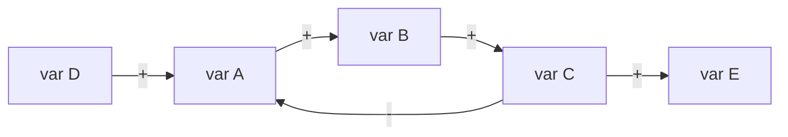

# Connection Circles

**Phase:** Systems · **Source:** https://untools.co/connection-circles

## Entry Predicate
`always_run`

## Inputs
- `frameworks/iceberg.md::patterns`
- `frameworks/iceberg.md::structures`
- `evidence/systems-*.md`

## Method
1. List 5-12 **variables** (things that change) relevant to the problem.
2. Place each on a circle (graph node).
3. Draw **directed edges**: A → B means "A increasing causes B to increase (or decrease — label `+`/`-`)".
4. Detect **cycles** programmatically (DFS).
5. For each cycle, classify: **balancing** (B) or **reinforcing** (R).

## Cycle Detection (formal logic)
A cycle is reinforcing iff `(count of negative edges in cycle) mod 2 == 0`.
A cycle is balancing iff `(count of negative edges in cycle) mod 2 == 1`.

## Output Schema (mermaid)

Plus cycle table:

| Cycle | Path | Type | Description |
|---|---|---|---|
| 1 | A→B→C→A | balancing | self-correcting goal-seeking |
| 2 | A→B→D→A | reinforcing | snowball |

## Decision Hook
- Each detected balancing cycle triggers `frameworks/balancing-loop.md`.
- Each detected reinforcing cycle triggers `frameworks/reinforcing-loop.md`.
- Variables with the most edges are **leverage points** — feed to Decision Matrix as candidate intervention sites.

## What This Means For The Decision
Decisions targeting high-degree variables (many edges) ripple farther. Decisions targeting reinforcing cycles can compound (good or bad). Balancing cycles resist change — choose interventions that shift the goal, not the gain.
