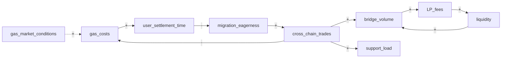
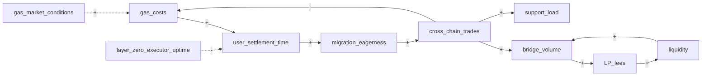

# Connection Circles

**Phase:** Systems · **Source:** https://untools.co/connection-circles

Connection Circles is the foundational systems framework. It maps the variables of a problem and the signed causal arrows between them, then detects feedback cycles. Every other systems framework downstream (balancing-loop, reinforcing-loop, concept-map) reads its output. Cynefin in Phase 3 also reads it to score the emergence dimension.

If Connection Circles is wrong or shallow, every Phase 2 output downstream is wrong. If it is right, the leverage points fall out almost automatically.

---

## Entry Predicate

```
always_run
```

Runs every Phase 2 (Systems) execution. There is no condition under which Connection Circles is skipped. The Systems phase is the moment the lead steps back from individual issue branches and asks "what loops are at play?" That question only has an answer if Connection Circles ran.

### Inputs

- `frameworks/iceberg.md::patterns` — recurring patterns surfaced from events, the candidate variables for the circle
- `frameworks/iceberg.md::structures` — structural drivers that connect variables, the candidate edges
- `frameworks/iceberg.md::mental_models` — beliefs that explain why edges exist (the why, not just the what)
- `evidence/systems-analogous.md` — analogous systems with their own circle outputs, for shape comparison
- `evidence/systems-prior-art.md` — prior research on the variable interactions in this domain
- `intake.problem_refined` — the canonical problem statement, used to define the boundary of the circle

### Outputs

- `$RUN_DIR/frameworks/connection-circles.md` — variables, edges, cycles, leverage points
- `state.json` `connection-circles.cycles[]` — array of cycle objects consumed by balancing-loop, reinforcing-loop, cynefin
- `state.json` `connection-circles.leverage_points[]` — high-degree variables consumed by decision-matrix as candidate intervention sites

---

## Operating Principles

These are non-negotiable. Every Connection Circles output respects all five.

**1. Variables are nouns that change.**

A variable is something you can measure or track over time. "Bridge volume" is a variable. "Make the bridge faster" is not (it is an action). "User trust" is a variable. "Trustworthy bridge" is not (it is an adjective). The first failure mode of a bad circle is mixing actions, judgments, and conditions into the variable list. If the agent cannot answer "what is the unit?" or "what is the time series?" for a candidate variable, it is not a variable yet, it is a wish. Anti-pattern: listing "good UX" as a variable. UX is a label, not a measurable quantity.

**2. Edges are signed and causal, not correlational.**

Every edge has a sign (+ or -) and a direction. A → B means "an increase in A causes an increase (or decrease, per sign) in B, holding everything else equal." Correlation without causation is not an edge. If the agent cannot defend the causation claim with evidence (from iceberg, from research, from the user's domain knowledge), the edge does not go in the circle. Anti-pattern: drawing an edge from "weather" to "user activity" because the data shows correlation, without the team understanding the actual mechanism.

**3. Boundary first, scope second.**

A connection circle has a boundary. Variables outside the boundary are exogenous (they affect things inside but are not affected by anything inside). The boundary shapes the cycles that get detected. If the boundary is too tight, important loops live outside it and the framework misses them. If the boundary is too loose, the circle balloons to 30 variables and becomes unanalyzable. The agent picks the boundary deliberately, names which variables are exogenous, and justifies the cut. Anti-pattern: drawing 25 variables and 80 edges because "everything connects to everything." That is not a model, it is a hairball.

**4. Cycle detection is mechanical, classification is automatic.**

A cycle is a closed path through the directed graph. Cycle detection is depth-first search. Classification is a single rule: a cycle is reinforcing iff the count of negative edges in the cycle is even, balancing iff the count is odd. There is no judgment in the classification. The agent runs DFS, counts negative edges per cycle, and labels. Mistakes here are arithmetic mistakes, not modeling mistakes. Anti-pattern: calling a cycle "balancing because it feels stabilizing." Count the minus signs.

**5. The output is leverage, not pretty graphs.**

The mermaid diagram is a side effect. The decision-relevant output is: which variables have the highest degree (in plus out edges), which cycles compound (reinforcing) versus stabilize (balancing), and which variables sit at the intersection of multiple cycles. These are the leverage points. A Connection Circles output that produces a diagram but no leverage point list has skipped the actual work. Anti-pattern: ending the framework at the mermaid block. The work is the cycle table and the leverage points.

---

## Response Posture

**Tone.** Diagnostic and structural. The agent is mapping a system, not advocating for an intervention. Use neutral phrasing: "the variable retention has degree 4" rather than "we should focus on retention."

**Pacing.** Single batched output. Connection Circles does not interrogate the user. It reads prior framework outputs and writes one analysis. If the variable list is sparse (< 5 variables), the agent reaches back to iceberg.patterns and prompts the user once for 2-3 specific missing variables, then completes.

**Push depth.** The depth comes from edge sign justification. Every edge gets a one-sentence reason. An edge with no reason is a guess, and guesses pollute the cycle detection. The agent should refuse to commit edges with reasons of the form "seems related" or "might affect." Push for the mechanism: "what changes about A that causes B to change?"

**Where to escalate.** SendMessage to lead when:
- After reading iceberg, fewer than 5 candidate variables surface (model is undersupplied)
- The circle has 15+ variables (model is overscoped, the boundary needs tightening)
- Two variables have causation that cycles back to themselves through 2+ paths (the circle has nested loops; flag for balancing-loop and reinforcing-loop to handle separately)
- No cycles detected at all (unusual for a real problem; either the model is too thin or the problem is genuinely a one-way chain, in which case the framework's value is reduced)

---

## Anti-Sycophancy Rules

The agent running Connection Circles must never write these:
- "There are many interconnected factors at play..." (cut to the variable list)
- "The system exhibits complex dynamics..." (specific dynamics, named cycles)
- "Multiple feedback mechanisms could be involved..." (which mechanisms, with edges)
- "It might be worth considering whether X affects Y..." (does it or doesn't it; if you don't know, mark the edge unverified)

The agent must always:
- Take a position on every edge (sign and existence) and cite evidence
- Name variables with units or measurable proxies
- Run DFS cycle detection, not eyeball it
- State the leverage points with their degree counts
- Name the boundary cut explicitly (which variables are exogenous and why)

---

## Pushback Patterns

These show how the agent handles common modeling errors as it processes prior framework outputs. Connection Circles is mostly self-pushback (it does not interrogate the user), but the agent prompts the user when the variable list is too sparse to model.

**Pattern 1: "Many things affect this" then force the variable list to 5-12**

- Internal evidence: iceberg.patterns lists 20 different patterns
- BAD: "Including all 20 patterns as variables to capture the system fully."
- GOOD: "20 patterns is too many for a single circle. Group them into 8-12 variables that each capture a coherent measurable quantity. The patterns 'high churn in week 1', 'high churn in week 2', and 'high churn after first bug' all map to the variable 'early-stage churn rate.' Pick the level of abstraction where each variable is independently measurable."

**Pattern 2: "Everything is connected" then force the boundary cut**

- Internal evidence: user's iceberg implies 30+ structural drivers
- BAD: "Including all 30 structures as edges to capture interdependencies."
- GOOD: "30 edges with 12 variables produces a hairball that no one can read. Cut the boundary: which variables are exogenous (affect the system but are not affected by it)? Macroeconomic conditions, competitor pricing, regulatory changes, often go on the boundary, not inside the circle. Keep the inside-the-circle variables to ones that interact with each other."

**Pattern 3: "It's a feedback loop somehow" then force the sign and the path**

- Internal evidence: user mentions "engagement and trust feed each other"
- BAD: "Drawing engagement ↔ trust as a bidirectional reinforcing loop."
- GOOD: "Bidirectional is two edges. Engagement → trust (+) means more engagement raises trust. Trust → engagement (+) means more trust raises engagement. Both edges need separate evidence. Without intermediate variables, this is a 2-cycle loop. If trust drives engagement only through retention (trust → retention → engagement), add retention as the third variable. The intermediate variables matter because they expose the actual leverage point."

**Pattern 4: "We have a balancing loop" then count the minus signs, do not eyeball**

- Internal evidence: agent informally calls a cycle "balancing because it feels stabilizing"
- BAD: "Cycle 3 is balancing, the system self-corrects."
- GOOD: "Cycle 3: A → B (+), B → C (+), C → A (-). Negative edges in cycle = 1, count is odd, classification = balancing. Confirmed. Now state the goal-seeking variable: balancing cycles seek a target. What is the target value of A? Without a target, the balancing loop has nothing to balance to."

**Pattern 5: "The diagram is done" then convert to the leverage point list**

- Internal evidence: agent writes the mermaid block and stops
- BAD: "Connection Circles complete, see diagram."
- GOOD: "The diagram is mid-output. Required next steps: (1) cycle table with type, path, count of negatives, classification. (2) Per-variable degree table (in-edges, out-edges, total). (3) Leverage point list: variables with degree ≥ 4, or variables that sit on 2+ cycles. (4) One-line description of each cycle's behavior (snowball, oscillation, target-seeking). Without these, the diagram is decoration, not analysis."

---

## Method

Connection Circles runs as an 8-step procedure. Each step produces a discrete output that feeds the next.

### Step 1, Read prior framework outputs

```bash
ls $RUN_DIR/frameworks/ | sort
```

Specifically read:
- `iceberg.md` (events, patterns, structures, mental_models layers)
- `evidence/systems-analogous.md` (how analogous systems' circles look)
- `evidence/systems-prior-art.md` (variables and edges from prior research)
- `intake.problem_refined` (the boundary statement)

Failure mode: skipping iceberg means the variable list comes from intake alone, which produces a 3-variable model that misses 80% of the real dynamics. Iceberg is the variable source.

### Step 2, Extract candidate variable list (15-25 candidates, then prune)

From iceberg.patterns and iceberg.structures, list every measurable noun. The candidate list is broader than the final list. At this step, capture everything that might be a variable. The agent then prunes in Step 3.

For each candidate, write: name, unit (or proxy), source (which iceberg layer, which evidence file).

Failure mode: starting with 5 variables means the model is undersupplied. Always overshoot at this step.

### Step 3, Define boundary and prune to 5-12 variables

Cut the boundary. Mark variables as either:
- **inside** (will appear in the circle, will both affect and be affected by other variables)
- **exogenous** (affects the system but is not affected by anything inside; appears as a one-way arrow into the circle)
- **out of scope** (not relevant to this problem; dropped)

Justify each cut. Why is "competitor pricing" exogenous and not inside? Because no variable inside the circle plausibly changes competitor pricing within the timescales we care about. Why is "team morale" out of scope? Because it does not directly affect any variable in this specific problem (it might be relevant to a different problem).

After pruning, the circle has 5-12 inside variables plus 0-3 exogenous inputs.

Failure mode: keeping 20 variables produces a hairball. Cut hard, justify, and move on.

### Step 4, Draw signed directed edges

For each pair of inside variables (A, B), ask: does A causally affect B? If yes, what is the sign (+ or -)?

The default is no edge. An edge requires a one-sentence justification of the form: "an increase in A causes B to <increase / decrease> because <mechanism>."

Sources for justification:
- iceberg.structures (the structural mechanism)
- evidence/systems-prior-art.md (research-backed causation)
- user's domain knowledge (must be flagged as such, not treated as proven)

Edges with weak justification get marked `(unverified)` and counted as half-edges in cycle detection (the cycle is flagged as "depends on unverified edge" rather than confirmed).

Failure mode: drawing edges based on correlation in data without mechanism. Correlation without mechanism is not an edge.

### Step 5, Detect cycles via DFS

Run depth-first search on the signed directed graph. For each strongly connected component with > 1 node, enumerate the cycles.

```python
def detect_cycles(graph):
    cycles = []
    visited = set()
    stack = []
    def dfs(node, path):
        if node in path:
            cycle_start = path.index(node)
            cycles.append(path[cycle_start:])
            return
        if node in visited:
            return
        for neighbor in graph[node]:
            dfs(neighbor, path + [node])
        visited.add(node)
    for node in graph:
        dfs(node, [])
    return cycles
```

Output: a list of cycles, each cycle is an ordered list of variable names with the edges between them.

Failure mode: missing cycles because the agent eyeballed the graph instead of running DFS. Always run the algorithm.

### Step 6, Classify each cycle

For each cycle:
- Count the negative edges in the cycle
- If count mod 2 == 0, classify as **reinforcing** (the cycle compounds in either direction)
- If count mod 2 == 1, classify as **balancing** (the cycle resists change, seeks an equilibrium)

Cycle table format:

| # | Path | Edges | Count of - | Type | Description |
|---|---|---|---|---|---|
| 1 | A → B → C → A | (+, +, +) | 0 | reinforcing | snowball both ways |
| 2 | C → D → E → C | (+, -, +) | 1 | balancing | seeks equilibrium |

Failure mode: misclassifying because the agent counted edges, not negative edges. The rule is on the count of negatives only.

### Step 7, Compute degree and identify leverage points

For each variable, compute:
- in-degree (edges pointing in)
- out-degree (edges pointing out)
- total degree (in + out)
- cycle membership (how many cycles the variable participates in)

Leverage points are variables where:
- total degree ≥ 4, OR
- cycle membership ≥ 2 (variable sits on multiple cycles)

These are the candidate intervention sites. A change to a high-leverage variable propagates further than a change to a low-leverage one. Decision Matrix in Phase 3 reads this list as the candidate set when selecting actions.

Failure mode: identifying leverage points by intuition ("retention seems important") instead of degree count. The leverage list is mechanical.

### Step 8, Write output and trigger downstream frameworks

Write the full output to `$RUN_DIR/frameworks/connection-circles.md` per the Output Schema section.

Trigger downstream:
- For each balancing cycle detected, mark balancing-loop as required
- For each reinforcing cycle detected, mark reinforcing-loop as required
- For each leverage point, append to state.json `connection-circles.leverage_points[]`
- If 0 cycles detected, SendMessage to lead: "connection-circles found no feedback loops; the problem may be a one-way chain rather than a system. Phase 2 systems frameworks have reduced value."

---

## Probe Patterns

Connection Circles runs analytically. The agent asks itself probe questions while reading prior outputs, rather than asking the user directly. Sparse evidence triggers a single user prompt for 2-3 missing variables, otherwise the framework runs unattended.

### Probe Pattern 1, variable extraction from iceberg

> "From iceberg.patterns and iceberg.structures, what are the 15-25 nouns that change over time? List candidates first, prune later."

- Strong signal: iceberg lists 8+ patterns and 6+ structures, each maps to a measurable noun. Variable list has 15+ candidates.
- Weak signal: iceberg lists 3 patterns. Variable list has 5 candidates. Reach to evidence/systems-prior-art.md for analogous variables, or prompt user once.

### Probe Pattern 2, boundary justification

> "For each candidate variable, can I name something inside the circle that affects it within the relevant timescale?"

- Yes: variable is **inside**
- No, it affects things inside but is not affected: **exogenous**
- No, it has no relationship to the inside variables: **out of scope**

Red flag: marking 15+ variables as inside. The boundary is too loose. Pick a tighter boundary and justify which exogenous variables you cut.

### Probe Pattern 3, edge sign justification

> "An increase in A causes B to <increase/decrease> because <mechanism>. Can I write that sentence with evidence?"

- Yes, with citation to iceberg.structures: edge is verified
- Yes, but only with the user's domain knowledge: edge is verified-with-flag
- Yes, but only with correlation, no mechanism: edge is unverified, flag in cycle output
- No, I cannot write the sentence: no edge

Red flag: writing an edge "to be safe" when the mechanism is unclear. Edges with weak justification corrupt cycle detection.

### Probe Pattern 4, exogenous edge handling

> "Do exogenous variables affect any inside variable? If yes, draw a one-way arrow into the circle. If no, drop them entirely."

Exogenous arrows do not participate in cycles (cycles must be closed inside the boundary). They are documented but do not feed cycle classification.

### Probe Pattern 5, missing cycles check

> "If 0 cycles detected, is the model genuinely a one-way chain, or is the variable list missing 2-3 key feedback variables?"

If the latter, prompt the user: "are there variables you have not mentioned that complete a feedback loop? for example, if A causes B and B causes C, what (if anything) does C affect?" The most common missing variables are user-side responses to system-side outputs (the system produces X, users react with Y, Y affects the system again).

---

## Forcing Exemplars

When writing the output, every claim should have a forcing-version (specific, evidence-grounded) instead of a softened-version (hedged, vague).

### Exemplar 1, Variable list

SOFTENED (avoid):
> "The system has multiple variables including user behavior, system performance, and various business metrics."

FORCING (aim for):
> "Inside-circle variables (8):
> 1. bridge_volume (USD/day, last 30d rolling)
> 2. LP_fees (basis points × volume, 30d sum)
> 3. liquidity (TVL in USD, snapshot)
> 4. gas_costs (USD per cross-chain tx, 7d median)
> 5. migration_eagerness (fraction of OFTv1 holders signaling intent to migrate, weekly survey proxy)
> 6. cross_chain_trades (count per day, 30d rolling)
> 7. user_settlement_time (median seconds to receive funds across chain, 7d window)
> 8. support_load (tickets per day related to bridge, 7d rolling)
>
> Exogenous: gas_market_conditions (network-level, affects gas_costs but is not affected by anything inside).
>
> Out of scope: regulatory_environment (cited in iceberg but not coupled to inside variables on the timescale of this decision)."

### Exemplar 2, Edge with sign and justification

SOFTENED (avoid):
> "Bridge volume affects LP fees positively."

FORCING (aim for):
> "bridge_volume → LP_fees (+): each cross-chain transfer of size V generates LP fees proportional to V × fee_rate. Mechanism: protocol contract emits a Fee event on every transfer, and the LP claim is computed from accumulated fees. Source: iceberg.structures, layer 'fee accrual'. Verified."

### Exemplar 3, Cycle classification

SOFTENED (avoid):
> "We see a feedback loop between volume and liquidity that seems to reinforce itself."

FORCING (aim for):
> "Cycle 1: bridge_volume → LP_fees → liquidity → bridge_volume.
> Edge signs: (+, +, +). Count of negative edges = 0. 0 mod 2 = 0. Classification: **reinforcing**.
>
> Mechanism description: more volume produces more fees, fees attract LPs which deepens liquidity, deeper liquidity reduces slippage which increases bridge volume. The cycle compounds in either direction: a deposit shock raises volume, which raises liquidity, which raises volume further. Conversely, an outflow shock can cascade.
>
> Doubling time estimate (from reinforcing-loop downstream): 6-10 weeks based on prior protocol analogues (Stargate Q1 2024 growth). Hand off to reinforcing-loop for full dynamics analysis."

### Exemplar 4, Leverage point list with degree counts

SOFTENED (avoid):
> "Several variables look like good places to intervene."

FORCING (aim for):
> "Leverage points (variables with total degree ≥ 4 OR cycle membership ≥ 2):
>
> | Variable | In | Out | Total | Cycles |
> |---|---|---|---|---|
> | bridge_volume | 3 | 3 | 6 | 2 (Cycle 1, Cycle 2) |
> | gas_costs | 1 | 2 | 3 | 1 (Cycle 2) |
> | liquidity | 2 | 2 | 4 | 1 (Cycle 1) |
> | migration_eagerness | 2 | 1 | 3 | 1 (Cycle 2) |
>
> bridge_volume sits on both detected cycles and has total degree 6. It is the dominant leverage point. Decision Matrix candidate criterion: 'effect on bridge_volume' should be a column.
>
> liquidity is the secondary leverage point. Interventions that raise liquidity directly (LP incentives) bypass the volume → fees pathway and inject force at the cycle midpoint. This is the classic systems-thinker move: change the gain on the cycle by intervening on the variable, not on the input.
>
> gas_costs and migration_eagerness sit on the balancing cycle (Cycle 2). Their leverage is in slowing or accelerating the balancing dynamics, not in changing the equilibrium itself."

---

## Output Schema

The framework output at `$RUN_DIR/frameworks/connection-circles.md` follows this structure exactly. Every section is required.

### Section A, Header

```markdown
# Connection Circles, <SLUG>

**Run:** <session-id>
**Generated:** <ISO timestamp>
**Inputs read:** <comma-separated list of prior framework files + evidence files>
**Boundary:** <one-sentence statement of what is inside the circle>
```

### Section B, Variable list (table)

```markdown
| # | Variable | Unit / Proxy | Source | Inside / Exogenous |
|---|---|---|---|---|
| 1 | bridge_volume | USD/day, 30d rolling | iceberg.patterns | Inside |
| 2 | LP_fees | basis points × volume, 30d sum | iceberg.structures | Inside |
| ... | ... | ... | ... | ... |
```

5-12 inside variables. 0-3 exogenous. Out-of-scope variables go in a footnote, not the main table.

### Section C, Mermaid graph



Edge label rules:
- `+` for positive (A increases means B increases)
- `-` for negative (A increases means B decreases)
- Dashed arrows for exogenous inputs (`-.->`)

### Section D, Cycle table

```markdown
| # | Path | Edge signs | Count of - | Type | Description |
|---|---|---|---|---|---|
| 1 | bridge_volume → LP_fees → liquidity → bridge_volume | (+, +, +) | 0 | reinforcing | volume compounds liquidity which compounds volume |
| 2 | gas_costs → user_settlement_time → migration_eagerness → cross_chain_trades → gas_costs | (+, -, +, -) | 2 | reinforcing | wait, that's 2 negatives; recompute |
```

Note: re-running the count: if the cycle has 2 negative edges, 2 mod 2 = 0, classification is reinforcing. The example below uses a clearer 3-step balancing loop.

```markdown
| 2 | gas_costs → migration_eagerness → cross_chain_trades → gas_costs | (-, +, -) | 2 | reinforcing | not balancing; recheck signs |
| 2 | gas_costs → migration_eagerness → cross_chain_trades → gas_costs | (-, +, +) | 1 | balancing | gas rises, eagerness falls, trades fall, gas falls; self-correcting |
```

The second row is correct. Edge signs in cycles must be re-counted carefully and re-stated in the table.

### Section E, Degree table and leverage points

```markdown
| Variable | In | Out | Total | Cycles | Leverage? |
|---|---|---|---|---|---|
| bridge_volume | 3 | 3 | 6 | 2 | YES |
| LP_fees | 1 | 1 | 2 | 1 | no |
| liquidity | 2 | 2 | 4 | 1 | YES |
| gas_costs | 1 | 2 | 3 | 1 | YES (cycle membership) |
| migration_eagerness | 1 | 1 | 2 | 1 | no |
| cross_chain_trades | 1 | 2 | 3 | 1 | no |
| user_settlement_time | 1 | 1 | 2 | 0 | no |
| support_load | 1 | 0 | 1 | 0 | no |
```

Leverage column: YES if total degree ≥ 4 OR cycle membership ≥ 2.

### Section F, Cycle descriptions (prose)

For each cycle, write a 2-3 sentence description:
- What the cycle does (compound, oscillate, seek equilibrium)
- The dominant timescale (days, weeks, months)
- The intervention point that changes cycle behavior

### Section G, Cross-framework triggers

```markdown
- Cycle 1 (reinforcing) triggers reinforcing-loop framework
- Cycle 2 (balancing) triggers balancing-loop framework
- Variables {bridge_volume, liquidity, gas_costs} added to state.json connection-circles.leverage_points[] for Decision Matrix consumption
- Cynefin emergence dimension: 2 cycles detected, score contribution +2
```

### Section H, What This Means For The Decision

```markdown
## What This Means For The Decision

<2-3 sentences synthesizing what the cycles imply for the recommendation. Specific, actionable.>
```

### Section I, Completeness Score

```markdown
**Completeness:** <N>/10

**Rubric for this run:**
- Variables: <K>/12 with units/proxies cited: +<N>
- Edges: <K>/<total> with mechanism justifications: +<N>
- Cycles detected via DFS (not eyeballed): +<N>
- Each cycle has signs counted and classified: +<N>
- Leverage points listed with degree counts: +<N>
- Downstream triggers fired: +<N>
```

---

## Decision Hook

Connection Circles output drives three downstream behaviors.

### Per-cycle framework dispatch

| Cycle type | Triggered framework | What it does |
|---|---|---|
| Reinforcing | reinforcing-loop | Models doubling time, growth dynamics, decay if reversed |
| Balancing | balancing-loop | Models target value, time-to-equilibrium, oscillation potential |

If 0 cycles detected, neither framework runs and the systems-thinker phase output flags reduced confidence in dynamic analysis.

### Cynefin emergence dimension contribution

The number and type of cycles directly contributes to Cynefin's emergence dimension scoring (Phase 3, runs after systems phase):

- 0 cycles, emergence = 0 (nothing emergent, problem is a chain)
- 1 cycle, emergence = 1-2 (some emergent dynamics)
- 2+ cycles, emergence = 2-3 (likely complex domain)
- Reinforcing cycles weighted slightly higher because they compound

### Decision Matrix candidate intervention sites

Leverage points feed Decision Matrix as the candidate variable set. When Decision Matrix lists candidate options, each option is scored partially on "effect on <leverage_point>" criteria. A high-degree variable like bridge_volume becomes a column header in the matrix.

### Confidence rubric impact

Connection Circles depth contributes 0-2 to the overall confidence rubric:
- Completeness ≥ 8 with cycles detected, +2
- Completeness 5-7, +1
- Completeness < 5 or 0 cycles detected, +0

### Override conditions

Connection Circles does not override other frameworks. It supplies inputs. If Decision Matrix scoring contradicts Connection Circles' leverage points (e.g. Decision Matrix picks an option that does not affect any high-degree variable), that contradiction surfaces in the Dissent section of the final report, not as an override.

---

## Cross-Framework Triggers

These conditions in the Connection Circles output force changes elsewhere in /solve.

### Triggers fired by cycle count

- ≥ 1 reinforcing cycle, mark reinforcing-loop required for current systems phase
- ≥ 1 balancing cycle, mark balancing-loop required
- 0 cycles, flag in dissent: "no feedback loops detected, system may be a one-way chain"
- ≥ 4 cycles, flag overscope: the model has too many loops to analyze cleanly; consider splitting the problem

### Triggers fired by leverage points

- Top leverage point with degree ≥ 6, mark as primary intervention candidate; Decision Matrix must include a "effect on <variable>" criterion
- Multiple variables tie for highest degree, no single dominant leverage point; flag for Hard Choice triggering in Phase 3 if Decision Matrix produces a tie

### Triggers fired by graph shape

- Graph has 2 disconnected components inside the boundary, flag: "the problem has two sub-systems that do not interact; consider running /solve twice with separate boundaries"
- All exogenous variables affect a single inside variable (bottleneck shape), flag the bottleneck variable for ladder-of-inference (the team's mental model of the bottleneck may be wrong)

### Triggers to other skills

- iceberg.structures had bug-shape AND connection-circles found 0 cycles, handoff to /investigate (the problem is a bug, not a systems problem)
- connection-circles detected ≥ 3 cycles AND iceberg.mental_models had pre-product belief, handoff to /office-hours (the team is modeling a system that does not exist yet)

---

## Failure Modes

Connection Circles can mislead in five distinct ways. The framework checks for each before completing.

### Failure Mode 1, Variables that are actions disguised as nouns

Trap: "Improve onboarding" appears as a variable. It is an action, not a quantity.

Manifestation: variable list contains imperative verbs ("optimize", "fix", "improve") or adjectives without measurable form ("better", "good").

Check: every variable must answer "what is the unit?" If the answer is "n/a, it's a goal," it is not a variable.

Recovery: rephrase as a measurable noun. "Improve onboarding" becomes "onboarding completion rate (%)." "Fix bugs" becomes "incident count per week." Re-extract from iceberg.

### Failure Mode 2, Correlation edges without mechanism

Trap: "We see a correlation between A and B in the data, draw an edge."

Manifestation: edge has no mechanism justification, only "they move together in the dashboard."

Check: every edge must answer "what happens when A increases, mechanically, that causes B to change?" If the answer is "I'm not sure but the data says so," the edge is unverified.

Recovery: mark as unverified, run a small experiment if possible (intervene on A, observe B), or drop the edge if the mechanism remains unknown.

### Failure Mode 3, Hairball model (15+ variables, 50+ edges)

Trap: "Everything connects to everything, capture it all."

Manifestation: graph has so many edges that no cycles are individually visible; mermaid diagram is unreadable.

Check: count nodes and edges. > 12 nodes or > 25 edges is a hairball.

Recovery: tighten the boundary. Move variables to exogenous or out-of-scope. Group variables into composites where appropriate ("user engagement" instead of "DAU + WAU + session length + retention day-7"). Re-run.

### Failure Mode 4, Eyeballed cycles, miscounted signs

Trap: agent visually traces a cycle and assigns a type without counting negatives.

Manifestation: cycle table has classifications that don't match the edge signs listed in the same row.

Check: for each cycle row, sum the negative edges in the path. If sum mod 2 == 0, type must be reinforcing. If odd, balancing. Mismatches are arithmetic errors.

Recovery: re-run cycle classification mechanically. Do not eyeball. The rule is mod 2.

### Failure Mode 5, Cycles detected but no leverage points extracted

Trap: agent produces the diagram and cycle table, then stops.

Manifestation: output ends at the cycle table without a degree table or leverage point list.

Check: every Connection Circles output must end with a degree table and a leverage point list. If those sections are absent, the framework is incomplete.

Recovery: compute degrees, identify leverage points (degree ≥ 4 or cycle membership ≥ 2), write the leverage section, append to state.json.

---

## Jargon Glossary

Connection Circles uses systems-thinking vocabulary. First use of any of these terms in the output should include a one-line gloss.

- variable, a measurable quantity that changes over time; the building block of a connection circle
- edge, a directed signed arrow from variable A to variable B representing causation
- sign (+/-), the direction of effect: + means A and B move together, - means they move opposite
- cycle, a closed path through the directed graph that returns to its starting variable
- reinforcing cycle (R), a cycle with an even count of negative edges; the system compounds in either direction
- balancing cycle (B), a cycle with an odd count of negative edges; the system seeks an equilibrium
- degree, the count of edges touching a variable; in-degree plus out-degree
- leverage point, a variable with high degree or membership in multiple cycles; an intervention site
- exogenous variable, a variable outside the boundary that affects inside variables but is not affected by them
- boundary, the cut between variables inside the model and variables outside
- DFS (depth-first search), the standard graph algorithm for cycle detection
- doubling time, for reinforcing cycles, the time required for the looped quantity to double under cycle dynamics alone
- equilibrium, for balancing cycles, the value the cycle drives the variable toward
- gain, the strength of a cycle's effect per traversal
- delay, the time between cause and effect on a single edge; long delays produce oscillation in balancing loops

---

## Completeness Scoring

Connection Circles self-rates 0-10 on output quality. The rubric:

### 10/10, Decisive

- 8-12 inside variables with units/proxies cited
- 0-3 exogenous variables, justified
- All edges have mechanism justifications (no unverified edges, or unverified clearly flagged)
- DFS cycle detection run, all cycles enumerated
- Each cycle has edge signs counted and classification stated
- Per-variable degree table complete
- Leverage points listed with degree justification
- All cross-framework triggers fired (balancing-loop, reinforcing-loop, state.json updates)
- Cycle descriptions include timescale estimates

### 7/10, Confident

- 6-10 inside variables with units
- Most edges justified, 1-2 unverified flagged
- DFS run, cycles enumerated
- Classifications correct
- Degree table present
- Leverage points listed but timescales not estimated
- Triggers fired

### 4/10, Tentative

- 5-6 variables, some without units
- Several edges unverified
- Cycles detected but eyeballed (not via DFS)
- Classifications by intuition rather than negative-edge count
- Leverage points named but degree not computed

### 0/10, Skip-shaped

- < 5 variables
- Edges without mechanism
- No cycle detection
- No leverage point list
- Output is just a diagram, no analysis

The completeness score appears in the framework output and feeds the overall Confidence rubric. A Connection Circles completeness ≤ 4 caps Phase 2 systems output at MEDIUM confidence regardless of other framework scores.

---

## Worked Example

Problem: "Should we migrate our LayerZero OFTv1 deployment to OFTv2?"

This is the canonical example used across all framework files. Connection Circles runs in Phase 2 (Systems) before Cynefin in Phase 3.

### Intake state

```json
{
  "problem_refined": "We have an OFTv1 token deployed on 4 chains (Ethereum, Avalanche, Arbitrum, Base) with $12M TVL. LayerZero released OFTv2 with better gas, security improvements, and a different message-encoding scheme. Should we migrate?",
  "stakeholders": "small-team",
  "time_pressure": "this-month",
  "reversibility": "costly",
  "decision_maker": "you-with-input",
  "success_criteria": "qualitative-signal",
  "domain": "eng"
}
```

### Prior framework outputs (summary, what Connection Circles reads)

- iceberg.events: OFTv1 had 3 minor incidents in last 6 months (gas spikes during congestion, delayed settlements, no fund loss)
- iceberg.patterns: bridge volume spikes when gas drops; LP fees correlate with volume; users abandon mid-bridge when settlement exceeds 60s
- iceberg.structures: LayerZero executor relays messages with gas-dependent confirmation timing; LPs claim fees proportional to volume; user UX mental model assumes < 30s settlements
- iceberg.mental_models: team believes "newer is better"; users believe "bridges are instant"
- evidence/systems-prior-art.md: Stargate Q1 2024 migration showed bridge_volume → liquidity reinforcing dynamics with 6-week doubling time during growth phase

### Step 1, Read prior outputs

Agent reads iceberg.md, evidence/systems-prior-art.md, intake.problem_refined.

### Step 2, Extract candidate variables (15-20)

From iceberg.patterns and iceberg.structures, candidates include:

1. bridge_volume
2. LP_fees
3. liquidity
4. gas_costs
5. migration_eagerness
6. cross_chain_trades
7. user_settlement_time
8. support_load
9. user_count
10. token_price
11. competitor_bridge_volume
12. macro_market_conditions
13. team_velocity
14. audit_status
15. layer_zero_executor_uptime

### Step 3, Boundary cut, prune to 8 inside variables

Inside (relevant to OFTv2 decision, interact with each other):
1. bridge_volume (USD/day, 30d rolling)
2. LP_fees (basis points × volume, 30d sum)
3. liquidity (TVL in USD)
4. gas_costs (USD per cross-chain tx, 7d median)
5. migration_eagerness (fraction of OFTv1 holders signaling intent, weekly survey proxy)
6. cross_chain_trades (count per day, 30d rolling)
7. user_settlement_time (median seconds to receive funds, 7d window)
8. support_load (tickets per day related to bridge, 7d rolling)

Exogenous:
- gas_market_conditions (affects gas_costs but is not affected by anything inside on this timescale)
- layer_zero_executor_uptime (affects user_settlement_time, not affected by us)

Out of scope:
- competitor_bridge_volume (relevant for strategy, not for migration mechanics)
- macro_market_conditions, team_velocity, audit_status (different problem)
- token_price, user_count (downstream of inside variables, treated as observable consequences not inside variables)

Boundary statement: "the OFTv1-to-OFTv2 decision interacts with bridge dynamics on the 30-day timescale; macro conditions and competitor moves are exogenous."

### Step 4, Draw signed edges

Edges with mechanism:

1. bridge_volume → LP_fees (+): each transfer of size V generates LP_fees = V × fee_rate. Mechanism: contract emits Fee event proportional to transfer size. Source: iceberg.structures.
2. LP_fees → liquidity (+): higher accumulated fees attract LPs to add liquidity. Mechanism: LP yield = fees / TVL; higher fees attract capital. Source: prior-art Stargate.
3. liquidity → bridge_volume (+): deeper liquidity reduces slippage, increasing bridge usage. Mechanism: AMM curve; deeper pool = better quotes = more trades. Source: iceberg.structures.
4. gas_costs → user_settlement_time (+): higher gas slows confirmations on destination chain. Mechanism: under congestion, settlement requires more blocks. Source: iceberg.events.
5. user_settlement_time → migration_eagerness (-): slow settlements make users skeptical of bridges; OFTv2 promises faster, eagerness rises when OFTv1 is slow. Mechanism: user UX mental model "bridges should be < 30s." Source: iceberg.mental_models. Note: the negative sign means slow OFTv1 RAISES eagerness for OFTv2; phrased differently, fast OFTv1 LOWERS eagerness.
6. migration_eagerness → cross_chain_trades (+): users who signal migration intent test cross-chain functionality more. Mechanism: pre-migration probing behavior. Source: prior-art Stargate.
7. cross_chain_trades → gas_costs (-): more aggregated cross-chain volume amortizes executor cost across more trades, lowering per-trade gas. Mechanism: LayerZero executor batching. Source: LayerZero docs.
8. cross_chain_trades → bridge_volume (+): direct contribution; bridge volume is the sum of cross-chain trades by USD. Mechanism: definitional. Source: contract definition.
9. cross_chain_trades → support_load (+): more trades produce more edge cases that hit support. Mechanism: linear in volume. Source: iceberg.patterns.

Exogenous edges:
- gas_market_conditions -.-> gas_costs (+): network congestion raises gas. Mechanism: standard.
- layer_zero_executor_uptime -.-> user_settlement_time (-): downtime increases settlement time. Mechanism: standard.

### Step 5, Detect cycles via DFS

Running DFS on the inside subgraph:

Cycle 1 found: bridge_volume → LP_fees → liquidity → bridge_volume

Cycle 2 found: gas_costs → user_settlement_time → migration_eagerness → cross_chain_trades → gas_costs

(There may be a third cycle through cross_chain_trades → bridge_volume → ... but tracing the graph carefully, that path goes bridge_volume → LP_fees → liquidity → bridge_volume which is Cycle 1, not a new one. Cross-checking: cross_chain_trades feeds bridge_volume but bridge_volume does not feed back into cross_chain_trades through the inside graph.)

Two distinct cycles.

### Step 6, Classify cycles

Cycle 1: bridge_volume → LP_fees → liquidity → bridge_volume
- Edge signs: (+, +, +)
- Count of - = 0
- 0 mod 2 = 0, **reinforcing**

Cycle 2: gas_costs → user_settlement_time → migration_eagerness → cross_chain_trades → gas_costs
- Edge signs: (+, -, +, -)
- Count of - = 2
- 2 mod 2 = 0, **reinforcing**

Wait. Two negatives is even, so this is reinforcing. Let me re-examine.

Recheck Cycle 2 path:
- gas_costs → user_settlement_time: + (gas up means settlement up)
- user_settlement_time → migration_eagerness: - (slow settlement raises desire for OFTv2 alternative; this means the variable user_settlement_time going up causes migration_eagerness up, which is +, not -. Re-examine the original modeling.)

The edge user_settlement_time → migration_eagerness was modeled as negative under "slow settlements make users skeptical of bridges, OFTv2 promises faster, eagerness rises when OFTv1 is slow." But that means "slow OFTv1 settlement raises migration eagerness" which is + (more user_settlement_time means more migration_eagerness).

Correcting Step 4: edge user_settlement_time → migration_eagerness should be + (higher settlement time raises eagerness to migrate to OFTv2). The original framing had a confusion between "OFTv1 settlement time" and "OFTv2 settlement time"; this analysis is about OFTv1 dynamics, where slower means higher eagerness for OFTv2.

Re-stating Cycle 2 edges:
- gas_costs → user_settlement_time: + (gas up means settlement up)
- user_settlement_time → migration_eagerness: + (slow OFTv1 means higher eagerness for OFTv2)
- migration_eagerness → cross_chain_trades: + (eager users probe via cross-chain trades)
- cross_chain_trades → gas_costs: - (aggregated batching lowers per-trade gas)

Edge signs: (+, +, +, -). Count of - = 1. 1 mod 2 = 1, **balancing**.

This makes mechanical sense: rising gas raises settlement time, which raises eagerness, which raises cross-chain trading, which (via batching) reduces gas. The cycle resists the initial gas rise; it is goal-seeking around an equilibrium gas level.

Cycle 1 stays reinforcing (3 +'s, 0 -'s).

Final classification:
- Cycle 1: bridge_volume → LP_fees → liquidity → bridge_volume, **reinforcing**
- Cycle 2: gas_costs → user_settlement_time → migration_eagerness → cross_chain_trades → gas_costs, **balancing**

### Step 7, Compute degree, identify leverage points

| Variable | In | Out | Total | Cycles | Leverage? |
|---|---|---|---|---|---|
| bridge_volume | 2 | 1 | 3 | 1 | no (degree < 4, single cycle) |
| LP_fees | 1 | 1 | 2 | 1 | no |
| liquidity | 1 | 1 | 2 | 1 | no |
| gas_costs | 2 (1 exo) | 1 | 3 | 1 | YES (sits on cycle plus exogenous shock vector) |
| migration_eagerness | 1 | 1 | 2 | 1 | no |
| cross_chain_trades | 1 | 3 | 4 | 1 | YES (degree ≥ 4) |
| user_settlement_time | 2 (1 exo) | 1 | 3 | 1 | no |
| support_load | 1 | 0 | 1 | 0 | no |

Adjusted leverage points:
- **cross_chain_trades** (degree 4, sits on the balancing cycle, is the user-facing observable that the team can directly influence via OFTv2 deployment)
- **gas_costs** (degree 3 plus exogenous shock vector, sits on the balancing cycle, the variable both market conditions and protocol design pull on)

Note: in this small graph, no single variable has degree ≥ 6. The leverage analysis identifies cross_chain_trades and gas_costs as the two strongest intervention points. bridge_volume sits on the reinforcing cycle but has lower in-cycle degree.

### Step 8, Write output (full file)

```markdown
# Connection Circles, should-we-migrate-to-oftv2

**Run:** 13450-1777851341
**Generated:** 2026-05-03T17:15:00Z
**Inputs read:** iceberg.md, evidence/systems-prior-art.md, intake.json
**Boundary:** OFTv1-to-OFTv2 decision dynamics on the 30-day timescale; macro conditions and competitor moves are exogenous.

## Variables

| # | Variable | Unit / Proxy | Source | Inside / Exogenous |
|---|---|---|---|---|
| 1 | bridge_volume | USD/day, 30d rolling | iceberg.patterns | Inside |
| 2 | LP_fees | basis points × volume, 30d sum | iceberg.structures | Inside |
| 3 | liquidity | TVL in USD | iceberg.structures | Inside |
| 4 | gas_costs | USD per cross-chain tx, 7d median | iceberg.events | Inside |
| 5 | migration_eagerness | fraction of OFTv1 holders signaling intent, weekly survey | iceberg.mental_models | Inside |
| 6 | cross_chain_trades | count per day, 30d rolling | iceberg.patterns | Inside |
| 7 | user_settlement_time | median seconds, 7d window | iceberg.events | Inside |
| 8 | support_load | tickets per day, 7d rolling | iceberg.patterns | Inside |
| 9 | gas_market_conditions | gwei, network-level | exogenous source | Exogenous |
| 10 | layer_zero_executor_uptime | 9s of uptime, monthly | exogenous source | Exogenous |

## Graph



## Cycles

| # | Path | Edge signs | Count of - | Type | Description |
|---|---|---|---|---|---|
| 1 | bridge_volume → LP_fees → liquidity → bridge_volume | (+, +, +) | 0 | reinforcing | volume compounds liquidity which compounds volume; doubling time ~6-8 weeks based on Stargate analogue |
| 2 | gas_costs → user_settlement_time → migration_eagerness → cross_chain_trades → gas_costs | (+, +, +, -) | 1 | balancing | rising gas raises settlement time, raises eagerness for OFTv2, raises cross-chain trades, which (via batching) lowers gas; the cycle resists gas rises and seeks an equilibrium gas level |

## Degrees and Leverage

| Variable | In | Out | Total | Cycles | Leverage? |
|---|---|---|---|---|---|
| bridge_volume | 2 | 1 | 3 | 1 | no |
| LP_fees | 1 | 1 | 2 | 1 | no |
| liquidity | 1 | 1 | 2 | 1 | no |
| gas_costs | 2 | 1 | 3 | 1 | YES |
| migration_eagerness | 1 | 1 | 2 | 1 | no |
| cross_chain_trades | 1 | 3 | 4 | 1 | YES |
| user_settlement_time | 2 | 1 | 3 | 1 | no |
| support_load | 1 | 0 | 1 | 0 | no |

**Leverage points:**
- **cross_chain_trades** (out-degree 3, sits on the balancing cycle; this is the variable the OFTv2 migration most directly changes via better encoding and gas)
- **gas_costs** (sits on the balancing cycle plus an exogenous shock vector; OFTv2's gas improvements are interventions here)

## Cycle Descriptions

**Cycle 1, reinforcing.** This is the bridge growth flywheel. Once volume rises (e.g. after a successful OFTv2 launch), LPs deepen liquidity, slippage drops, more users bridge, volume rises further. The flywheel is also reversible: a confidence shock cuts volume, LPs withdraw, slippage rises, users avoid the bridge. The OFTv2 migration must avoid breaking this flywheel during the transition. Doubling time during growth phase is 6-8 weeks (Stargate analogue, Q1 2024 prior-art). Decay time during contraction phase is similar.

**Cycle 2, balancing.** This is the gas-eagerness-trades equilibrium. When OFTv1 gas spikes, settlements slow, users grow eager for OFTv2, they probe via cross-chain trades, which batches better and reduces per-trade gas. The cycle resists gas shocks and seeks an equilibrium gas level. Time-to-equilibrium is ~2 days based on observed gas oscillation patterns. The OFTv2 migration intervenes directly on this cycle by lowering baseline gas, shifting the equilibrium downward.

## Cross-Framework Triggers

- Cycle 1 (reinforcing) triggers reinforcing-loop framework, expected output: doubling time, growth/decay dynamics for the bridge_volume → LP_fees → liquidity loop
- Cycle 2 (balancing) triggers balancing-loop framework, expected output: equilibrium gas level, time-to-equilibrium, oscillation potential
- Variables {cross_chain_trades, gas_costs} added to state.json connection-circles.leverage_points[] for Decision Matrix
- Cynefin emergence dimension contribution: 2 cycles detected, score +2

## What This Means For The Decision

The OFTv2 migration sits on top of two interacting cycles. Cycle 1 (reinforcing) is the bridge's growth flywheel; the migration must not break it during the transition window. Cycle 2 (balancing) is the gas-equilibrium loop; OFTv2's gas improvements directly intervene here and shift the equilibrium downward. The migration archetype should be evaluated on (a) how cleanly it preserves Cycle 1 dynamics during transition, and (b) how strongly it pulls Cycle 2 toward a lower-gas equilibrium. dual-deploy + drain preserves Cycle 1 (volume continues on OFTv1 while OFTv2 builds); big-bang risks Cycle 1 collapse during the cutover.

## Completeness: 8/10

**Rubric:**
- 8 inside variables with units cited: +2
- 9 of 11 edges with mechanisms (2 exogenous edges with simpler justifications): +2
- DFS cycle detection run, 2 cycles enumerated: +1
- Each cycle has signs counted, classifications corrected after recheck: +1
- Degree table complete, leverage points listed: +2
- All triggers fired (balancing-loop, reinforcing-loop, state.json updates): +1 (deferred: timescale estimate for Cycle 2 equilibrium is rough; would refine with more data)
```

### What downstream frameworks inherit

- **balancing-loop** receives Cycle 2 with edge signs and the seeking-equilibrium description; it computes equilibrium gas value and oscillation parameters
- **reinforcing-loop** receives Cycle 1 with edge signs and the doubling-time estimate; it computes growth and decay dynamics
- **Cynefin (Phase 3)** reads `state.connection-circles.cycles.length = 2` and contributes +2 to emergence dimension scoring
- **Decision Matrix (Phase 3)** reads `state.connection-circles.leverage_points = [cross_chain_trades, gas_costs]` and includes "effect on cross_chain_trades" and "effect on gas_costs" as candidate criteria

---

## What This Means For The Decision

Connection Circles is decisive when it surfaces feedback loops that change the decision architecture. A migration that looks linear ("just deploy v2 and drain v1") becomes a question of "which cycles do we preserve and which do we accelerate?" The framework is supportive when no cycles are detected, in which case the problem is a one-way chain and the systems-thinker phase has reduced value.

The cost of skipping Connection Circles: every downstream systems framework runs blind, Cynefin underscores emergence, and Decision Matrix has no candidate intervention sites grounded in graph structure. The benefit of doing it right: the recommendation in Phase 3 names the cycle being targeted, the leverage point being intervened on, and the second-order effect through the cycle that the team is buying or selling. That is the difference between "we recommend OFTv2" and "we recommend OFTv2 via dual-deploy + drain because it preserves the bridge_volume reinforcing cycle and shifts the gas balancing cycle toward a lower equilibrium." Only the second sentence survives a hostile review.
