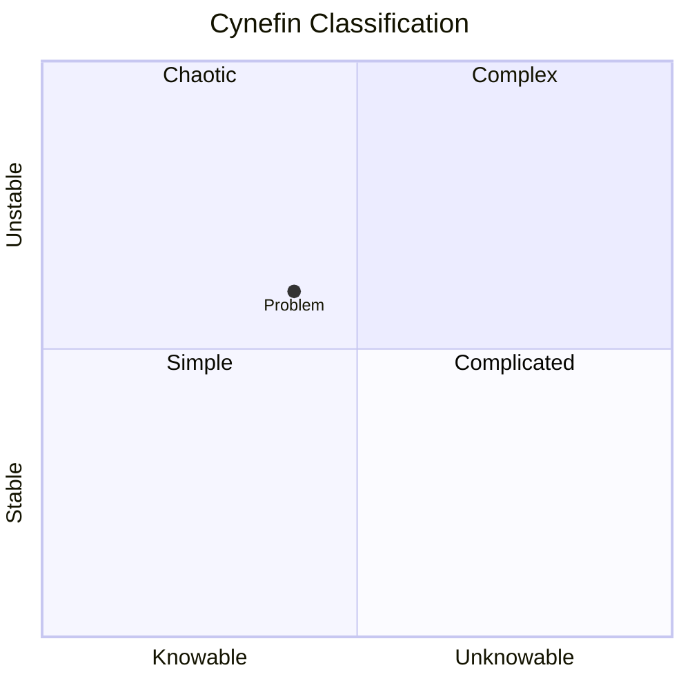

# Cynefin Framework

**Phase:** Decide · **Source:** https://untools.co/cynefin-framework

## Entry Predicate
`always_run` — runs first in Decide phase, sets the regime.

## Inputs
- All Phase 1 + Phase 2 outputs

## Method
Classify the problem into one of 5 domains:
- **Simple (Clear)**: cause→effect known, best practice exists. Sense → categorize → respond.
- **Complicated**: cause→effect knowable with expertise. Sense → analyze → respond.
- **Complex**: cause→effect only in retrospect. Probe → sense → respond.
- **Chaotic**: no cause→effect, must act first. Act → sense → respond.
- **Disorder**: not yet classified.

For each candidate domain, list 3 evidence pieces from Phase 1/2.

## Output Schema (mermaid + prose)


```
DOMAIN: <complex>
EVIDENCE:
  - <evidence>
  - <evidence>
APPROACH: probe → sense → respond
```

## Decision Hook
The domain dictates which Decide-phase frameworks dominate:
- Simple → Decision Matrix is sufficient
- Complicated → Decision Matrix + Six Hats + Second-Order
- Complex → Probe via OODA, run small experiments, defer big-bet decisions
- Chaotic → Confidence-Speed-Quality says: act fast, accept lower quality
- Disorder → re-run Phase 1 with refined intake

This **routes** the rest of Phase 3.

## What This Means For The Decision
Wrong-domain thinking is the #1 source of bad decisions. Treating a complex problem as complicated invites over-confident plans. Treating a simple problem as complex wastes time.
