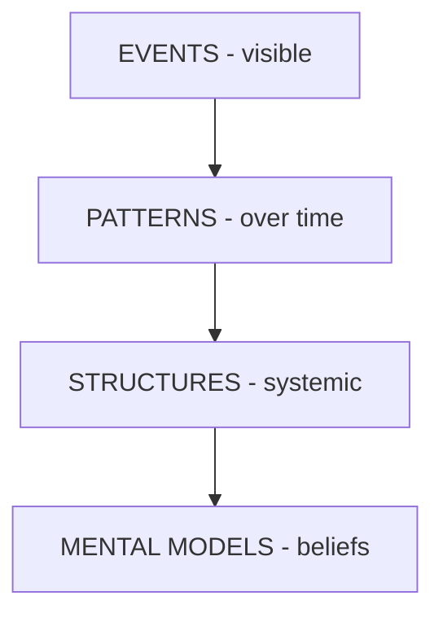

# Iceberg Model

**Phase:** Systems · **Source:** https://untools.co/iceberg-model

## Entry Predicate
`always_run`

## Inputs
- `frameworks/ishikawa.md::confirmed_causes`
- `intake.problem_refined`
- `evidence/define-*.md`

## Method
1. **Events** — what visibly happens (the surface).
2. **Patterns** — recurring events over time.
3. **Structures** — systems / incentives / rules / org design that produce the patterns.
4. **Mental Models** — beliefs / assumptions held by actors that uphold the structures.

For each layer, write 3-7 bullet points sourced from research and prior frameworks.

## Output Schema (mermaid + prose)


```
EVENTS
  - <event>
  - <event>

PATTERNS
  - <pattern>

STRUCTURES
  - <structure>

MENTAL MODELS
  - <belief>
```

## Decision Hook (Cross-Skill Triggers)

If Structures layer reveals a **bug-shape** (specific system component failing reliably) → **auto-invoke `/investigate`** via Skill tool. Pause /solve, capture investigation output, resume.

If Mental Models layer reveals **product-market or pre-product uncertainty** → **auto-invoke `/office-hours`** at end of phase.

If Structures layer reveals **architecture decision** is required → flag for end-of-run handoff to `/plan-eng-review`.

## What This Means For The Decision
Surface-level fixes treat events. Real leverage is at structures + mental models. The decision should target the deepest layer the team has authority to change.
