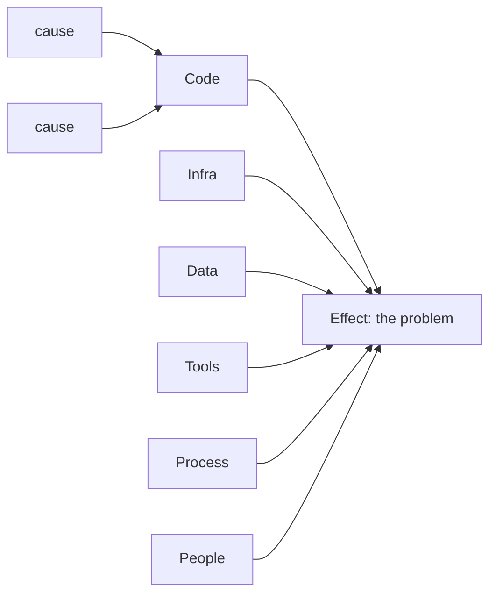

# Ishikawa (Fishbone) Diagram

**Phase:** Define · **Source:** https://untools.co/ishikawa-diagram

## Entry Predicate
`always_run` if domain ∈ {eng, product}; otherwise `intake.problem_refined contains "why" | "broken" | "failing"`

## Inputs
- `intake.problem_refined`
- `intake.domain`

## Method
1. State the **effect** (the problem) at the head of the fish.
2. Draw 6 bones for cause categories (6M for ops, or domain-tuned):
   - Engineering: Code / Infra / Data / Tools / Process / People
   - Product: Users / Market / Feature / Onboarding / Pricing / Distribution
   - General: Method / Material / Machine / Manpower / Measurement / Environment
3. For each bone, brainstorm 3-5 candidate causes.
4. Mark each cause as: **confirmed** / **suspected** / **speculative**.

## Output Schema (mermaid)

Plus a table:

| Category | Cause | Status |
|---|---|---|
| Code | concurrency bug in handler | confirmed |
| Code | bad cache key | suspected |
| ... | ... | ... |

## Decision Hook
Confirmed causes feed iceberg/connection-circles. Suspected causes feed Wave 1A research as targets.

## What This Means For The Decision
Ishikawa converts a vague "it's broken" into a graph of candidate causes. The decision is which causes to investigate first, weighted by impact × evidence.
