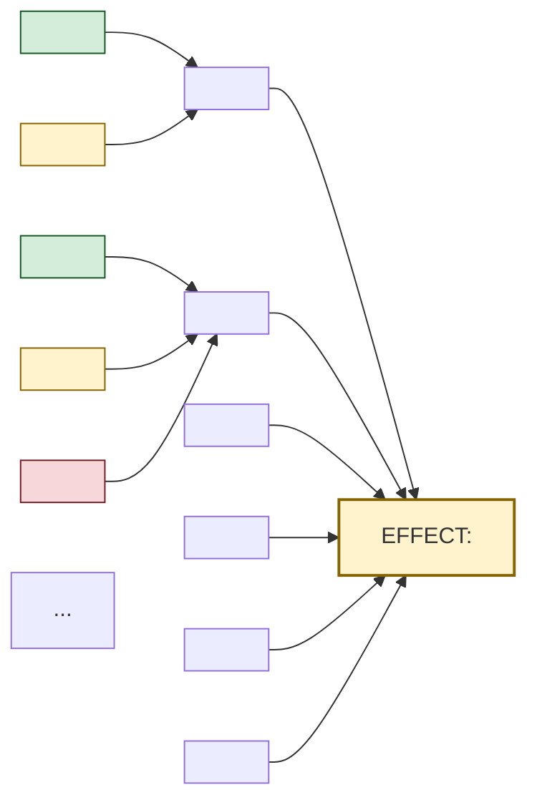
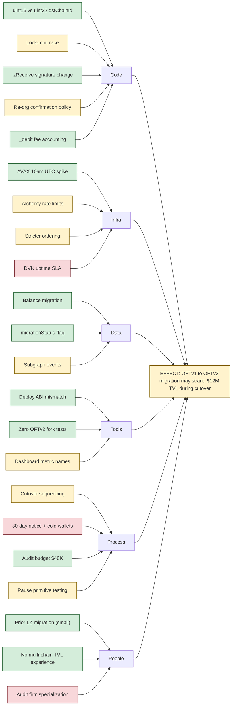

# Ishikawa (Fishbone) Diagram

**Phase:** Define · **Source:** https://untools.co/ishikawa-diagram

Ishikawa converts a vague effect ("the migration might fail," "the API is slow," "users churn at week 2") into a structured graph of candidate causes. The job is not to find the answer. The job is to enumerate the search space so downstream frameworks (iceberg, connection-circles, research fan-out) know where to dig and where not to.

This is the second framework in Phase 1 (Define) for engineering and product domains. It runs after issue-tree decomposes the problem and before iceberg goes deep on the surviving candidates. Without ishikawa, iceberg gets handed three vague "system is broken somewhere" prompts. With it, iceberg gets specific structures to map.

---

## Entry Predicate

```
intake.domain ∈ {eng, product}
∨ intake.problem_refined matches /(why|broken|failing|degraded|slow|wrong)/i
∨ ∃ branch ∈ issue-tree.branches : branch.confidence < 0.6
```

The predicate fires when the problem is shaped like a "what's causing X" question. Strategy and general domains skip ishikawa unless the problem statement explicitly contains failure language. A pure "should we" decision (build vs buy, market entry, hire pattern) does not run ishikawa, that's what abstraction-ladder + zwicky-box are for.

If issue-tree produced a branch with confidence below 0.6, ishikawa runs even outside the eng/product domains, because that branch's vagueness is exactly what ishikawa exists to resolve.

### Inputs

- `intake.problem_refined`, the canonical problem statement
- `intake.domain`, auto-detected eng / product / strategy / general
- `intake.stakeholders`, used to gate the People bone depth
- `frameworks/issue-tree.md`, prior decomposition (optional but useful)
- `frameworks/abstraction-ladder.md`, target rung context (the bones live at the rung below the target)
- `evidence/define-prior-art.md`, prior failures of similar systems (seeds suspected causes)

### Outputs

- `$RUN_DIR/frameworks/ishikawa.md`, the fishbone diagram + cause table + status markers
- `state.ishikawa.confirmed_causes`, list of causes with status=confirmed, read by iceberg as Phase 2 input
- `state.ishikawa.suspected_causes`, list of causes with status=suspected, dispatched as Wave 1A research targets
- `state.ishikawa.bones[]`, the 6 category labels chosen, read by definer for next-framework selection

---

## Operating Principles

These are the non-negotiable rules. Every fishbone respects all five.

**1. Pick the bone taxonomy that matches the domain, not the textbook 6M.**

The "6M" (Manpower, Machines, Methods, Materials, Measurement, Mother Nature) is an industrial-quality-control inheritance. For a software migration, calling people "Manpower" is a tell that the framework is being run cosmetically. Use Code / Infra / Data / Tools / Process / People for engineering. Use Users / Market / Feature / Onboarding / Pricing / Distribution for product. Map the bones to the actual failure surfaces of the system being analyzed. Anti-pattern: forcing the 6M onto a software problem and then having to stretch "Code" into the "Materials" bone, the diagram becomes harder to read than the original problem.

**2. Every cause carries a status marker.**

Confirmed (we have direct evidence: a log line, a benchmark, a postmortem), suspected (the shape matches but we have not verified for this case), or speculative (it is consistent with the symptoms but no evidence in this context). Without status, the diagram is a brainstorming dump. With status, it is a research dispatch sheet. Anti-pattern: a 30-cause fishbone where every cause is unmarked, downstream frameworks have no signal about which causes to dig and which to deprioritize.

**3. Stop at 3-5 causes per bone.**

A bone with 12 causes is a tell that the bone itself is too broad and should be split into two bones. A bone with 1 cause is a tell that the bone is the wrong category for this problem. Aim for 3-5 candidates per bone. The total cause count should land at 18-30 across 6 bones. Below 12, the analysis is too shallow. Above 40, the analysis is uncalibrated and downstream frameworks will choke on the volume. Anti-pattern: padding bones to look thorough, every cause that doesn't pass the "could a senior eng on this team write a 1-paragraph hypothesis for this?" test gets dropped.

**4. Confirmed causes do not feed Wave 1A research, suspected causes do.**

Wave 1A research exists to verify suspected causes against external prior art (Stack Overflow, blog posts, prior commits, internal RFCs). Confirmed causes already have evidence and feed iceberg directly. Speculative causes either get demoted to "consider in iceberg.mental-models" or dropped entirely. Mixing them up causes the research to waste cycles re-confirming what we already know, or chase ghosts. Anti-pattern: dispatching all 25 causes as research targets, the researcher returns 25 surface-level summaries and zero depth.

**5. Ishikawa enumerates causes, not solutions.**

A bone labeled "we should add caching" is not a cause, it's a solution. The cause is "the read path makes N+1 database calls under load." Solutions belong in zwicky-box and decision-matrix. Anti-pattern: causes phrased as imperatives ("fix the bug in handler.py") rather than descriptive states ("handler.py drops connection on retry-with-jitter at 5s timeout").

---

## Response Posture

**Tone.** Diagnostic and inventory-style. The agent is enumerating the failure surface, not selecting a fix. Use neutral, descriptive phrasing: "Cause: handler drops connection at retry-with-jitter," not "I think the handler is buggy." Bones are names of failure surfaces, not opinions.

**Pacing.** Bone-by-bone, sequentially. The agent picks the taxonomy, then walks each bone start to finish before moving to the next. No back-and-forth. If new bones suggest themselves while working a different one, capture them in a "deferred" list and add at the end.

**Push depth.** When the user (in conversational mode) gives a vague cause ("the API is slow"), push for the specific symptom shape: which endpoint, what latency profile, what request pattern. The depth comes from forcing each cause to have a measurable or observable manifestation. A cause that cannot be stated as a testable hypothesis gets demoted to speculative.

**Where to escalate.** SendMessage to lead when:
- More than 40 causes accumulate (the bones are too broad, lead may want to split the analysis)
- A bone has 0 candidate causes after a sincere attempt (the bone may not apply, lead decides whether to drop it)
- A cause is marked "confirmed" but the evidence is in a system the agent cannot access (lead decides whether to fetch it)
- All 6 bones have only speculative causes (the problem is too vague for ishikawa, lead may rerun intake)

---

## Anti-Sycophancy Rules

The agent running ishikawa must never write these:
- "There are many possible causes, including..." (cut to the bones, name them)
- "It could be related to either..." (mark the candidates, status them, move on)
- "We should look into..." (look into it now or mark it as suspected)
- "Some teams have seen this issue when..." (cite the team or the link or drop the claim)
- "It's a complex issue with many contributing factors..." (every cause has a name, write them down)

The agent must always:
- Pick the 6-bone taxonomy and commit to it; do not list 3 candidate taxonomies and ask the user.
- For every cause, pick a status (confirmed / suspected / speculative) before moving on.
- For every confirmed cause, state the evidence in one sentence with a source.
- For every suspected cause, state what evidence would confirm it.
- Name the bones that came back empty and explain why (genuine "this category doesn't apply" vs "ran out of ideas").

---

## Pushback Patterns

These show how the agent handles common framing errors during cause enumeration.

**Pattern 1: Vague cause then push for the observable manifestation**

- User input: "Maybe there's a race condition somewhere in the order pipeline."
- BAD: "Got it. Adding 'race condition in order pipeline' as a suspected cause under Code."
- GOOD: "Race condition is a category, not a cause. Push: which two operations race? On the same row, the same key, or the same lock? What's the observable signature, intermittent failures with no consistent reproducer, duplicate writes, or stale reads? Pick one shape and we'll add it as a cause. Without the shape, this is a wish, not a cause."

**Pattern 2: Solution as cause then redirect to the underlying state**

- User input: "We need to add idempotency keys to all writes. Add that as a cause."
- BAD: "Adding 'lack of idempotency keys' under Process."
- GOOD: "Idempotency keys are the fix, not the cause. The cause is the underlying state: writes can be replayed under retry, and the receiver does not deduplicate. Add as cause: 'write path is non-idempotent under client retry.' If the fix is to add idempotency keys, that's a solution candidate for zwicky-box, not a cause for ishikawa."

**Pattern 3: One bone has 12 causes then split the bone**

- User input: "Under People we have onboarding, training, hiring, comp, ramp time, attrition, knowledge silos, oncall coverage, code-review bandwidth, retro cadence, hiring-manager calibration, recruiting pipeline."
- BAD: "Adding all 12 to People."
- GOOD: "People bone is overloaded. Split into two: 'Hiring & Ramp' (onboarding, training, hiring, ramp time, attrition, hiring-manager calibration, recruiting pipeline) and 'Operating Cadence' (oncall, code review, retros, knowledge silos, comp). 12 causes in one bone tells me the category is too coarse. The split takes 30 seconds and downstream frameworks pick up the right granularity."

**Pattern 4: All bones come back speculative then escalate to lead**

- User input: "We have suspected causes in every bone but no confirmed ones."
- BAD: "Got it, marking everything as suspected. Moving to iceberg."
- GOOD: "Stop. If every bone is speculative, the problem statement is too vague for cause enumeration. We should not feed iceberg a fishbone with zero confirmed causes, iceberg's structures layer needs anchoring evidence to map. Two paths: (a) ping the lead via SendMessage and request a research wave to confirm at least 2 causes per bone before moving on, or (b) re-run intake to refine the problem statement to something narrower where confirmed evidence exists. Recommend option (a) if we have 24 hours, option (b) if not."

**Pattern 5: Cause stated without observable signature then demand the signature**

- User input: "Under Infra: 'sometimes the load balancer behaves weirdly.'"
- BAD: "Adding 'load balancer behaves weirdly' as a suspected cause."
- GOOD: "Behaves weirdly is not a cause. Push: weirdly how? Which symptoms, in which logs, on which dashboard? 'LB returns 502 on 0.3% of requests during the daily 10am traffic spike, no correlation with backend health checks' is a cause. 'LB sometimes acts up' is a hunch. Restate or drop."

---

## Method

Ishikawa runs as a 7-step procedure. Each step produces a discrete output that the next step consumes.

### Step 1, Read prior framework outputs and pick the bone taxonomy

Read `intake.json`, the issue-tree output if present, and the abstraction-ladder output if present. Read `evidence/define-prior-art.md` if present.

Decide the 6-bone taxonomy. The choice is determined by `intake.domain`:
- **eng:** Code / Infra / Data / Tools / Process / People
- **product:** Users / Market / Feature / Onboarding / Pricing / Distribution
- **strategy:** Market / Competition / Internal-Capability / Resource / Timing / Stakeholder-Alignment
- **general:** Method / Material / Machine / Manpower / Measurement / Environment (the classic 6M, only used as fallback)

If the domain is mixed (e.g. an engineering problem with a UX failure surface), the agent picks 4 from the dominant taxonomy and 2 from the secondary. Document the choice as a one-line note at the top of the output.

**Prerequisites:** intake.problem_refined exists.
**Output type:** taxonomy decision recorded in the output file header.
**Failure mode:** picking the textbook 6M for a software problem because it's the default.

### Step 2, Restate the effect at the head of the fish

The effect is the problem stated as an observable, measurable outcome. Not "the product is bad," but "user retention drops 60% between week 1 and week 4 across all 4 chains." Not "migration risk," but "if we cut over OFTv1 to OFTv2 in a single transaction, we may freeze $12M TVL during a 4-block reorg."

The effect statement is the test. If the agent cannot write the effect as a measurable outcome, the problem is too vague, escalate to lead before continuing.

**Prerequisites:** Step 1 complete.
**Output type:** the head-of-fish text.
**Failure mode:** writing the effect as a vague feeling ("things are bad").

### Step 3, Brainstorm 3-5 candidate causes per bone

Walk each bone in order. For each bone, write 3-5 candidate causes. Each cause is:
- A noun phrase or short clause naming a state or condition (not an imperative).
- Specific enough that a senior eng could write a 1-paragraph hypothesis explaining how this cause produces the effect.
- Distinct from causes in other bones (no duplicates across categories).

If a bone has 1 cause: the bone is wrong, drop it, replace with a bone that has 3+ causes.
If a bone has more than 7 causes: the bone is too broad, split it.

Capture causes that don't fit any current bone in a "deferred" list, decide at end whether to add a new bone or drop them.

**Prerequisites:** Step 2 complete.
**Output type:** a flat list of (bone, cause) tuples.
**Failure mode:** padding bones to look balanced, then having to backfill speculative causes for the last 2 bones.

### Step 4, Mark each cause with a status

For each cause, assign exactly one status:

- **confirmed:** direct evidence exists. The agent must cite the evidence in one sentence with a source (a log path, a benchmark name, a commit hash, a research summary file).
- **suspected:** the shape matches a known failure pattern but verification is pending. The agent must state what evidence would confirm it.
- **speculative:** consistent with the effect but no evidence. The agent must state the test that would either upgrade it to suspected or demote it to "drop."

Refuse to mark a cause as "confirmed" without a citation. The cost of a false confirmation is high, downstream frameworks treat it as ground truth.

**Prerequisites:** Step 3 complete.
**Output type:** the status column added to each cause.
**Failure mode:** marking everything "suspected" because it feels safe.

### Step 5, Write the mermaid fishbone graph

Generate the fishbone diagram in mermaid `graph LR` format. The Effect node is the head of the fish, on the right. Each bone is a category node connecting to the Effect. Each cause hangs off its bone. Use `:::confirmed`, `:::suspected`, `:::speculative` class labels for color-coding.

The mermaid block must render correctly. Test the output by reading it back, if a node has unbalanced quotes or unclosed brackets, fix and rewrite.

**Prerequisites:** Step 4 complete.
**Output type:** mermaid block in the output file.
**Failure mode:** mermaid syntax error, the rendered diagram is broken and downstream readers can't see the structure.

### Step 6, Write the cause table

Below the mermaid, write a table with columns: Category, Cause, Status, Evidence-or-Confirmation-Test, Source.

Every row matches a cause from the diagram. The table is the single source of truth, the diagram is the visual aid.

The Source column lists which prior framework or evidence file motivated the cause (e.g. "issue-tree.branches[2]," "evidence/define-prior-art.md," "intake.problem_refined").

**Prerequisites:** Step 5 complete.
**Output type:** markdown table.
**Failure mode:** table mismatched with diagram (a cause in the diagram missing from the table or vice versa).

### Step 7, Compute the dispatch lists and write the decision hook

Group causes by status:

- **confirmed_causes:** these feed iceberg as Phase 2 input. List them in the output's Decision Hook section.
- **suspected_causes:** these feed Wave 1A research. List them as research targets with the confirmation test.
- **speculative_causes:** these are tracked but do not feed downstream. They reappear in iceberg.mental-models if the speculative cause is a belief.

Write the "What This Means For The Decision" block, summarizing which bones the decision should pay closest attention to and which can be deprioritized.

**Prerequisites:** Step 6 complete.
**Output type:** dispatch lists + decision hook section.
**Failure mode:** writing the decision hook before status assignment is complete, listing speculative causes as research targets and burning a research wave on phantoms.

---

## Question Patterns

Ishikawa runs analytically over prior framework outputs in most cases. When the agent does ask the user (typically when the problem statement is too thin to enumerate causes from prior context), these are the patterns.

### Question 1, Validate the bone taxonomy

> "I'm using the engineering taxonomy: Code / Infra / Data / Tools / Process / People. Does this match the failure surface, or should I swap a bone? E.g., is there a Compliance or Vendor bone that matters more than People?"

**Good answer:** "Drop Tools, add Vendor (we depend on a third-party LZ executor and that's where most issues originate)."
**Red flag:** "Looks fine," without engagement. Push: "Pick one, do you have any complaints about my taxonomy?"
**Smart-skip:** if the user already specified bone preferences in intake or in the conversation.

### Question 2, Confirm the effect statement

> "I've stated the effect as: 'OFTv1 to OFTv2 cutover may strand $12M TVL during a 4-block reorg.' Is this measurable enough, or should I tighten it?"

**Good answer:** "Tighten: 'During cutover, if a reorg of depth ≥ 3 occurs within 60 seconds of the cutover transaction, lock-mint pairs may desync, causing fund loss equal to in-flight transfer volume (~$50K based on past 30 days)."
**Red flag:** "Yeah that's fine." Push: "If we can't measure the effect, we can't measure the cause's impact. Tighten or I escalate."
**Smart-skip:** if the effect is already stated as a measurable outcome in intake.

### Question 3, Surface confirmed causes from postmortems or logs

> "What confirmed causes do we have from past incidents in this system class? Cite postmortem URLs or commit hashes if possible."

**Good answer:** "PR #4521 fixed a similar lock-mint race when migrating Stargate v0 to v1, see commit abc123. Two prior internal incidents documented in the wiki at /incidents/2024-Q3."
**Red flag:** "I think we had something similar but I don't remember." Push: "Search the postmortem dir for 'OFT' or 'cutover' before continuing."
**Smart-skip:** if `evidence/define-prior-art.md` already contains the postmortem citations.

### Question 4, Surface speculative causes from outside experience

> "Are there causes you've seen on other systems that you suspect apply here, even without direct evidence? Mark them speculative and we'll either upgrade or drop."

**Good answer:** "On Stargate, the Avalanche P-Chain finality difference caused issues with cross-chain message ordering. Speculative for us because we're not on Stargate, but the LayerZero executor pattern is similar."
**Red flag:** "Nothing comes to mind." Push: "Even one speculative cause per bone helps. Brainstorm for 60 seconds."
**Smart-skip:** if the bone already has 5+ confirmed/suspected causes.

### Question 5, Probe for missing bones

> "Are there bones I should have added but didn't? E.g., is there a Compliance, Liquidity, Governance, or Audit bone that's distinct from the 6 I picked?"

**Good answer:** "Add Audit. We have a $40K third-party audit budget that gates the migration, and the audit timeline is its own failure surface."
**Red flag:** "No, looks complete." Push: "Even one missing bone catches a category of causes that would otherwise hide. Think about what's *not* in my taxonomy."
**Smart-skip:** if the user already approved the bone list in Question 1.

---

## Forcing Exemplars

When writing the fishbone, every cause should have a forcing-version (specific, observable, statused) instead of a softened-version (vague, speculative).

### Exemplar 1, Stating a cause

SOFTENED (avoid):
> "Code: bug in handler"

FORCING (aim for):
> "Code: handler.py drops the LayerZero `lzReceive` callback when retry-with-jitter exceeds the 5s default timeout, observed in staging logs on 2026-04-12 (suspected; reproduces on staging but not yet verified on mainnet, confirmation test: replay 10 failed transactions with extended timeout and check whether they succeed)."

### Exemplar 2, Citing evidence on a confirmed cause

SOFTENED (avoid):
> "Data: schema mismatch (confirmed)"

FORCING (aim for):
> "Data: OFTv1's `_send` event emits `_dstChainId` as uint16 but OFTv2 expects uint32, causing decode failures on the OFTv2 receiver path (confirmed; LayerZero's migration guide section 4.2 documents this exact incompatibility, three prior projects (Stargate, Radiant, Ethena) hit the same wall and required a translator contract)."

### Exemplar 3, Naming the confirmation test for suspected causes

SOFTENED (avoid):
> "Infra: maybe gas price oracle is wrong (suspected)"

FORCING (aim for):
> "Infra: Avalanche C-Chain gas price oracle returns stale values during 10am UTC traffic spike, leading to under-estimated gas on cross-chain messages (suspected; confirmation test: instrument the oracle path, log returned price vs. actual block gas price for 1 week, alert if delta > 20% for > 30s in any 1-hour window)."

### Exemplar 4, Naming the bone-empty case

SOFTENED (avoid):
> "Tools: nothing here"

FORCING (aim for):
> "Tools: empty by design. We use only first-party LayerZero tooling (forge, foundry, lz-evm-oapp-v2), all under our control. The tooling failure surface collapses into Code and Infra. If we adopt a third-party executor or relayer, this bone becomes non-empty and ishikawa should rerun."

---

## Output Schema

The framework output at `$RUN_DIR/frameworks/ishikawa.md` follows this structure exactly.

### Section A, Header

```markdown
# Ishikawa, <SLUG>

**Run:** <session-id>
**Generated:** <ISO timestamp>
**Bone taxonomy:** <eng | product | strategy | general | mixed>
**Effect:** <one-sentence measurable outcome>
**Inputs read:** <comma-separated list of prior framework files + evidence files>
```

### Section B, Fishbone diagram (mermaid)



### Section C, Cause table

```markdown
| Category | Cause | Status | Evidence or Confirmation Test | Source |
|---|---|---|---|---|
| <bone> | <cause as noun-phrase, observable> | confirmed/suspected/speculative | <one-line evidence with citation, or test that would confirm> | <prior framework file or evidence file> |
| ... | ... | ... | ... | ... |
```

Required columns:
- **Category:** the bone label (must match a label in Section B)
- **Cause:** noun phrase or short clause naming the state, never an imperative
- **Status:** exactly one of confirmed / suspected / speculative
- **Evidence or Confirmation Test:** one sentence, mandatory, no empty cells
- **Source:** which prior framework or evidence file motivated this cause

### Section D, Empty-bone notes

```markdown
## Empty Bones

- **<bone label>:** <one-sentence reason>
```

Bones that came back empty after a sincere attempt are documented here. The reason must be substantive ("we use only first-party tooling, this category collapses into Code") rather than evasive ("ran out of ideas"). If the agent ran out of ideas, do not list the bone here, instead split or replace it.

### Section E, Decision Hook (dispatch lists)

```markdown
## Decision Hook

### Confirmed causes (feed iceberg as Phase 2 input)
- <cause 1>: <one-line evidence>
- <cause 2>: <one-line evidence>
- ...

### Suspected causes (Wave 1A research targets)
- <cause 1>: <confirmation test, search-query hint>
- <cause 2>: <confirmation test, search-query hint>
- ...

### Speculative causes (tracked, not dispatched)
- <cause 1>: <test that would upgrade>
- ...
```

The Wave 1A research dispatch reads from this section directly. Each suspected cause becomes a research task with the confirmation test as the success criterion.

### Section F, Cross-Framework Triggers

```markdown
## Cross-Framework Triggers

- N confirmed causes in <bone>, iceberg should weight <layer> heavily for this bone
- 2+ confirmed causes pointing at the same structural component, name the component for iceberg.structures
- All causes in <bone> are speculative, downgrade this bone's weight in iceberg
- All bones speculative, escalate to lead before iceberg runs
```

### Section G, What This Means For The Decision

```markdown
## What This Means For The Decision

<2-3 sentences synthesizing which bones the decision should pay closest attention to, which causes are confirmed actionable, and which downstream frameworks (iceberg layers, research waves) should fire next.>
```

### Section H, Completeness Score

```markdown
**Completeness:** <N>/10

**Rubric for this run:**
- All 6 bones populated with 3-5 causes each: +<N>
- Status assigned to every cause (no unmarked): +<N>
- Confirmed causes have one-line evidence with source: +<N>
- Suspected causes have specific confirmation tests: +<N>
- Mermaid renders without syntax errors: +<N>
- Empty bones have substantive reasons: +<N>
```

---

## Decision Hook

Ishikawa's output drives three downstream activities.

### Feeds iceberg (Phase 2)

Confirmed causes become inputs to iceberg's events and patterns layers. The agent running iceberg reads `state.ishikawa.confirmed_causes` and asks: which of these causes is a one-time event, which is a pattern, which is the structural cause underneath?

If ishikawa identifies 5 confirmed causes and they cluster around 1-2 system components (e.g. all are about the lock-mint race in cross-chain bridges), iceberg's structures layer is anchored on those components. If the 5 confirmed causes scatter across all 6 bones with no clustering, iceberg's structures layer needs to find a common substrate.

### Dispatches Wave 1A research

Suspected causes become research targets for Wave 1A (the parallel research fan-out that runs after Phase 1). Each suspected cause produces one research task:
- Search query: derived from the cause text + domain
- Success criterion: the confirmation test from the ishikawa table
- Output: an evidence summary that either upgrades the cause to confirmed or demotes it

If ishikawa produces 8+ suspected causes, Wave 1A fans out aggressively. If it produces 2-3, the fan-out is targeted.

### Confidence rubric impact

- All 6 bones populated with 3+ confirmed causes per bone, +2 to overall confidence (the failure surface is well-mapped).
- 4-5 bones populated with mostly confirmed causes, +1.
- Mostly suspected causes, no impact (the work moves to research).
- All speculative, no impact, but flag in dissent section.

### Override conditions

Ishikawa does not override other frameworks. It supplies the evidence diet. If a downstream framework (iceberg, decision-matrix) reaches a confident conclusion that contradicts a confirmed ishikawa cause, the contradiction is flagged in the final dissent section but does not auto-override.

---

## Cross-Framework Triggers

Conditions in ishikawa's output that force changes elsewhere in /solve:

### Triggers fired by cause clustering

- 2+ confirmed causes in the same bone pointing at the same component, name the component for iceberg.structures and weight that structure heavily.
- 0 confirmed causes across all bones, escalate to lead via SendMessage; iceberg cannot anchor without confirmed causes.
- 1 bone has 5+ confirmed causes while others are empty, the problem may be over-scoped on one dimension; suggest re-running issue-tree to decompose.

### Triggers fired by status distribution

- Suspected causes outnumber confirmed by 3:1, request a Wave 1A research wave with extended budget (the failure surface is mapped but unverified).
- Speculative causes only, escalate to lead; the problem is too vague for ishikawa.
- More than 5 confirmed causes total, flag the run as "well-evidenced," confidence rubric +1.

### Triggers fired by bone selection

- Bone taxonomy = "general" (the 6M fallback) was used, flag in dissent. The problem may not have been domain-typed correctly in intake; lead may want to revise.
- More than 2 bones empty, the taxonomy is wrong; auto-rerun ishikawa with a different taxonomy.

### Cross-skill handoffs

- 3+ confirmed causes in the Code bone all about the same component, AND `intake.domain = eng`, suggest invoking `/investigate` on that component before iceberg runs. The /investigate skill specializes in root-cause analysis on bug-shaped problems.
- 3+ confirmed causes in the Users or Market bone, AND `intake.domain = product`, suggest `/office-hours` for product-strategy review before iceberg runs. The /office-hours skill specializes in pre-product and PMF questions.
- 3+ confirmed causes pointing at architectural patterns (e.g. all in Infra + Process + Tools), flag `state.PLAN_ENG_REVIEW_AT_END = true` so the lead invokes `/plan-eng-review` after the recommendation lands.

---

## Failure Modes

Ishikawa fails silently in five distinct ways. Self-check each before completing.

### Failure Mode 1, Padding bones with speculation

Trap: a bone has 1 candidate cause and the agent invents 2-3 speculative ones to look balanced. Downstream frameworks treat the bone as if it has signal, and Wave 1A wastes cycles confirming phantoms.

Manifestation: a bone with 4 causes where 3 are speculative and have generic confirmation tests ("check the codebase," "ask the team"). The diagram looks balanced but the data is thin.

Check: before completing, count speculative causes per bone. If any bone is more than 50% speculative, either drop the speculative ones (preferred) or replace the bone with one that has more confirmed evidence.

Recovery: keep the 1-2 real causes, drop the speculation, mark the bone as "thin" in the empty-bone notes section. Downstream frameworks will deprioritize.

### Failure Mode 2, Treating bones as solutions

Trap: bones get labeled with imperatives ("Add Caching," "Improve Logging," "Fix Database") instead of failure surfaces ("Code," "Infra," "Data"). The diagram becomes a fix list, not a cause map. Iceberg's input is then "we should add caching," which iceberg cannot decompose into structures.

Manifestation: bone labels contain verbs. Causes hanging off them describe more verbs ("we need to..."). The diagram is a roadmap, not an analysis.

Check: every bone label is a noun or noun phrase naming a category. Every cause is a state or condition. If any imperative appears, rewrite.

Recovery: rewrite the bone labels and causes. Move the imperatives to a separate "candidate solutions" file for zwicky-box's input.

### Failure Mode 3, Confirmed without source

Trap: a cause is marked confirmed because it "feels confirmed" (the senior eng said so verbally, or someone has a hunch). Downstream frameworks treat it as ground truth and miss the gap.

Manifestation: confirmed causes with vague evidence ("the team knows this," "we've seen it before") and no specific source citation.

Check: every confirmed cause has a source citation that includes either a file path, a commit hash, a postmortem link, an evidence file, or a research summary. No verbal claims allowed.

Recovery: demote unsourced confirmations to suspected with a confirmation test "verify the verbal claim against [source]." Suspected is honest. Confirmed-without-source is misleading.

### Failure Mode 4, Mixing causes and effects across bones

Trap: a cause in one bone is actually an effect of a cause in another bone. E.g., "Process: poor incident response" is a cause that is itself caused by "People: oncall under-staffed." The diagram has a hidden chain.

Manifestation: two causes appear in different bones but reading them carefully reveals one is the effect of the other. Iceberg's structures layer then has to untangle the chain.

Check: for each cause, ask "is this caused by another cause in the diagram?" If yes, demote the dependent one (it's an intermediate effect) and keep the upstream one.

Recovery: rewrite the dependent cause as an outcome of the upstream cause in the prose. Keep only the root-shaped causes in the diagram.

### Failure Mode 5, Domain mismatch in bone taxonomy

Trap: an engineering problem gets the product taxonomy or vice versa. The bones do not map to the actual failure surfaces and the analysis collapses.

Manifestation: bones have causes that don't fit naturally. The Process bone in an engineering taxonomy gets stuffed with "users churn at week 2" because there's no Users bone. The fishbone is forced.

Check: read each cause and confirm it lands naturally in its bone. If 3+ causes feel forced into their bones, the taxonomy is wrong.

Recovery: rerun Step 1 with a different taxonomy. Re-bin causes. Document the swap in the header.

---

## Jargon Glossary

Terms used in ishikawa output that need glossing on first use.

- **bone**, one of the 6 main category lines coming off the spine of the fish; each bone is a class of causes.
- **effect**, the problem statement at the head of the fish; the observable outcome that causes produce.
- **6M**, the classic Manpower / Machines / Methods / Materials / Measurement / Mother Nature taxonomy, inherited from manufacturing QA; the textbook default.
- **6P**, an alternative taxonomy: People / Process / Product / Place / Procedure / Policy, used in service operations.
- **confirmed cause**, a candidate cause with direct evidence (log, benchmark, postmortem, commit) that this cause produces (or contributes to) the effect.
- **suspected cause**, a candidate cause that pattern-matches but is unverified for this case; a Wave 1A research target.
- **speculative cause**, a cause consistent with the effect but with no evidence; tracked but not dispatched downstream.
- **fishbone**, the visual layout: spine pointing right at the effect, bones angled off the spine, sub-bones for individual causes.
- **MECE**, mutually exclusive, collectively exhaustive; the property that bones should not overlap and together cover the failure surface.
- **failure surface**, the set of all places a system can fail; ishikawa enumerates a sample, not the whole surface.
- **dispatch list**, the lists by status that feed downstream frameworks; the operational output of ishikawa.
- **upstream cause**, a cause that produces another cause; the diagram should keep upstreams and demote downstream effects.
- **root cause**, the deepest cause that, if fixed, would prevent the effect; ishikawa lists candidates, /investigate finds the root.

---

## Completeness Scoring

Ishikawa self-rates 0-10 on cause-enumeration quality.

### 10/10, Decisive

- All 6 bones populated with 3-5 causes each (18-30 total)
- Every cause has status assigned
- Every confirmed cause has source citation with file/commit/URL
- Every suspected cause has specific confirmation test
- No causes are imperatives; all are observable states
- Mermaid renders without syntax errors
- Empty-bone notes (if any) have substantive reasons
- 5+ causes are confirmed
- Cross-framework triggers checked

### 7/10, Confident

- 5-6 bones populated, 12-25 total causes
- Status assigned to every cause
- Most confirmed causes have source citations
- Most suspected causes have confirmation tests
- 3-4 causes are confirmed
- 1-2 bones thin or empty with reason
- Mermaid renders correctly

### 4/10, Tentative

- 3-4 bones populated
- Some causes lack status
- Few confirmed causes (1-2)
- Confirmation tests are generic
- 2+ bones empty with weak reasons
- Mermaid syntax issues, requires fixing

### 0/10, Insufficient

- Bones empty or unpopulated
- No status markers
- No confirmed causes
- All speculative

A completeness score below 4 caps the overall confidence rubric at LOW for the run. Iceberg cannot proceed without anchored confirmed causes; if ishikawa is below 4, escalate to lead before continuing.

---

## Worked Example

Problem: "Should we migrate our LayerZero OFTv1 deployment to OFTv2?"

This walks the canonical OFTv2 example through ishikawa. The same problem flows downstream into iceberg, then into Phase 3 frameworks.

### Intake state

```json
{
  "problem_refined": "We have an OFTv1 token deployed on 4 chains (Ethereum, Avalanche, Arbitrum, Base) with $12M TVL. LayerZero released OFTv2 with better gas, security improvements, and a different message-encoding scheme. Should we migrate?",
  "stakeholders": "small-team",
  "time_pressure": "this-month",
  "reversibility": "costly",
  "decision_maker": "you-with-input",
  "success_criteria": "qualitative-signal",
  "domain": "eng"
}
```

### Step 1, Pick taxonomy

Domain is `eng`. Default engineering taxonomy: Code / Infra / Data / Tools / Process / People.

Sanity check: do the 6 bones map to the actual failure surface of an OFT migration?
- Code: yes, the OFT contract logic, the lzReceive callbacks, the lock/burn/mint paths
- Infra: yes, the LayerZero relayers, executors, and the underlying RPC providers
- Data: yes, the message-encoding format, the on-chain state schema
- Tools: yes, the deployment tooling, the audit pipeline, the testing infra
- Process: yes, the cutover sequence, the rollback plan, the monitoring runbook
- People: yes, the small team's bandwidth, the audit firm coordination, user comms

All 6 bones map cleanly. Use the standard eng taxonomy.

### Step 2, Restate the effect

Effect (head of fish):

> "If we migrate from OFTv1 to OFTv2 within the next 30 days, the cutover may strand value, desync chains, or freeze user funds, with worst-case impact = $12M TVL exposure during the cutover window."

This is measurable: the impact bound is $12M, the window is 30 days, the failure modes are stranded / desynced / frozen.

### Step 3, Brainstorm 3-5 causes per bone

Walking each bone:

**Code (5 causes):**
- C1: OFTv1 emits `_dstChainId` as uint16 but OFTv2 expects uint32 in the message-encoding header
- C2: Lock-mint race: OFTv1 lock on chain A and OFTv2 mint on chain B may double-spend if both are listening to the same nonce
- C3: lzReceive callback signature changed between v1 and v2; deployed callers using old signature will revert
- C4: Re-org safety: OFTv1's confirmation policy assumes 12 blocks on Ethereum; OFTv2 defaults to 15
- C5: Burn-on-source path: OFTv1 used `_debitFrom`, OFTv2 uses `_debit` with different fee accounting

**Infra (4 causes):**
- I1: LayerZero executor on Avalanche C-Chain has historical 10am UTC traffic spike behavior; OFTv2 first-deploy on this chain may hit the spike
- I2: RPC provider for Base mainnet (we use Alchemy) may rate-limit during cutover heavy traffic
- I3: Cross-chain message ordering: OFTv2's new executor pattern relies on stricter ordering guarantees than OFTv1
- I4: LayerZero's DVN (Decentralized Verifier Network) may have different uptime SLAs in the OFTv2 architecture

**Data (3 causes):**
- D1: Existing OFTv1 token holders' state (balances, locked amounts) must be migrated; partial migration creates ghost balances
- D2: Migration state on-chain: a `migrationStatus` flag is required to prevent double-deposits during cutover
- D3: Historical event indexers (subgraphs, our internal analytics) need to handle both v1 and v2 events during the transition

**Tools (3 causes):**
- T1: Our forge-script deploy pipeline targets OFTv1 ABIs; needs ABI regeneration and re-test
- T2: Our existing test suite has 0 OFTv2 fork tests
- T3: Our monitoring dashboard (Grafana) has OFTv1-specific metric names; needs renaming

**Process (4 causes):**
- P1: Cutover sequencing: which chain first, and what's the abort/rollback decision tree?
- P2: User communication: 30-day notice window may be insufficient if some users hold OFTv1 in cold wallets
- P3: Audit budget and timeline: $40K budgeted, but a v1-to-v2 migration audit is more complex than a fresh deploy
- P4: Incident-response runbook: who can pause the cutover, who can roll back, and what's the chain-by-chain pause primitive

**People (3 causes):**
- Pe1: Team has migrated 1 prior LZ deployment (smaller, $500K, single chain)
- Pe2: No prior experience with multi-chain cutover under TVL pressure
- Pe3: Audit firm is engaged but their LZ-OFT specialization is unverified

Total: 22 causes across 6 bones.

### Step 4, Status each cause

| Cause | Status | Reason |
|---|---|---|
| C1 | confirmed | LayerZero migration guide section 4.2 explicitly documents this incompatibility |
| C2 | suspected | Pattern matches Stargate v0-to-v1 migration race condition (Stargate postmortem cited) |
| C3 | confirmed | OFTv2 docs show new lzReceive signature; existing dependent contracts need update |
| C4 | suspected | OFTv2 changelog mentions confirmation policy change; need to verify on Ethereum specifically |
| C5 | confirmed | Source diff shows the `_debitFrom` to `_debit` rename and fee accounting change |
| I1 | confirmed | Internal monitoring shows the 10am UTC spike on AVAX C-Chain consistently for 6 months |
| I2 | suspected | Alchemy rate limits are documented but our specific quota at cutover load is untested |
| I3 | suspected | LayerZero docs hint at stricter ordering but no specific test case for our usage |
| I4 | speculative | DVN architecture is new; uptime SLAs not yet published for OFTv2 |
| D1 | confirmed | Standard migration concern; LayerZero's `OFT::lock` to `OFT::burn` requires user-balance migration scheme |
| D2 | confirmed | Required by LayerZero's recommended migration pattern (their docs and 3 prior migrations) |
| D3 | suspected | Our subgraph likely needs update; not yet checked |
| T1 | confirmed | Direct verification: our forge scripts reference OFTv1 ABIs; migration to v2 ABIs is mechanical but untested |
| T2 | confirmed | Test count: 0 fork tests targeting OFTv2 contracts |
| T3 | suspected | Dashboard config not yet audited; assumed needs rename but unverified |
| P1 | suspected | We have a draft sequencing plan but it has not been peer-reviewed |
| P2 | speculative | Cold-wallet user fraction unknown; we have no on-chain heuristic for it |
| P3 | confirmed | Audit firm quoted $40K for v1-to-v2 migration audit, scope reviewed |
| P4 | suspected | Runbook draft exists but pause-primitive testing is incomplete |
| Pe1 | confirmed | Internal records: Q3 2024 single-chain LZ migration |
| Pe2 | confirmed | Internal records: no prior multi-chain migration under TVL pressure |
| Pe3 | speculative | Audit firm's prior OFT work is undocumented to us |

Status distribution: 10 confirmed, 9 suspected, 3 speculative.

### Step 5, Mermaid fishbone



### Step 6, Cause table

| Category | Cause | Status | Evidence or Confirmation Test | Source |
|---|---|---|---|---|
| Code | C1: OFTv1 emits dstChainId uint16, OFTv2 expects uint32 | confirmed | LayerZero migration guide section 4.2 | LZ docs |
| Code | C2: Lock-mint race: same nonce on both chains | suspected | Stargate postmortem cites identical pattern; verify against our pause primitives | evidence/define-prior-art.md |
| Code | C3: lzReceive callback signature change | confirmed | OFTv2 source diff; dependent contracts identified | LZ source |
| Code | C4: Re-org confirmation policy change | suspected | OFTv2 changelog mentions; verify our config matches new defaults on Ethereum | LZ changelog |
| Code | C5: _debit fee accounting | confirmed | Source diff confirms _debitFrom to _debit rename + fee semantics | LZ source |
| Infra | I1: AVAX 10am UTC spike | confirmed | Internal Grafana dashboard, last 6 months | internal monitoring |
| Infra | I2: Alchemy rate limits at cutover load | suspected | Alchemy docs cite quotas; test under simulated cutover load | Alchemy docs |
| Infra | I3: Stricter ordering in OFTv2 executor | suspected | LZ docs hint; need test case for our specific message pattern | LZ docs |
| Infra | I4: DVN uptime SLA undocumented | speculative | OFTv2 DVN is new; ask LayerZero support for SLA | open question |
| Data | D1: User balance migration | confirmed | Standard migration requirement; documented in 3 prior migrations | prior-art |
| Data | D2: migrationStatus flag | confirmed | LayerZero recommended pattern, used in Stargate, Radiant, Ethena | prior-art |
| Data | D3: Subgraph events handling v1 + v2 | suspected | Subgraph not yet audited for v2 events | open task |
| Tools | T1: Forge ABI mismatch | confirmed | Direct verification: scripts reference OFTv1 ABIs | internal |
| Tools | T2: 0 OFTv2 fork tests | confirmed | Test count from repo | internal |
| Tools | T3: Grafana metric names OFTv1-specific | suspected | Dashboard not yet audited | open task |
| Process | P1: Cutover sequencing not peer-reviewed | suspected | Draft exists; review pending | internal |
| Process | P2: 30-day notice for cold-wallet users | speculative | No heuristic for cold-wallet user fraction; need on-chain analysis | open question |
| Process | P3: Audit budget $40K, scope reviewed | confirmed | Audit firm quote and scope | internal |
| Process | P4: Pause primitive testing incomplete | suspected | Runbook draft exists; tests pending | internal |
| People | Pe1: 1 prior LZ migration (Q3 2024) | confirmed | Internal records | internal |
| People | Pe2: No multi-chain TVL migration experience | confirmed | Internal records | internal |
| People | Pe3: Audit firm OFT specialization unverified | speculative | Need to ask audit firm for prior OFT engagements | open question |

### Step 7, Decision Hook

```markdown
## Decision Hook

### Confirmed causes (10) — feed iceberg as Phase 2 input
- C1 (uint16 vs uint32): Code structural change, iceberg will treat as a known structural seam
- C3 (lzReceive signature): Code structural change, dependent contracts identified
- C5 (_debit fee accounting): Code structural change with fee implications
- I1 (AVAX 10am UTC spike): Infra pattern, iceberg.patterns layer anchor
- D1 (User balance migration): Data structural requirement
- D2 (migrationStatus flag): Data + Process structural requirement
- T1 (Forge ABI mismatch): Tools structural delta, mechanical fix
- T2 (0 OFTv2 fork tests): Tools coverage gap
- P3 (Audit budget $40K): Process resource constraint
- Pe1, Pe2 (Team experience): People baseline

### Suspected causes (9) — Wave 1A research targets
- C2 (Lock-mint race): query "LayerZero OFT migration race condition"; confirmation: Stargate-pattern matches our pause primitives?
- C4 (Re-org confirmation): query "OFTv2 confirmation policy Ethereum"; confirmation: our config matches v2 defaults?
- I2 (Alchemy rate limits): query "Alchemy mainnet rate limit cutover"; confirmation: simulate 10x load?
- I3 (OFTv2 executor ordering): query "LayerZero v2 executor message ordering"; confirmation: test case for our pattern?
- D3 (Subgraph events): internal task; confirmation: subgraph audit for v2 events?
- T3 (Dashboard names): internal task; confirmation: dashboard audit?
- P1 (Sequencing peer review): internal task; confirmation: review complete?
- P4 (Pause primitive tests): internal task; confirmation: tests passing?
- Pe3 (Audit firm OFT specialization): query audit firm; confirmation: prior OFT work documented?

### Speculative causes (3) — tracked, not dispatched
- I4 (DVN SLA): upgrade if LayerZero publishes SLAs in next 2 weeks
- P2 (Cold-wallet users): upgrade after on-chain analysis of OFTv1 holder distribution
- Pe3 alternative: tracked but not dispatched as research; included as risk note
```

### Cross-Framework Triggers fired

- 5+ confirmed causes total: confidence rubric +1, well-evidenced run
- 3+ confirmed causes in Code bone, all clustering on the v1-to-v2 source delta: iceberg.structures should anchor on "v1-to-v2 source delta" as the structural component
- Tools bone has 2 confirmed causes about coverage gaps (T1, T2): suggest dispatching a test-coverage subtask before iceberg
- People bone has confirmed multi-chain inexperience (Pe2): flag for /plan-eng-review at end of run, the recommendation should specify a senior-eng review checkpoint

### What This Means For The Decision

The fishbone shows the migration risk is concentrated in Code (5 causes, 3 confirmed) and Infra (4 causes, 1 confirmed), with structural data and tooling gaps that are mechanical to fix. The People bone confirms the team's inexperience with multi-chain TVL migrations, which is an irreducible risk that the recommendation must address with audit + senior-eng review. Iceberg will pick up the 10 confirmed causes and map structures around two clusters: the v1-to-v2 source delta (Code) and the cutover-execution mechanics (Process). Wave 1A should fan out on the 9 suspected causes, with priority on C2 (lock-mint race) and I3 (executor ordering) since those have highest impact.

### Completeness: 9/10

- All 6 bones populated with 3-5 causes (22 total): +2
- Status assigned to every cause: +2
- Confirmed causes have source citations: +2
- Suspected causes have specific confirmation tests: +2
- Mermaid renders without syntax errors: +1
- Empty-bone notes (none needed): +0 (no deduction)
- Speculative causes are tracked, not dispatched: pass

Deduction: I4 (DVN SLA) is speculative with a generic confirmation test ("ask LayerZero support"), which could be tightened to a specific support-channel and SLA-doc query. Minor, holds at 9/10.

---

## What This Means For The Decision

Ishikawa is the Define-phase enumeration step. It converts a vague problem statement into a structured graph of candidate causes with status markers, dispatch lists, and downstream targets. Its output is not a recommendation, it is the evidence diet for everything Phase 2 (iceberg, connection-circles) and Phase 3 (decision-matrix, six-hats) consume. A Phase 1 run without ishikawa hands iceberg a vague "system might fail" prompt and Decision Matrix a vague "pick option X" criterion list. With ishikawa, iceberg knows which structures to map and Decision Matrix has explicit risk dimensions tied to confirmed causes.

The cost of skipping ishikawa: downstream frameworks operate on hunches. The cost of doing ishikawa badly (too many speculative causes, wrong taxonomy, no status markers): research waves chase phantoms and confidence rubric overstates evidence. The cost of doing ishikawa well: the recommendation has cause-by-cause traceability and the "what could go wrong" failure modes are pre-mapped before decision-matrix scores them.
