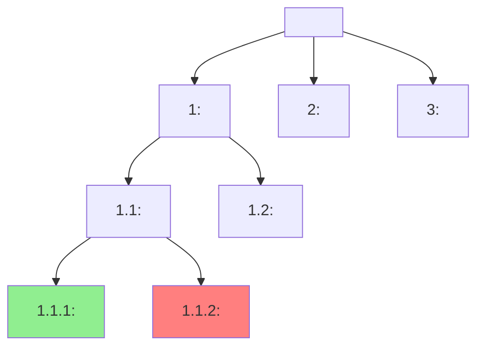

# Issue Tree

**Phase:** Define (runs in Wave 1B, depends on abstraction-ladder for the root) · **Source:** https://untools.co/issue-trees

The issue tree decomposes the target rung (from abstraction-ladder) into a MECE (mutually exclusive, collectively exhaustive) set of sub-questions. Each branch is a sub-question. Each leaf is an answerable claim. The tree converts a fuzzy decision into a structured graph of what we know, what we don't know, and what we can find out. Leaves marked needs-research become research tasks for the researcher teammate.

This is the decomposer. Every Define-phase framework after this one operates on subsets of the tree. zwicky-box generates archetypes for branches, ishikawa fishbones for cause-branches, decision-matrix evaluates leaf-options. A bad tree produces bad everything downstream because the tree is the decomposition the rest of /solve inherits.

---

## Entry Predicate

```
always_run
```

This framework runs on every /solve invocation. There is no condition under which it is skipped. Even when the problem feels small enough to "hold in your head," the act of writing the tree forces clarity about what is actually being decomposed and what is being deferred.

### Inputs

- `frameworks/abstraction-ladder.md::target_rung` — the rung that becomes the tree's root (mandatory; if abstraction-ladder did not run, fail fast and SendMessage to lead)
- `intake.problem_refined` — the user's canonical statement (used as a fallback root only if abstraction-ladder failed)
- `intake.success_criteria` — measurable / qualitative / can't-articulate / TBD (changes how leaves are scored as known vs needs-research)
- `frameworks/first-principles.md::atomic_truths` (if available) — atoms that constrain valid branches
- `$RUN_DIR/evidence/define-prior-art.md` — research on how similar problems were decomposed elsewhere
- `$RUN_DIR/evidence/define-failure-modes.md` — historical failure decompositions (signal common branch errors)

### Outputs

- `$RUN_DIR/frameworks/issue-tree.md` — the tree (mermaid + table), branch summaries, leaf classifications
- `state.json` `tree_root` — the root sentence (canonical reference for downstream frameworks)
- `state.json` `tree_leaves` — array of leaves with classification {known, unknown, needs-research}
- Research tasks spawned for every needs-research leaf, formatted as `T-research-tree-leaf-<leaf-id>` and assigned to researcher

---

## Operating Principles

These five rules govern every tree this framework produces.

**1. MECE at every level.**

Mutually exclusive: no two siblings overlap. Collectively exhaustive: the siblings together cover the parent. If a branch's siblings can be merged or if there is a missing sibling, the level is not MECE. Anti-pattern: branches that read like a list of "things to think about" rather than a partition of the parent's space. The list is brainstorm; the tree is decomposition.

**2. Each branch is a sub-question with a verb.**

Branches are questions. Questions have answers. "Technical migration" is not a branch. "What technical mechanism replicates v1 state into v2 across all chains?" is a branch. The verb forces the branch to be answerable. Anti-pattern: nouns or topic phrases as branches. Topics produce more topics; questions produce answers.

**3. Leaves must be answerable directly.**

A leaf is the bottom of the tree. It must be answerable as known (we have the answer), unknown (we know we don't have the answer and have a path to find it), or needs-research (we don't have the answer and need external research). If a "leaf" still requires further decomposition, it is not a leaf; it is an internal node that should have children. Anti-pattern: a "leaf" that is itself a question requiring decomposition. The tree did not bottom out.

**4. Depth is bounded by answerability, not by aesthetic.**

Trees are 2-4 levels deep typically. Some branches bottom out at level 2 (the question is directly answerable). Some go to level 4 (the question contains nested decompositions). The depth varies by branch; do not force uniform depth. Anti-pattern: forcing every branch to depth 3 because the tree "looks balanced." Depth follows the question, not the diagram.

**5. Every leaf has a status and a status reason.**

Status is one of {known, unknown, needs-research}. Status reason is one sentence: for known, what evidence supports it; for unknown, what gap exists and how it could be closed; for needs-research, what specific research would close it. Anti-pattern: marking leaves "TBD" or "depends." Leaves must commit; ambiguity belongs in the status reason.

---

## Response Posture

**Tone.** Structural and demanding. The agent treats the tree like a proof: every level must be MECE, every leaf must be answerable, every branch must be a question. The default posture is "the first-pass tree is wrong; the second-pass tree is closer."

**Pacing.** Two passes minimum. First pass: write the tree top-down with whatever decomposition feels right. Second pass: validate MECE at every level and answerability at every leaf. Third pass (if needed): redraw branches that failed validation.

**Push depth.** Maximum on MECE compliance. The agent should reject any level where siblings overlap or where the union does not cover the parent. The cost of MECE violations is downstream confusion: zwicky-box generates duplicate archetypes, decision-matrix double-counts criteria.

**Where to escalate.** SendMessage to lead when:
- The target rung is not actionable as a question (it is a topic). Recommend re-running abstraction-ladder.
- After 3 passes, the tree still has overlapping branches. Signals the framing is incoherent; re-run intake.
- The tree has > 30 leaves (likely too granular) or < 4 leaves (likely too shallow). Either signals that the target rung is at the wrong abstraction level.
- ≥ 50% of leaves are needs-research. Signals the team is decomposing a problem they have very little evidence on; recommend pausing /solve and running upstream research first.

---

## Anti-Sycophancy Rules

The agent running this framework must never write these:
- "Let's think about this from a few angles..." (the framework is the decomposition; commit to a partition)
- "There are several aspects to consider..." (name them, partition them, validate MECE)
- "We could break this down a few different ways..." (pick one, justify it; alternative decompositions live in a "rejected branches" appendix if needed)
- "It depends on how you look at it..." (it depends on the target rung; the rung is fixed; commit)

The agent must always:
- Write every branch as a question with a verb.
- Validate MECE at every level explicitly. If validation fails, name the failure and redraw.
- Mark every leaf as exactly one of {known, unknown, needs-research}.
- Spawn research tasks for needs-research leaves before declaring the framework complete.
- Name the rejected decomposition (the alternative tree shape considered and dropped) so reviewers can audit the choice.

---

## Pushback Patterns

These five patterns show how the agent resists soft decomposition.

**Pattern 1: Branches overlap → redraw the level**

- Internal evidence: branch A asks "How do we handle technical migration?" branch B asks "How do we minimize technical risk?" These overlap.
- BAD: "Both branches are valid. The technical migration branch covers mechanism, the technical risk branch covers risk."
- GOOD: "Branch A and branch B overlap. 'Mechanism' and 'risk' are not mutually exclusive at this level. Redraw: branch A 'What technical mechanism replicates v1 state into v2?', branch B 'What governance, audit, and approval path validates the chosen mechanism?', branch C 'What user-side coordination is required during the cutover window?' These three are MECE: mechanism, validation, coordination. Risk is not a branch; it is a dimension that applies inside each branch."

**Pattern 2: Branches are nouns → force questions**

- Internal evidence: the agent listed branches as "Technical, Audit, Operational, Comms."
- BAD: "Children: Technical, Audit, Operational, Comms."
- GOOD: "These are topics, not questions. Each topic could ask 5+ different questions; the tree cannot decompose a topic. Rewrite as questions: 'What technical mechanism replicates state?', 'What audit scope and timing satisfies risk threshold?', 'What operational runbook ensures continuity during cutover?', 'What user/LP communication maintains trust during the migration window?' Now each branch is answerable."

**Pattern 3: Leaf is still a question → keep decomposing or mark needs-research**

- Internal evidence: a leaf reads "What is the gas cost of v2 vs v1 for our specific contract?"
- BAD: "Leaf: gas cost comparison."
- GOOD: "This is not yet a leaf because it is still a question without an answer. Two paths: (a) decompose further into sub-questions like 'What is the gas cost of v2 send()?', 'What is the gas cost of v2 receive()?', 'What is the gas cost of v2 _credit()?' Each of those might be a leaf if we have measurements. (b) Mark this as needs-research with status reason 'Run testnet benchmarks of v2 send/receive/credit on Avalanche Fuji and compare to v1 baseline.' Spawn research task. The tree must commit; pick (a) or (b) and proceed."

**Pattern 4: Tree is balanced for aesthetics → vary depth by branch**

- Internal evidence: every branch has exactly 3 children at every level, 27 leaves total.
- BAD: "The tree is symmetric, easy to read."
- GOOD: "Symmetry is a smell. Different branches have different decomposition shapes. Branch A 'mechanism' has 4 sub-questions because there are 4 candidate mechanisms; branch B 'audit' has 2 sub-questions because audit has only scope and timing dimensions; branch C 'comms' has 3 sub-questions. Forcing 3 children per branch either inflates branch B (adding fake siblings) or deflates branch A (merging real siblings). Allow asymmetric depth."

**Pattern 5: Needs-research leaf without research task → spawn the task**

- Internal evidence: agent marked 5 leaves as needs-research but did not spawn research tasks.
- BAD: "Marked needs-research; researcher will see this when they next check the tree."
- GOOD: "Needs-research leaves must spawn research tasks immediately, with explicit owner=researcher, blockedBy nothing, and a clear task description that includes (a) the leaf statement, (b) what would close it (the specific evidence the framework needs), (c) the expected output location $RUN_DIR/evidence/tree-leaf-<id>.md. Without spawning the task, the leaf is a TODO that nobody owns."

---

## Method

The framework runs as an 8-step procedure.

### Step 1, Confirm the root from abstraction-ladder

Read `frameworks/abstraction-ladder.md::target_rung`. The target rung statement becomes the root of the tree, exactly as written. If abstraction-ladder did not run or did not commit a target rung, fail fast and SendMessage to lead.

If the target rung is a topic (no verb), the tree cannot be built. SendMessage to lead recommending an abstraction-ladder rebuild.

Failure mode if skipped: building the tree on the user's submitted framing rather than the validated target rung. The decomposition decomposes the wrong problem.

### Step 2, Generate level 1 branches

Decompose the root into 3-7 child branches. Each child is a sub-question with a verb. Aim for MECE at this level. Common partition shapes:

- **By dimension** (mechanism, validation, coordination)
- **By stakeholder** (engineer-side, user-side, LP-side)
- **By time** (pre-cutover, cutover, post-cutover)
- **By cause category** (when the root is "why is X failing", branch by potential root cause classes)

Pick the partition shape that best matches the root question. If multiple shapes work, document the chosen shape and why; the rejected shapes go into the "rejected decomposition" appendix.

Failure mode: copying a generic decomposition (e.g. always "technical / audit / operational") regardless of root. The decomposition should fit the question.

### Step 3, Validate MECE at level 1

For each pair of sibling branches, ask:
- Do they overlap? (If yes, mutually exclusive fails; redraw.)
- Together with the other siblings, do they cover the parent? (If no, collectively exhaustive fails; add missing sibling.)

Common MECE failures:
- Overlap: "What is the technical mechanism?" and "What are the technical risks?" both involve the technical mechanism.
- Gap: branches cover engineer-side and user-side but miss LP-side.

Failure mode: skipping the MECE check. The output looks tree-shaped but downstream frameworks find the overlap and produce duplicate work.

### Step 4, Recurse to level 2 and beyond

For each level 1 branch, repeat steps 2-3 to produce level 2 branches. Stop a branch when a level 2 (or 3, or 4) child is directly answerable as a leaf.

Allow asymmetric depth. Some branches stop at level 2; others go to level 4. Depth is bounded by answerability, not aesthetics.

Cap total leaves at 30. If a tree exceeds 30 leaves, the target rung is too granular for issue-tree (it should have been decomposed by abstraction-ladder into a smaller problem). SendMessage to lead.

Failure mode: forcing uniform depth. The tree looks balanced but contains either inflated leaves (fake siblings to fill out a level) or deflated leaves (merged when they should be distinct).

### Step 5, Classify every leaf

For each leaf:
- **known** — we have the answer with high confidence; cite evidence (file, prior framework, prior commit, prior incident)
- **unknown** — we know we don't have the answer; describe the gap (what specifically is unknown) and the closure path (what would resolve it)
- **needs-research** — we don't have the answer and external research would close it; specify the research target (prior art, base rates, vendor docs, expert consult)

A leaf must be exactly one of these. "TBD" / "depends" / "varies" are not valid; if genuinely ambiguous, mark needs-research and spawn the task.

Failure mode: defaulting all leaves to needs-research. Indicates the team has no evidence and is decomposing in a vacuum; SendMessage to lead recommending pause for upstream research.

### Step 6, Spawn research tasks for needs-research leaves

For each needs-research leaf, create a research task:

```
TaskCreate(
  description="<leaf statement>",
  owner="researcher",
  blockedBy=[],
  metadata={
    "type": "tree-leaf-research",
    "leaf_id": "<id>",
    "research_target": "<specific target: prior art / base rate / vendor / expert>",
    "expected_output": "$RUN_DIR/evidence/tree-leaf-<id>.md",
    "completion_criteria": "<the specific evidence shape that closes the leaf>"
  }
)
```

Researcher claims tasks asynchronously. Do not block the framework on research completion.

Failure mode: marking leaves as needs-research without spawning tasks. The work is invisible to the team and never gets done.

### Step 7, Validate the tree against operating principles

Self-check:
- Every level is MECE (Principle 1)
- Every branch is a question with a verb (Principle 2)
- Every leaf is directly answerable (Principle 3)
- Depth is bounded by answerability not aesthetic (Principle 4)
- Every leaf has status + status reason (Principle 5)

Any failed check forces a rebuild of that part of the tree.

### Step 8, Write the output

Write `$RUN_DIR/frameworks/issue-tree.md` per the Output Schema. Update state.json with `tree_root` and `tree_leaves`. Confirm research tasks were spawned.

---

## Probe Patterns

The framework runs analytically. The agent runs these probes against the decomposition.

### Probe Pattern 1, MECE-at-this-level test

> "If I removed branch X, does the union of remaining siblings still cover the parent? If yes, branch X is redundant. If no, branch X is necessary."

What good looks like: each branch is necessary; removing any one creates a gap.

Red flags: a branch can be removed without creating a gap. Means it is redundant; either merge it into a sibling or it is at the wrong level.

### Probe Pattern 2, Mutually-exclusive test

> "If a piece of evidence applies to branch X, can the same piece of evidence also apply to branch Y? If yes, branches overlap."

What good looks like: every piece of evidence applies to exactly one branch.

Red flags: a single piece of evidence (e.g. a gas benchmark) applies to multiple branches. Indicates overlap.

### Probe Pattern 3, Answerability test

> "If I gave a competent contributor 1 day to investigate this leaf, would they return with an answer or with more questions?"

What good looks like: a contributor returns with an answer (known), a clear gap (unknown), or a research path (needs-research).

Red flags: a contributor returns with more questions, all of which require their own decomposition. Means the leaf is not a leaf.

### Probe Pattern 4, Coverage-vs-completeness test

> "If we answered every leaf, would we have enough evidence to decide the root?"

What good looks like: yes; the union of leaf answers fully informs the root decision.

Red flags: the leaf answers leave a gap. Means a branch is missing or a leaf was misclassified.

### Probe Pattern 5, Asymmetry test

> "If two branches have very different depths, is that because their natures differ or because the tree was lazy?"

What good looks like: the depth difference reflects the nature of the question. A simple branch is shallow; a complex branch is deep.

Red flags: a shallow branch hides decomposition (it should be deeper); a deep branch is over-decomposed (collapse some levels).

---

## Forcing Exemplars

Every claim should pick the forcing version.

### Exemplar 1, Stating a branch

SOFTENED (avoid):
> "Branch 1 covers the technical aspects of the migration."

FORCING (aim for):
> "Branch 1: 'What mechanism replicates v1 state into v2 across all 4 currently-deployed chains and the 5 expected v2-only chains?' Sub-branches: (1.1) 'How does the chosen mechanism handle the wrapped-message vs native-v2 envelope choice?', (1.2) 'How does the chosen mechanism handle in-flight v1 messages during cutover?', (1.3) 'What rollback path exists if the mechanism fails after partial deployment?'"

### Exemplar 2, Naming a leaf classification

SOFTENED (avoid):
> "Leaf 1.1.2: gas cost analysis. Status: TBD."

FORCING (aim for):
> "Leaf 1.1.2: 'What is the gas cost delta for our specific OFT send() between v1 and v2 implementations on Avalanche?' Status: needs-research. Status reason: testnet benchmarks not yet run; spawning task T-research-tree-leaf-1-1-2 with target 'forge test --gas-report on Fuji deployments of both v1 and v2 OFT send() with 5 different message sizes'; expected output $RUN_DIR/evidence/tree-leaf-1-1-2.md."

### Exemplar 3, Naming MECE compliance

SOFTENED (avoid):
> "We've covered the main areas at level 1."

FORCING (aim for):
> "Level 1 MECE check:
> - Branches: (1) mechanism, (2) validation, (3) coordination, (4) rollback.
> - Mutually exclusive: each piece of expected evidence applies to exactly one branch. Mechanism = state replication choice; validation = audit + governance; coordination = user + LP comms; rollback = fail-safe path. No overlap.
> - Collectively exhaustive: every piece of work the migration requires falls into one of these. Cutover-shape goes under mechanism. Audit timing goes under validation. User comms goes under coordination. Reversibility design goes under rollback.
> - MECE confirmed at level 1."

### Exemplar 4, Asymmetric depth

SOFTENED (avoid):
> "The tree has different depths in different places."

FORCING (aim for):
> "Branch 1 (mechanism) goes to depth 3 because mechanism contains 4 sub-questions, each with 2-3 sub-sub-questions. Branch 4 (rollback) stops at depth 2 because rollback is 'fail-safe path' decomposed into (4.1) 'What state is preserved during rollback?' and (4.2) 'What is the rollback trigger?' Both are directly answerable from intake plus prior frameworks; no further decomposition is useful. The asymmetry reflects the nature of the questions, not laziness."

---

## Output Schema

The framework writes to `$RUN_DIR/frameworks/issue-tree.md` with this structure.

### Section A, Header

```markdown
# Issue Tree, <SLUG>

**Run:** <session-id>
**Generated:** <ISO timestamp>
**Inputs read:** frameworks/abstraction-ladder.md, frameworks/first-principles.md (if available), evidence/define-prior-art.md
**Root (target rung):** <copied verbatim from abstraction-ladder.md::target_rung>
**Partition shape:** <by dimension / by stakeholder / by time / by cause / by mechanism / custom>
```

### Section B, Mermaid tree



The tree must be readable. Long leaf statements are abbreviated in the diagram; full statements live in the leaf table below.

### Section C, Branch summary table

```markdown
| Branch ID | Question | Why this branch (purpose in MECE partition) | # Leaves | Asymmetric depth reason |
|---|---|---|---|---|
| 1 | <question> | <why this is one of the MECE siblings> | <N> | <if applicable> |
```

### Section D, Leaf table

```markdown
| Leaf ID | Question | Status | Status reason | Evidence (for known) / Research target (for needs-research) |
|---|---|---|---|---|
| 1.1.1 | <question> | known | <evidence supports this> | <citation> |
| 1.1.2 | <question> | needs-research | <gap and closure path> | <research target spawned as T-research-tree-leaf-1-1-2> |
| 1.2 | <question> | unknown | <gap and closure path> | <closure path> |
```

Every leaf appears in this table, even if abbreviated in the mermaid diagram.

### Section E, MECE compliance audit

```markdown
## MECE Compliance Audit

### Level 1
- Branches: <N>
- Mutually exclusive: <yes/no, with evidence>
- Collectively exhaustive: <yes/no, with the full coverage check>
- Compliance: PASS / FAIL

### Level 2 (per branch)
- Branch 1: MECE check result + evidence
- Branch 2: ...
```

If any level fails MECE, the framework is incomplete. Either redraw or accept failure with explicit dissent ("level 2 of branch 3 is not fully MECE; specifically X and Y overlap on Z; the overlap is acknowledged and downstream frameworks must dedupe Z").

### Section F, Rejected decomposition (appendix)

```markdown
## Rejected Decompositions

The framework considered other partition shapes for level 1. The shapes below were rejected; documenting them allows reviewers to audit the choice.

- **By time** (pre-cutover / cutover / post-cutover): rejected because cutover and post-cutover share too much in mechanism + rollback; not cleanly MECE.
- **By stakeholder** (engineer / user / LP): rejected because the dominant axis of the decision is technical mechanism, not stakeholder; partitioning by stakeholder hides the mechanism question.
```

This is optional but valued; it makes the framework's choice auditable.

### Section G, Research tasks spawned

```markdown
## Research Tasks Spawned

| Task ID | Leaf | Research target | Expected output | Owner |
|---|---|---|---|---|
| T-research-tree-leaf-1-1-2 | 1.1.2 | Run testnet gas benchmarks for v1/v2 OFT send() | $RUN_DIR/evidence/tree-leaf-1-1-2.md | researcher |
```

### Section H, Downstream hooks

```markdown
## Downstream Hooks

- zwicky-box: branch <X> generates archetypes; dimensions of the matrix are <list> derived from leaves <list>
- ishikawa: branch <Y> (cause-shaped) feeds the fishbone; effect = root, bones = level-1 branches
- decision-matrix: leaves marked known become criteria; options come from zwicky-box at the target rung
- iceberg: leaves marked unknown surface as candidate "structures" or "mental models" for iceberg to investigate
```

### Section I, What This Means For The Decision

```markdown
## What This Means For The Decision

<2 paragraph synthesis: what the tree reveals about what's known vs unknown; whether the decision is research-bound (most leaves needs-research), framing-bound (most leaves known but the framing was wrong), or evaluation-bound (leaves known but options need scoring).>
```

### Section J, Completeness Score

```markdown
**Completeness:** <N>/10

**Rubric for this run:**
- Root copied verbatim from abstraction-ladder target rung: +<N>
- Every level MECE-validated: +<N>
- Every branch is a question with a verb: +<N>
- Every leaf classified with status reason: +<N>
- Research tasks spawned for needs-research leaves: +<N>
- Downstream hooks specified: +<N>
- Asymmetric depth justified per branch: +<N>
```

---

## Decision Hook

This framework's output drives the following downstream frameworks.

### Frameworks that read tree_leaves

- **zwicky-box** — generates archetypes by combining values across the dimensions named in branches; uses the tree's structure to ensure archetypes cover the partition completely.
- **ishikawa** (when branch is cause-shaped) — the level-1 branches become the fishbone bones; level-2 leaves become candidate causes.
- **decision-matrix** — known leaves become inputs to criteria; needs-research leaves block decision-matrix until research returns.
- **iceberg** — unknown leaves surface as candidate "structures" or "mental models" the system-thinker investigates.
- **conflict-resolution-diagram** (when stakeholder-shaped) — branches that involve stakeholders become parties in the conflict diagram.

### Confidence rubric impact

- Tree has 5-15 leaves with ≤ 30% needs-research, +1 to overall confidence rubric.
- Tree has > 50% needs-research, -1 (decomposition is research-bound; decision will be deferred until research returns).
- Tree has < 4 leaves, -1 (decomposition is too shallow; the target rung might be at the wrong level).
- Any level fails MECE without explicit dissent, -2 (downstream frameworks will produce duplicates).

### Override conditions

This framework does not override other frameworks. It supplies the decomposition. The only override-like effect: if zwicky-box, ishikawa, or decision-matrix tries to operate on a different decomposition, the output is invalid and the lead re-runs the framework with the tree as canonical.

---

## Cross-Framework Triggers

Conditions in the output that fire other frameworks or skill handoffs.

- ≥ 50% of leaves are needs-research, SendMessage to lead: "tree is research-bound; recommend pausing /solve and running upstream research before continuing." Lead may approve continuation if research can run in parallel with downstream phases.
- A leaf is classified as known but cites evidence that another framework is investigating, mark the leaf as "tentatively known, blocked on framework <X> output." Re-validate after framework X completes.
- A leaf statement contains "is this still true" or "did this break", flag as a candidate /investigate handoff target. The bug-shape signal is pre-iceberg but worth surfacing early.
- Branch shape is "by cause" (root asks "why is X failing"), trigger ishikawa to consume this branch as the fishbone effect.
- Tree spawns ≥ 5 research tasks, SendMessage to lead with cost estimate: each research task is ~$0.10-$0.30 of API spend. Confirm budget.
- Tree contains a branch that maps to a stakeholder dimension AND `intake.stakeholders ≠ "single-decider"`, trigger conflict-resolution-diagram with that branch as the conflict surface.

---

## Failure Modes

Five distinct ways this framework misleads.

### Failure Mode 1, Topic-list disguised as a tree

Trap: The tree's branches are nouns or topic phrases ("Technical, Audit, Operational, Comms"). The shape looks tree-like but the branches do not partition into answerable questions.

Manifestation in output: branches do not contain verbs. Leaves are also nouns ("gas costs," "audit timing").

Check: every branch and every leaf must be a question with a verb. Scan the table; reject any cell that is a noun or topic.

Recovery: rewrite branches as questions. If the agent cannot rewrite a topic into a question, the topic is not a real branch; merge into a sibling or drop.

### Failure Mode 2, MECE violations swept under the rug

Trap: Branches overlap (mutual exclusion fails) or leave gaps (collective exhaustion fails). The agent did not validate MECE explicitly and committed the tree.

Manifestation in output: the same evidence appears under multiple leaves, or zwicky-box / decision-matrix later finds a missing branch (e.g. there is no branch covering rollback).

Check: the MECE compliance audit (Section E). Run the probe patterns 1 and 2 explicitly.

Recovery: redraw the failed level. If after 3 attempts the level still fails MECE, the partition shape is wrong; choose a different shape and rebuild.

### Failure Mode 3, Leaves that are still questions

Trap: A "leaf" still requires further decomposition. The agent stopped because the diagram looked done, not because the leaf was answerable.

Manifestation in output: a leaf reads as a question that contains 2+ implicit sub-questions ("What is the cost of migration?" implicitly contains audit cost, deployment cost, comms cost, opportunity cost).

Check: probe pattern 3 (answerability test). For each leaf, ask "if a contributor investigates this for 1 day, would they return with an answer or more questions?"

Recovery: decompose the leaf one more level, or mark it needs-research with a specific target ("research the total cost of similar migrations across 3 prior protocols, decomposed by category").

### Failure Mode 4, All leaves marked needs-research

Trap: The team has weak evidence and the framework defaulted every leaf to needs-research. The tree looks complete but downstream frameworks have nothing to operate on.

Manifestation in output: ≥ 50% of leaves are needs-research; the few known leaves are tangential.

Check: count leaves by status. If needs-research > 50%, this failure mode triggers.

Recovery: SendMessage to lead recommending pause for upstream research. The tree is correct (it accurately represents what the team doesn't know) but /solve cannot proceed productively until the research returns. Alternatively, the lead may approve narrow scope: shrink the target rung so the tree fits the team's evidence.

### Failure Mode 5, Forced symmetric depth

Trap: Every branch has exactly N children at every level. The tree looks balanced but the symmetry is artificial.

Manifestation in output: branches that should stop at level 2 have inflated level-3 children; branches that should go to level 4 have collapsed level-3 children.

Check: the asymmetry test (probe pattern 5). For each branch, ask "is the depth here justified by the question or imposed by aesthetics?"

Recovery: vary depth per branch. Allow branches to bottom out at different levels. The tree's purpose is decomposition, not visual balance.

---

## Jargon Glossary

These terms appear in the framework output. First use should include a one-line gloss.

- root — the top of the tree; the target rung from abstraction-ladder
- branch — an internal node; a sub-question with a verb
- leaf — a terminal node; an answerable claim
- MECE — mutually exclusive, collectively exhaustive; the partition rule for tree levels
- partition shape — the way level-1 branches divide the parent (by dimension, stakeholder, time, cause, mechanism, custom)
- known — leaf classification; the answer is in hand with cited evidence
- unknown — leaf classification; the answer is not in hand but the gap and closure path are clear
- needs-research — leaf classification; the answer is not in hand and external research is required
- closure path — the description of what would resolve an unknown leaf
- research target — for needs-research leaves, the specific evidence shape that would close the leaf
- asymmetric depth — different branches reaching different depths because the questions differ in nature
- decomposition shape — the algorithm used to break down a node (by dimension, by stakeholder, by time, etc.)
- coverage — the property of a level being collectively exhaustive
- exclusion — the property of a level being mutually exclusive (no overlap among siblings)
- rejected decomposition — an alternative tree shape considered and dropped, documented for auditability

---

## Completeness Scoring

This framework self-rates 0-10. The rubric:

### 10/10, Decisive

- Root copied verbatim from abstraction-ladder target rung
- Tree has 5-25 leaves
- Every branch is a question with a verb
- MECE validated at every level with explicit pair-wise mutual-exclusion check + coverage check
- Every leaf classified known / unknown / needs-research with status reason
- Research tasks spawned for every needs-research leaf
- Asymmetric depth justified per branch
- Downstream hooks specified for zwicky-box, ishikawa (if cause-shaped), decision-matrix, iceberg
- Rejected decomposition appendix included

### 7/10, Confident

- Root from target rung
- Tree has 5-25 leaves
- Most branches are questions; 1-2 are topics (auto-rewritten)
- MECE validated at level 1 explicitly; level 2 implicit
- Every leaf classified
- Research tasks spawned
- Asymmetric depth without explicit justification

### 4/10, Tentative

- Root borrowed from intake (abstraction-ladder did not run cleanly)
- Tree has < 5 or > 25 leaves
- Some branches are topics
- MECE not validated (taken on faith)
- Some leaves marked TBD

### 0/10, Insufficient

- Root not connected to target rung
- Branches are topic phrases
- No MECE check
- Most leaves marked TBD or unknown without status reason
- No research tasks spawned

A completeness ≤ 4 forces a rebuild before downstream Define-phase frameworks run.

---

## Worked Example

Problem: "Should we migrate our LayerZero OFTv1 deployment to OFTv2?"

Canonical example. Intake state and prior framework outputs match cynefin.md, abstraction-ladder.md, first-principles.md.

### Inputs going in

- abstraction-ladder.md::target_rung = "Choose the migration archetype (big-bang, dual-deploy+drain, wrapped legacy, separate token)."
- first-principles.md::atomic_truths = [Atom A: state replicable across chains; Atom B: replication safe under adversarial conditions; Atom C: latency-bounded; Atom D: gas-bounded; Atom E: audits subject to scheduling; Atom F: TVL $12M; Atom G: reversibility costly]
- first-principles.md::convention_breaks = [#7 v2 gas claim, #12 user acceptance, #13 LP acceptance, #14 audit availability, #21 v2-only chain TVL, #24 OFTv1 correctness, #33 auditor experience]

### Step 1, Confirm root

Root: "Choose the migration archetype (big-bang, dual-deploy+drain, wrapped legacy, separate token)."

Verb: "choose". Object: "the migration archetype." Constraints: 4 named candidates.

The root has a verb. Proceed.

### Step 2, Generate level 1 branches

Partition shape options:
- By dimension of the archetype (cutover-shape, liquidity-handling, naming, audit-scope) → matches first-principles' suggested zwicky dimensions
- By time (pre-cutover, cutover, post-cutover) → captures the timeline but lumps mechanism with rollback
- By stakeholder (engineer, user, LP, auditor) → maps to coordination cost
- By branch of activity (mechanism, validation, coordination, rollback) → covers the work shape

Choose: "by branch of activity" because the root asks how to choose an archetype, and each archetype must be evaluated on mechanism, validation, coordination, and rollback. The other shapes are valid but produce shallower trees.

Level 1 branches:

1. **Mechanism**: What state-replication mechanism does each archetype implement, and how does it satisfy Atoms A-D?
2. **Validation**: What audit, governance, and risk-review path validates the chosen archetype before mainnet?
3. **Coordination**: What user, LP, and partner-protocol communication is required during the cutover window?
4. **Rollback**: What fail-safe path exists if the archetype reveals an issue post-deployment, and how does it satisfy Atom G (reversibility costly)?

### Step 3, Validate MECE at level 1

- Mutually exclusive:
  - Mechanism evidence (state replication, encoding, send/receive paths) → only branch 1
  - Validation evidence (audit reports, governance votes, risk reviews) → only branch 2
  - Coordination evidence (user comms, LP coordination, partner deployment plans) → only branch 3
  - Rollback evidence (fail-safe scripts, rollback playbooks, reversibility-window analysis) → only branch 4
  - No overlap. Mutual exclusion holds.

- Collectively exhaustive:
  - All work the migration archetype evaluation requires falls into one of these 4 buckets.
  - Are there any pieces missing? Cost? Cost spans all 4 (cost of mechanism deployment, cost of validation, cost of coordination, cost of rollback). Treat cost as a dimension within each branch, not as its own branch.
  - Time pressure? Time pressure is an intake variable, not a branch.
  - Coverage holds.

MECE level 1: PASS.

### Step 4, Recurse to level 2

#### Branch 1: Mechanism

1.1. What does each of the 4 archetypes do mechanically? (Sub-questions: 1.1.1 big-bang behavior, 1.1.2 dual-deploy+drain behavior, 1.1.3 wrapped legacy behavior, 1.1.4 separate token behavior.)

1.2. Which archetypes satisfy Atom A (state replicable) under the v1→v2 encoding scheme transition?

1.3. Which archetypes satisfy Atom B (safe under adversarial conditions, no double-spend, no fund-loss)?

1.4. Which archetypes satisfy Atom C (latency within UX-acceptable 60-180s)?

1.5. Which archetypes satisfy Atom D (gas cost bounded, ideally lower than v1)?

#### Branch 2: Validation

2.1. What audit scope is required for each archetype (full vs delta)?

2.2. What audit timing is feasible per Convention Break #14 (audit availability) and Convention Break #33 (auditor experience)?

2.3. What governance / approval path applies (decision_maker = you-with-input)?

#### Branch 3: Coordination

3.1. What user-facing changes does each archetype impose (per Convention Break #12)?

3.2. What LP-side coordination is required during cutover (per Convention Break #13)?

3.3. What partner-protocol coordination is required (Hyperliquid, Sei, Mantle teams per Convention Break #21)?

#### Branch 4: Rollback

4.1. For each archetype, what is the rollback trigger (what signal indicates we need to abort)?

4.2. For each archetype, what is the rollback execution path (what scripts / actions reverse the migration)?

4.3. For each archetype, what is the rollback time-cost (per Atom G, this should be measured)?

### Step 5, Classify every leaf

| Leaf | Question | Status | Status reason |
|---|---|---|---|
| 1.1.1 | What does big-bang archetype do mechanically? | known | LayerZero docs describe it; prior research notes (define-prior-art.md) cover big-bang patterns |
| 1.1.2 | What does dual-deploy+drain archetype do mechanically? | known | LayerZero docs + 3 prior protocol migrations (Stargate, Radiant, Ethena) used this; documented in evidence/ |
| 1.1.3 | What does wrapped legacy archetype do mechanically? | known | LayerZero docs cover wrapper patterns; less common than dual-deploy but documented |
| 1.1.4 | What does separate token archetype do mechanically? | known | Pattern is "deploy v2 OFT as new token, voluntary migration"; documented |
| 1.2 | Which archetypes satisfy Atom A under encoding transition? | needs-research | Need to verify v1→v2 encoding compatibility per archetype; spawn T-research-tree-leaf-1-2 |
| 1.3 | Which archetypes satisfy Atom B (adversarial safety)? | needs-research | Audit reports from prior migrations are needed; spawn T-research-tree-leaf-1-3 |
| 1.4 | Which archetypes satisfy Atom C (latency)? | needs-research | Need testnet measurements per archetype; spawn T-research-tree-leaf-1-4 |
| 1.5 | Which archetypes satisfy Atom D (gas)? | needs-research | Per Convention Break #7, gas claims are unmeasured; spawn T-research-tree-leaf-1-5 |
| 2.1 | What audit scope per archetype? | known | Big-bang = full audit; dual-deploy+drain = full + drain script audit; wrapped legacy = wrapper audit + delta on legacy; separate token = full audit on new token. Industry standard from prior migrations. |
| 2.2 | What audit timing is feasible? | needs-research | Per Convention Break #14, need to call audit firm and confirm slot availability. Spawn T-research-tree-leaf-2-2 |
| 2.3 | What governance path applies? | known | decision_maker = "you-with-input" per intake; you decide with senior eng input. No DAO governance required. |
| 3.1 | What user-facing changes per archetype? | known | Big-bang = forced switch (high friction); dual-deploy+drain = transparent (low friction); wrapped legacy = transparent (low friction); separate token = voluntary (medium friction, depends on incentives). |
| 3.2 | What LP coordination per archetype? | needs-research | Per Convention Break #13, need to talk to top 5 LPs; spawn T-research-tree-leaf-3-2 |
| 3.3 | What partner protocol coordination per archetype? | needs-research | Per Convention Break #21, need to talk to Hyperliquid + Sei + Mantle teams; spawn T-research-tree-leaf-3-3 |
| 4.1 | What is the rollback trigger per archetype? | unknown | The team has not designed rollback triggers yet; closure path = design them in this run |
| 4.2 | What is the rollback execution path per archetype? | unknown | Same as 4.1; closure path = design in this run |
| 4.3 | What is the rollback time-cost per archetype? | unknown | Derives from 4.2; closure path = once 4.2 is designed, estimate time to execute |

Total leaves: 17. Status counts: known 7, unknown 3, needs-research 7.

needs-research is 7/17 = 41%. Below the 50% threshold; the framework can proceed.

### Step 6, Spawn research tasks

7 research tasks spawned:
- T-research-tree-leaf-1-2: verify v1→v2 encoding compatibility per archetype
- T-research-tree-leaf-1-3: collect adversarial-safety audit reports from 3 prior migrations
- T-research-tree-leaf-1-4: testnet measurements for cross-chain latency per archetype
- T-research-tree-leaf-1-5: testnet measurements for v1 vs v2 gas per archetype
- T-research-tree-leaf-2-2: call audit firm for slot availability in time pressure window
- T-research-tree-leaf-3-2: 1-week comms with top 5 LPs on archetype acceptance
- T-research-tree-leaf-3-3: 1-week comms with Hyperliquid / Sei / Mantle teams

Each is assigned to researcher with full task description.

### Step 7, Validate

- MECE at level 1: PASS (validated above)
- MECE at level 2 within each branch: PASS (mechanism sub-questions cover archetype + atoms; validation sub-questions cover audit + governance; coordination sub-questions cover user + LP + partner; rollback sub-questions cover trigger + execution + time-cost; no overlap, full coverage)
- Every branch has a verb: PASS (what, which, how, what)
- Every leaf is answerable: 7 known + 3 unknown (with closure paths) + 7 needs-research (with research targets) = all answerable
- Asymmetric depth: branch 1 goes 2 levels (1.1 has 4 children, 1.2-1.5 are direct leaves), branch 2 has 3 leaves at level 2, branch 3 has 3 leaves, branch 4 has 3 leaves. The asymmetry reflects that branch 1 has the most decomposition because mechanism has 4 named candidates plus 4 atom-checks; branches 2-4 are simpler.

### Step 8, Write output

```markdown
# Issue Tree, should-we-migrate-to-oftv2

**Run:** 13450-1777851341
**Generated:** 2026-05-03T17:38:00Z
**Inputs read:** frameworks/abstraction-ladder.md, frameworks/first-principles.md, evidence/define-prior-art.md
**Root (target rung):** Choose the migration archetype (big-bang, dual-deploy+drain, wrapped legacy, separate token).
**Partition shape:** by branch of activity (mechanism, validation, coordination, rollback)

[Mermaid tree as above with classes for known/unknown/research]

## Branch Summary

| Branch ID | Question | Why this branch | # Leaves | Asymmetric depth reason |
|---|---|---|---|---|
| 1 | What state-replication mechanism does each archetype implement? | covers the mechanical core of the archetype choice | 8 | 4 archetype-specific leaves + 4 atom-check leaves; wider than other branches |
| 2 | What audit, governance, and risk-review validates the archetype? | covers the pre-deployment validation work | 3 | scope + timing + governance; no further decomposition needed |
| 3 | What user/LP/partner coordination is required? | covers the human-side work of cutover | 3 | one leaf per stakeholder class |
| 4 | What rollback path exists if the archetype reveals issues? | covers the fail-safe and Atom G compliance | 3 | trigger + execution + time-cost |

## Leaves Table

[Full leaf table as constructed in Step 5]

## MECE Compliance Audit

### Level 1
- Branches: 4 (mechanism, validation, coordination, rollback)
- Mutually exclusive: confirmed; each evidence type maps to exactly one branch
- Collectively exhaustive: confirmed; all migration-archetype work falls into one of the 4 buckets
- Compliance: PASS

### Level 2
- Branch 1: PASS; the 4 archetype leaves + 4 atom-checks together cover mechanism question
- Branch 2: PASS; scope + timing + governance cover validation
- Branch 3: PASS; user + LP + partner cover coordination (no other stakeholder classes apply)
- Branch 4: PASS; trigger + execution + time-cost cover rollback

## Rejected Decompositions

- **By time** (pre-cutover / cutover / post-cutover): rejected because mechanism + rollback span the full timeline; partitioning by time forces overlapping branches at level 2.
- **By stakeholder**: rejected because the dominant axis is technical mechanism (which archetype), not stakeholder; partitioning by stakeholder hides the archetype comparison.
- **By archetype** (4 branches, one per archetype): rejected because each archetype shares the same evaluation dimensions (mechanism, validation, coordination, rollback); partitioning by archetype produces 4 copies of the same tree.

## Research Tasks Spawned

| Task ID | Leaf | Research target | Expected output | Owner |
|---|---|---|---|---|
| T-research-tree-leaf-1-2 | 1.2 | verify v1→v2 encoding compatibility per archetype | $RUN_DIR/evidence/tree-leaf-1-2.md | researcher |
| T-research-tree-leaf-1-3 | 1.3 | adversarial-safety audit reports from Stargate, Radiant, Ethena migrations | $RUN_DIR/evidence/tree-leaf-1-3.md | researcher |
| T-research-tree-leaf-1-4 | 1.4 | testnet cross-chain latency measurements per archetype on Fuji | $RUN_DIR/evidence/tree-leaf-1-4.md | researcher |
| T-research-tree-leaf-1-5 | 1.5 | testnet gas measurements for v1 vs v2 OFT send() per archetype | $RUN_DIR/evidence/tree-leaf-1-5.md | researcher |
| T-research-tree-leaf-2-2 | 2.2 | call audit firm for slot availability in next 6 weeks | $RUN_DIR/evidence/tree-leaf-2-2.md | researcher |
| T-research-tree-leaf-3-2 | 3.2 | 1-week comms with top 5 LPs on archetype acceptance | $RUN_DIR/evidence/tree-leaf-3-2.md | researcher |
| T-research-tree-leaf-3-3 | 3.3 | 1-week comms with Hyperliquid / Sei / Mantle teams | $RUN_DIR/evidence/tree-leaf-3-3.md | researcher |

## Downstream Hooks

- zwicky-box: branch 1 leaves generate archetypes via cross-product of (cutover-shape, liquidity-handling, naming, audit-scope); 4 archetypes confirmed by 1.1.1-1.1.4
- ishikawa: not triggered (root is a choice, not a why-failure question)
- decision-matrix: criteria from Atoms A-G + Convention Breaks; options from zwicky-box; leaves 2.1, 2.3, 3.1 are immediately usable as criteria
- iceberg: leaves 4.1, 4.2, 4.3 (rollback unknowns) surface as candidate "structures" iceberg should investigate (rollback dynamics in cross-chain bridges)

## What This Means For The Decision

The decomposition reveals that the decision is part research-bound (7 research tasks must complete before the choice can be made with high confidence) and part design-bound (3 unknown leaves on rollback design require this run to design them, not research them externally). 7 leaves are immediately known and provide enough scaffolding to begin zwicky-box and decision-matrix construction in parallel with research.

The framework recommends: (1) zwicky-box runs immediately on the 4 known archetypes (1.1.1-1.1.4), (2) decision-matrix runs criteria construction immediately using known leaves, (3) decision-matrix scoring waits on the 7 research tasks (estimated 1 week), (4) the 3 rollback unknowns are designed within this run as part of decision-matrix scoring (any archetype that fails Atom G after design is disqualified).

## Completeness: 9/10

**Rubric:**
- Root copied verbatim from target rung: +2
- MECE validated at level 1 + level 2: +2
- Every branch is a question with a verb: +1
- Every leaf classified with status reason: +2
- Research tasks spawned for all 7 needs-research leaves: +1
- Downstream hooks specified: +1
- Asymmetric depth justified per branch: +1
- 1 deferred check (probe pattern 4 coverage-vs-completeness only spot-checked, not exhaustive): -1
```

This output then feeds:
- zwicky-box, which uses the 4 known archetypes (1.1.1-1.1.4) and the dimensions implied by atoms A-D as the matrix axes
- decision-matrix, which uses Atoms A-G and the convention breaks as criteria and waits on research for full scoring
- iceberg, which gets the rollback unknowns as candidate structures to investigate
- researcher, which has 7 research tasks to claim and complete

### What zwicky-box inherits

zwicky-box receives:
- 4 archetype anchors: big-bang, dual-deploy+drain, wrapped legacy, separate token
- Constraints: must satisfy Atoms A-D (mechanism atoms) per branch 1
- Dimensions: cutover-shape (instant / staged / parallel), liquidity-handling (drain / wrap / fork), naming (same-token / new-token), audit-scope (delta / full / wrapper)
- Convention break dimensions: validate-gas-claim (yes/no), validate-user-acceptance (yes/no), validate-LP-acceptance (yes/no)

zwicky-box constructs the matrix and generates archetypes, including potentially novel combinations the 4 named archetypes don't cover.

---

## What This Means For The Decision

This framework is the structure-builder for /solve. Every Define-phase framework after issue-tree operates on subsets of the tree. zwicky-box generates archetypes for branches; ishikawa drills into cause-branches; decision-matrix scores leaf-options. A bad tree means downstream frameworks build on bad foundation; a good tree means each downstream framework knows exactly what it operates on.

The cost of skipping or rushing this framework: downstream frameworks default to whatever decomposition happens to be in the agent's head, which is rarely MECE and rarely covers all the work. Decisions get made on incomplete decompositions; gaps surface as 1-AM bug-shape incidents in production. The benefit of doing it right: the team sees what's known, what's unknown, what needs research, and the partition is auditable. Downstream frameworks operate on a known structure, which makes their outputs comparable and combinable.
