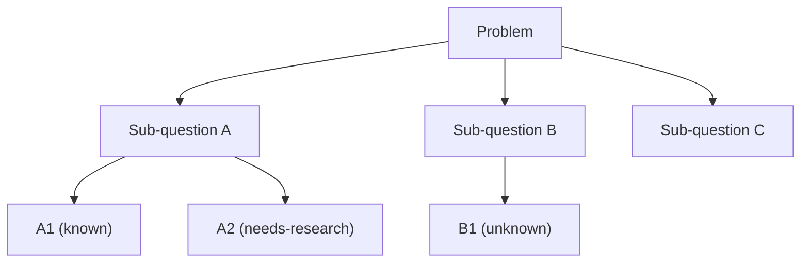

# Issue Tree

**Phase:** Define · **Source:** https://untools.co/issue-trees

## Entry Predicate
`always_run`

## Inputs
- `intake.problem_refined`
- `frameworks/abstraction-ladder.md::target_rung`

## Method
1. Decompose the problem into sub-questions.
2. Each level must be **MECE** (mutually exclusive, collectively exhaustive).
3. Recurse 2-4 levels until leaves are answerable directly.
4. Annotate each leaf with: known / unknown / needs-research.

## Output Schema (mermaid)

## Decision Hook
Leaves marked `needs-research` become **research targets** for Wave 1A research fan-out. Spawn one subagent per leaf.

## What This Means For The Decision
The tree shows what's actually unknown. If 80% of leaves are known and only 1-2 are unknown, the decision is research-bound, not framing-bound.
