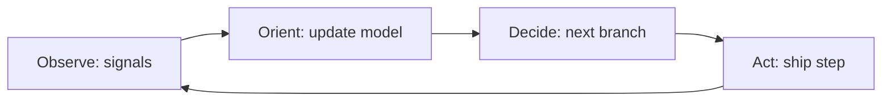

# OODA Loop (Boyd)

**Phase:** Decide · **Source:** https://untools.co/ooda-loop

## Entry Predicate
`always_run` if `intake.time_pressure ∈ {now}` OR `cynefin.domain ∈ {complex, chaotic}`. Otherwise `recommended`.

## Inputs
- Top recommendation
- `intake.time_pressure`
- `frameworks/cynefin.md::domain`

## Method
Frame the recommendation as a loop, not a one-shot:
1. **Observe** — what signals will tell us the action is working?
2. **Orient** — given those signals, how will we update our model of the situation?
3. **Decide** — what's the next decision branch (continue, pivot, abort)?
4. **Act** — concrete first step to ship.
5. Estimate **cycle time** — how fast can we complete one O→O→D→A cycle?

## Output Schema (mermaid + table)

| Stage | Concrete Step | Cycle Time |
|---|---|---|
| Observe | log X, monitor Y | continuous |
| Orient | weekly review of metrics | 1 week |
| Decide | continue / pivot / abort | every cycle |
| Act | <first step> | 2 days |

**Total cycle time:** ~10 days

## Decision Hook
If cycle time > deadline / 3, the loop is too slow — recommendation is high-risk. Flag in Dissent.

If Cynefin = complex or chaotic, OODA is the **primary decision mode**, not Decision Matrix.

## What This Means For The Decision
In complex/chaotic domains, you don't decide once — you decide a cadence. OODA cycle time becomes the operating constraint. Faster loops dominate slower ones at equal quality.
