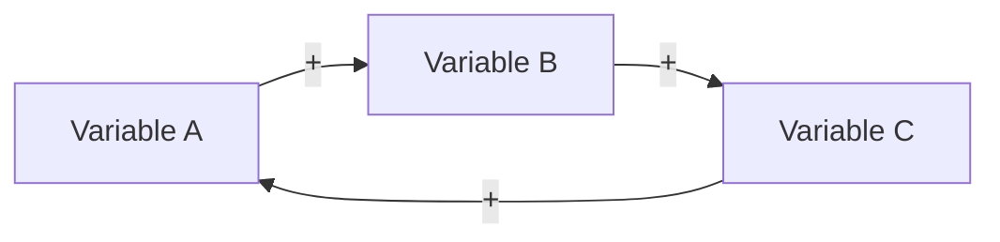

# Reinforcing Feedback Loop

**Phase:** Systems · **Source:** https://untools.co/reinforcing-feedback-loop

## Entry Predicate
`∃ cycle ∈ connection-circles.cycles : type = reinforcing`

## Inputs
- `frameworks/connection-circles.md::cycles`

## Method
For each reinforcing cycle:
1. Identify the **direction**: virtuous (compounds positively) or vicious (compounds negatively)?
2. Identify the **growth driver** — the variable whose increase amplifies the rest.
3. Identify the **limit** — what eventually constrains the loop (limits to growth).
4. Estimate **doubling time** or growth rate.
5. Find the **leverage**: amplify the driver? Remove a limit? Or, if vicious, break the cycle by negating one edge?

## Output Schema (mermaid + table)

| Loop | Direction | Driver | Limit | Doubling Time | Leverage |
|---|---|---|---|---|---|
| ... | virtuous | ... | ... | ~3mo | amplify driver |
| ... | vicious | ... | ... | ~1wk | break by negating edge X→Y |

## Decision Hook
Reinforcing loops are the highest-leverage intervention sites. A decision that starts a virtuous loop pays compounding returns. A decision that breaks a vicious loop pays compounding savings.

## What This Means For The Decision
If a vicious reinforcing loop exists, breaking it dominates all other decisions on impact. If a virtuous loop exists, accelerating it dominates linear improvements. Limits ultimately bound everything — model them.
