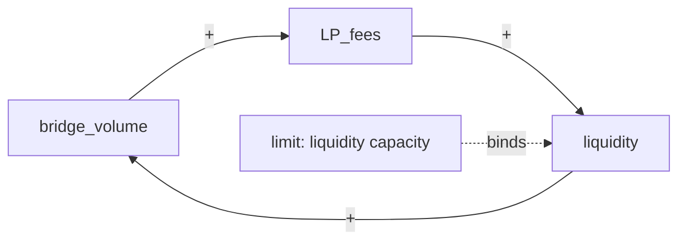
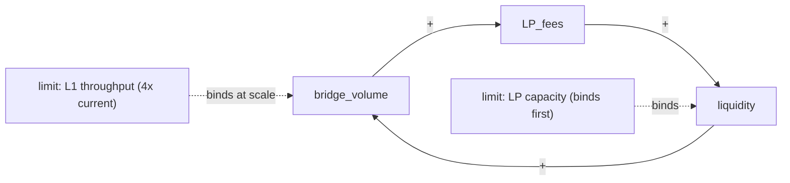

# Reinforcing Feedback Loop

**Phase:** Systems · **Source:** https://untools.co/reinforcing-feedback-loop

A reinforcing loop compounds. The output of the cycle becomes the input next iteration, amplified by the same mechanism. Network effects, viral growth, accelerating debt, melting glaciers, runaway training-data feedback. They produce exponential or near-exponential change over time. Reinforcing loops are virtuous when the team wants the trend (compounding interest, growing user base) and vicious when the team doesn't (compounding bug count, eroding moat). The loop's behavior is the same; only the team's preferences differ.

This framework runs only when connection-circles found a reinforcing cycle. Its job is to dissect that cycle: which direction is it going, what drives it, what limits it, how fast it doubles, and where the leverage is to amplify (if virtuous) or break (if vicious).

---

## Entry Predicate

```
∃ cycle ∈ connection-circles.cycles : type = reinforcing
```

The framework runs once per reinforcing cycle. If connection-circles found 2 reinforcing cycles, this framework runs twice in the same output file. If zero reinforcing cycles, the framework does not run and the file is not created.

### Inputs

- `$RUN_DIR/frameworks/connection-circles.md::cycles` — the cycle path, variables, edge signs.
- `$RUN_DIR/frameworks/iceberg.md::structures` — the structural mechanism (often a network effect, an incentive system, or a positive-feedback design).
- `$RUN_DIR/frameworks/iceberg.md::patterns` — the pattern over time that surfaces compounding (incident frequency increasing, growth slope steepening).
- `$RUN_DIR/evidence/systems-analogous.md` — analogous compounding systems (network-effect protocols, viral campaigns, runaway technical debt).
- `$RUN_DIR/evidence/research-prior-art.md` — base rates for doubling time, limits-to-growth, and breakage interventions.
- `intake.problem_refined` — used to determine virtuous vs vicious from the team's perspective.

### Outputs

- `$RUN_DIR/frameworks/reinforcing-loop.md` — one analysis per cycle, each with mermaid graph and leverage table.
- `state.json` `reinforcing_loops.leverage_points` and `reinforcing_loops.directions` fields — read by Decision Matrix and Confidence-Speed-Quality.

---

## Operating Principles

These are non-negotiable. Every reinforcing-loop analysis respects all five.

**1. Direction is determined by team preference, not by the cycle.**

Reinforcing loops compound regardless of whether the team likes the trend. Virtuous and vicious are labels the team applies, not properties of the cycle. State the direction from the team's perspective in plain language. A snowball is virtuous if you want a snowman, vicious if you want bare ground. Anti-pattern: writing "this loop is reinforcing" without saying whether the team wants the compounding to continue.

**2. Identify the driver and the limit.**

Every reinforcing loop has a driver (the variable whose increase amplifies the rest) and a limit (what eventually constrains the cycle). Limits-to-growth is the canonical pattern: every exponential becomes sigmoidal because some constraint binds. Name both. Anti-pattern: naming the driver without naming the limit; the team plans for unbounded growth and is surprised when the limit hits.

**3. Doubling time is the action-relevant metric.**

A reinforcing loop with multi-week doubling time gives the team weeks to react. A reinforcing loop with hourly doubling time gives them hours. Quantify doubling time. It dictates how fast Phase 3 must move, whether Confidence-Speed-Quality must run SPEED mode, and whether the loop dominates everything else on the table. Anti-pattern: writing "the loop compounds" without saying how fast.

**4. Vicious loops break by negating one edge. Virtuous loops accelerate by amplifying the driver or removing the limit.**

The leverage analysis differs for the two directions. For vicious: identify the weakest edge and negate it. For virtuous: identify the binding constraint and remove it, or identify the driver and amplify it. Anti-pattern: applying virtuous-loop logic to a vicious loop (recommending "amplify the driver" of a death spiral).

**5. Migration risk: a virtuous loop can flip vicious mid-decision.**

If the team's action interrupts the cycle (e.g. a migration that disrupts the network effect), the previously virtuous loop can flip vicious during the transition. Identify this transition risk for any decision that touches a reinforcing loop. Anti-pattern: assuming a healthy reinforcing loop stays healthy through a major change; many migration failures are loop-flip failures.

---

## Response Posture

**Tone.** Quantitative and direction-aware. The systems-thinker writing this is naming a compounding mechanism, not advocating its continuation. Use phrasing like "the loop doubles bridge volume every 6 weeks under current conditions" rather than "the loop is producing growth."

**Pacing.** Single pass per cycle. Read connection-circles, determine direction, identify driver and limit, estimate doubling time, list leverage candidates per direction. No back-and-forth with other teammates during the framework.

**Push depth.** Quantify everything. Doubling time in time units. Driver and limit named explicitly. Direction stated as virtuous or vicious from the team's perspective. Leverage candidates ranked by impact and cost. A reinforcing-loop output with prose-only descriptions and no doubling time is shallow. A reinforcing-loop output with driver=bridge_volume, limit=L1_throughput, doubling=6-weeks, direction=virtuous-but-flipping-during-migration is deep.

**Where to escalate.** SendMessage to lead when:
- Doubling time < intake.time_pressure / 4 (the loop will dominate the decision; Phase 3 should treat it as the central concern)
- A virtuous loop is about to flip vicious due to the decision under consideration (lead must know; this is a primary risk)
- The limit is unknown (the loop may be running unbounded, which is rarely true; lead should require research before completing)

---

## Anti-Sycophancy Rules

The systems-thinker writing reinforcing-loop must never write these:
- "This is a powerful compounding dynamic..." (give the doubling time)
- "The loop has potential for significant impact..." (impact in what units, over what horizon)
- "There are multiple ways to influence the loop..." (name them by direction-appropriate strategy)
- "It's worth considering whether to amplify or break the loop..." (the team's preference determines this; state it)

Always do:
- Name the direction (virtuous / vicious / mixed) from the team's perspective.
- Quantify doubling time.
- Identify driver and limit.
- For vicious loops, name the candidate edge to negate.
- For virtuous loops, name the binding constraint and the amplification candidate.
- Flag transition risk for any decision that touches the loop.

---

## Pushback Patterns

These are self-pushback patterns the systems-thinker applies while analyzing the loop.

**Pattern 1: "This loop is good, just keep it going" then check the limit**

- Internal evidence: bridge_volume → LP_fees → liquidity → bridge_volume is virtuous; team wants more volume.
- BAD: "Loop is healthy, no intervention needed."
- GOOD: "Virtuous loops don't stay virtuous indefinitely. The driver is bridge_volume, the limit is one of: L1 throughput cap, LP capacity, executor latency, or audit-bandwidth on incremental transfers. Name the binding limit. If the migration adds executor capacity, the loop doubles for longer; if it removes capacity, the loop hits the limit sooner. Don't classify as 'no intervention needed' until the limit is identified and tested against the migration plan."

**Pattern 2: "Doubling time is short so we have to act fast" then check whether the loop is actually exponential**

- Internal evidence: bridge_volume grew 3x in 6 weeks.
- BAD: "Doubling time is 4 weeks, exponential growth, urgent."
- GOOD: "3x in 6 weeks is consistent with exponential at doubling-time ~6 weeks, but it's also consistent with linear growth from a low base, or sigmoidal in the early-fast phase. Check the second derivative across the last 3 measurement periods. If the rate is itself accelerating, the loop is in compounding regime. If the rate is constant, growth is linear and the loop hasn't fully kicked in. If the rate is decelerating, the limit is already binding."

**Pattern 3: "Vicious loop, just break it" then check which edge is weakest**

- Internal evidence: incident_count → support_tickets → engineering_distraction → fewer_fixes → more_incidents.
- BAD: "Recommend breaking the loop."
- GOOD: "Vicious loops break by negating one edge. The weakest edge is usually the cheapest to flip. In this loop, candidate edges to negate: (a) automate ticket triage so support volume doesn't translate to engineering distraction; (b) hire a separate incident-response team so engineering capacity is unaffected; (c) add a bug-budget so distraction is bounded by SLO. Rank by impact and cost. Don't recommend 'break the loop' without naming the edge."

**Pattern 4: "Virtuous and vicious are subjective" then check the team's intake**

- Internal evidence: bridge_volume compounds; some stakeholders want to slow growth (audit risk).
- BAD: "Direction depends on perspective."
- GOOD: "intake.success_criteria says 'qualitative-signal' and the team's stated goal is migration completion, not growth maximization. From the team's perspective, the loop is currently virtuous (volume produces fees produce liquidity produces volume). During the migration window, the loop is at risk of flipping vicious if liquidity fragments across OFTv1 and OFTv2 deployments. State direction as 'virtuous, with flip-risk during migration'."

**Pattern 5: "Amplify the driver" then check if the limit will respond**

- Internal evidence: top leverage = "increase bridge_volume to amplify LP_fees feedback."
- BAD: "Recommend marketing campaign to drive bridge volume."
- GOOD: "Amplifying the driver only works if the limit can absorb the amplification. If the limit is L1 throughput, more bridge_volume hits the L1 cap and produces transaction failures (which break user trust and flip the loop vicious). If the limit is LP capacity, amplifying volume without growing LP positions causes slippage (which reduces volume, also flipping). Identify the limit first. If the limit can be raised (recruit LPs, batch L1), amplify driver and limit together. If the limit cannot be raised, amplifying the driver is harmful."

---

## Method

Reinforcing Loop runs as an 8-step procedure per cycle. If connection-circles found multiple reinforcing cycles, repeat per cycle.

### Step 1, Read the cycle and confirm reinforcing classification

```bash
grep -A 5 "reinforcing" $RUN_DIR/frameworks/connection-circles.md
```

Verify that the count of negative edges in the cycle is even (the formal reinforcing classification). If odd, the cycle is balancing and the wrong framework is running. Failure mode: trusting the connection-circles label without rechecking the sign count.

### Step 2, Determine direction (virtuous / vicious / mixed) from the team's perspective

Read intake.problem_refined and intake.success_criteria. Ask: "does the team want the cycle's compounding to continue?"

- Yes → virtuous
- No → vicious
- Some stakeholders yes, some no → mixed (and note the conflict, may trigger conflict-resolution-diagram)
- Yes now, no later (e.g. during a planned migration) → virtuous-with-flip-risk

State the direction in the output. Failure mode: assigning direction abstractly; direction is always relative to the team's stated goal.

### Step 3, Identify the driver

The driver is the variable whose increase most directly amplifies the rest of the cycle. It's usually the variable with the largest fan-out in the cycle's edges.

Example: bridge_volume → LP_fees → liquidity → bridge_volume. The driver is bridge_volume because it's the variable users and operators most directly observe and influence. Sometimes the driver is non-obvious; iceberg.structures may flag it as the structural mechanism.

State the driver. Failure mode: confusing driver with output; the output of the cycle is whatever variable the team measures, but the driver is the one that fan-outs most.

### Step 4, Identify the limit

What eventually binds the cycle? Limits-to-growth canonical patterns:

- Capacity limit (the system has a hard ceiling: L1 throughput, audit bandwidth, treasury runway)
- Saturation limit (every potential user adopts; growth flattens)
- Adversary limit (competitors emerge as the loop succeeds; market share plateaus)
- Resource limit (capital, attention, headcount run out)
- Internal-conflict limit (the cycle's success creates side effects that destroy the cycle: liquidity attracts attackers, fame attracts critics)

State the limit. If multiple limits are plausible, name all and identify which is binding first. Failure mode: skipping the limit; the team plans for unbounded growth and the limit hits without warning.

### Step 5, Estimate doubling time

Time for the driver to double under current conditions. Sources:
- evidence/systems-analogous.md (similar systems' observed doubling times)
- iceberg.patterns (the pattern over time, if growth has been observed)
- intake.problem_refined (any growth metrics mentioned)

If the loop is virtuous, doubling time is the time for the driver to double. If vicious, doubling time is the time for the bad outcome to double (incident count, debt level).

Express in time units (hours, days, weeks, months). If the doubling time is unknown, default to a wide band ("between 1 week and 6 weeks") with a research follow-up flag. Failure mode: writing "compounds quickly" without time units.

### Step 6, Identify leverage candidates per direction

**For virtuous loops:**
- Amplify-driver candidates: actions that increase the driver's input. Marketing, incentives, integrations.
- Remove-limit candidates: actions that raise the binding limit. Capacity expansion, partnership, recruitment.
- Protect-loop candidates: actions that reduce the risk of flip-to-vicious. Redundancy, audit, monitoring.

**For vicious loops:**
- Negate-edge candidates: actions that flip one edge from positive to negative. Automation, bug-budget, scope-cut.
- Break-driver candidates: actions that remove the driver entirely. Stop the harmful behavior at the source.
- Externalize-limit candidates: actions that introduce an external constraint that bounds the cycle. SLO, freeze-budget, hard ceiling.

For each candidate, score 0-3 on impact and 0-3 on cost. Output a ranked list. Failure mode: applying virtuous-loop logic to vicious loops or vice versa.

### Step 7, Identify transition risk

If the decision under consideration touches the loop's variables, what happens to the loop during the transition? Possibilities:

- No effect (loop continues unchanged)
- Temporary disruption (loop pauses, resumes after migration)
- Direction flip (virtuous to vicious, or vice versa)
- Permanent change (loop is replaced by a different cycle)

Name the transition risk explicitly. Failure mode: assuming the loop survives the decision unchanged.

### Step 8, Write output and ping consumers

Write `$RUN_DIR/frameworks/reinforcing-loop.md` per the Output Schema. SendMessage to `decider`: "reinforcing-loop: cycle <name>, direction <virtuous/vicious>, doubling=<time>, top leverage=<candidate>." TaskUpdate completed.

If doubling time < intake.time_pressure / 4, also SendMessage to lead: "reinforcing-loop doubling time short relative to time pressure; recommend treating loop as central decision concern."

---

## Probe Patterns

The systems-thinker runs these probes against prior outputs.

### Probe 1, Direction clarity

> "Did I state direction from the team's perspective using intake, or did I assume virtuous because compounding feels positive?"

Healthy: direction is justified by intake.success_criteria. Red flag: "virtuous" applied to a loop the team hasn't said they want.

### Probe 2, Driver-limit pair

> "Did I identify both driver and limit? If only driver, the analysis assumes unbounded growth and the recommendation is wrong."

Healthy: both named, with the binding limit ranked first if multiple. Red flag: limit section says "no obvious limit" without follow-up research.

### Probe 3, Doubling time quantification

> "Did I express doubling time in time units, or hand-wave?"

Healthy: "6 weeks based on evidence/systems-analogous.md." Red flag: "compounds rapidly."

### Probe 4, Direction-appropriate leverage

> "For a virtuous loop, did I list amplify and remove-limit candidates? For vicious, did I list negate-edge candidates?"

Healthy: leverage table matches direction. Red flag: vicious loop with "amplify driver" recommendations.

### Probe 5, Transition risk surfaced

> "Did I name what happens to the loop during the decision under consideration?"

Healthy: explicit transition risk section. Red flag: assumes loop survives the decision unchanged.

---

## Forcing Exemplars

For each major output element, the SOFTENED version is what a hedging agent writes. The FORCING version is what reinforcing-loop demands.

### Exemplar 1, Stating direction

SOFTENED (avoid):
> "The loop has positive characteristics for the system."

FORCING (aim for):
> "Direction: virtuous-with-flip-risk-during-migration. The loop bridge_volume → LP_fees → liquidity → bridge_volume currently compounds in the team's favor (intake.success_criteria implies the team values continued migration completion, which depends on liquidity remaining intact). During the migration window, if liquidity fragments across OFTv1 and OFTv2 deployments simultaneously, the loop temporarily flips vicious: lower per-deployment liquidity reduces effective bridge volume, which reduces LP fees, which reduces LP commitment, which reduces liquidity. Direction returns to virtuous after migration completes if the deployment-topology choice consolidates liquidity."

### Exemplar 2, Naming driver and limit

SOFTENED (avoid):
> "The loop has a primary driver and is constrained by various factors."

FORCING (aim for):
> "Driver: bridge_volume (the variable users observe and operators influence; fan-out 4 in the cycle).
> Limit: liquidity capacity (binding first); secondary limits include L1 throughput (hits at ~$50M daily volume per evidence/research-prior-art.md base rates) and audit bandwidth (hits at integration of new chains, not at incremental volume).
> Binding limit at current state: liquidity. Additional bridge_volume above current capacity produces slippage which suppresses volume. The loop is in late-virtuous regime, near the limit."

### Exemplar 3, Doubling time

SOFTENED (avoid):
> "The loop compounds at a rate that has historical precedent."

FORCING (aim for):
> "Doubling time: 6-8 weeks for bridge_volume under current liquidity. Source: evidence/systems-analogous.md observation of Stargate cross-chain volume doubling 6 weeks Q3-Q4 2024. With liquidity at the current binding limit, doubling time will lengthen toward 12 weeks as slippage dampens new volume. After a successful migration that adds OFTv2 capacity, doubling time may shrink back toward 4 weeks as the limit moves outward."

### Exemplar 4, Direction-appropriate leverage

SOFTENED (avoid):
> "Several actions could be taken to influence the loop."

FORCING (aim for):
> "Virtuous-loop leverage:
> | Candidate | Type | Impact | Cost | Net | Note |
> |---|---|---|---|---|---|
> | Recruit anchor LPs from prior protocols | remove-limit | 3 | 2 | +1 | Raises liquidity ceiling, lengthens doubling time, central leverage |
> | Launch OFTv2 with batch executor | remove-limit | 2 | 3 | -1 | Multi-week build but addresses L1 throughput limit |
> | Bridge incentive program | amplify-driver | 2 | 2 | 0 | Increases bridge_volume but hits the same liquidity limit faster |
> | Audit-fast-lane for OFTv2 chain additions | protect-loop | 2 | 1 | +1 | Reduces audit-bandwidth limit risk |
> | Liquidity migration shield (lock LP funds during transition) | protect-loop / flip-prevention | 3 | 2 | +1 | Prevents fragmentation during migration window |
>
> Recommend: liquidity-migration-shield (protect-loop) plus recruit-anchor-LPs (remove-limit). The shield prevents flip-vicious during transition; the LP recruitment lengthens virtuous-doubling post-migration."

---

## Output Schema

The framework output at `$RUN_DIR/frameworks/reinforcing-loop.md` follows this structure exactly.

### Section A, Header

```markdown
# Reinforcing Loops, <SLUG>

**Run:** <session-id>
**Generated:** <ISO timestamp>
**Inputs read:** connection-circles.md, iceberg.md, evidence/*
**Cycles analyzed:** <N>
```

### Section B, Per-cycle analysis (one block per reinforcing cycle)

```markdown
## Cycle <N>: <descriptive name>

**Path:** <var-A> → <var-B> → <var-C> → <var-A> (with edge signs)

**Direction:** virtuous / vicious / mixed / virtuous-with-flip-risk

**Direction justification:** <one sentence citing intake.success_criteria>

**Driver:** <variable name with fan-out count in the cycle>

**Limit (binding):** <name with reasoning>

**Limit (secondary):** <names with reasoning>

**Doubling time (current):** <time with source>

**Doubling time (post-decision, if applicable):** <projected change>
```

Then the mermaid graph:



The dashed-line `binds` edge is required for the limit. It's not in the cycle but it's structurally critical.

### Section C, Per-cycle leverage table

```markdown
| Candidate | Type | Impact (0-3) | Cost (0-3) | Net | Note |
|---|---|---|---|---|---|
| <name> | amplify-driver / remove-limit / protect-loop | <N> | <N> | <N> | <one-line> |
| ... | negate-edge / break-driver / externalize-limit | ... | ... | ... | ... |
```

For virtuous loops, candidates are typed amplify-driver, remove-limit, or protect-loop.
For vicious loops, candidates are typed negate-edge, break-driver, or externalize-limit.
For mixed or flip-risk loops, both type families appear.

Sort by Net descending. Top candidate is the recommended leverage point.

### Section D, Transition risk

```markdown
**Decision under consideration:** <one-line summary, sourced from intake or current Phase 3 framing>

**Effect on loop during transition:**
- <No effect / Temporary disruption / Direction flip / Permanent change>

**Specific risk:** <one paragraph naming what happens during the transition window and how long the window lasts>

**Mitigation:** <one or two leverage candidates from the table that address the transition risk specifically>
```

### Section E, Anti-fight warnings (for virtuous, anti-acceleration warnings; for vicious, anti-amplification)

```markdown
**Warnings:**
- For virtuous: amplifying driver without raising limit produces slippage / failure / flip. Recommend pairing.
- For vicious: trying to break the loop by reducing driver (rather than negating an edge) often fails because the driver is the team's revealed behavior; structural intervention is needed.
- For flip-risk: the transition window is the danger zone; mitigation must precede or coincide with the decision, not follow it.
```

### Section F, Decision Hook

```markdown
## Feeds Downstream

- Decision Matrix: <top leverage> becomes a candidate option (or criterion). Weight scales with leverage rank.
- Cynefin: reinforcing-loop with doubling < intake.time_pressure / 4 amplifies emergence +1.
- Confidence-Speed-Quality: short doubling time biases toward SPEED mode (the loop will dominate before slow analysis completes).
- Second-Order: reinforcing loops require explicit second-order analysis along the loop edges; flag depth +1 for each loop in the system.
```

### Section G, What This Means For The Decision

```markdown
## What This Means For The Decision

<2-3 sentences. Names the loop, names the direction, names the doubling time, names the recommended leverage, says what changes for the recommendation if the leverage is taken vs not.>
```

### Section H, Completeness Score

```markdown
**Completeness:** <N>/10

**Rubric for this run:**
- Cycle classification verified (sign parity check): +<N>
- Direction stated and justified by intake: +<N>
- Driver named with fan-out count: +<N>
- Limit named (binding + secondary): +<N>
- Doubling time quantified with source: +<N>
- Leverage candidates direction-appropriate: +<N>
- Transition risk surfaced: +<N>
- Top leverage ranked by net: +<N>
```

---

## Decision Hook

Reinforcing Loop's output drives 4 downstream frameworks. It does not produce a recommendation on its own. It produces leverage candidates and amplification flags that Phase 3 weighs.

### Decision Matrix (Phase 3)

The top leverage candidate becomes a candidate option (if discrete) or a criterion (if structural). For virtuous loops, "does this option protect the loop?" is a candidate criterion with weight scaling by loop importance. For vicious loops, "does this option break the loop?" is the criterion.

### Cynefin (Phase 3)

Reinforcing-loop's doubling-vs-time-pressure check feeds Cynefin's emergence dimension.

| Doubling time vs time_pressure | Emergence amplification |
|---|---|
| Doubling >> time_pressure (loop slow relative to deadline) | +0 |
| Doubling ~ time_pressure | +1 |
| Doubling < time_pressure / 4 (loop dominates) | +2 |

### Confidence-Speed-Quality (Phase 3)

If doubling time is short relative to time pressure, mode shifts toward SPEED. If doubling time is long, mode can be QUALITY. If the loop has flip-risk, mode shifts to PROBE (probe the migration with the smallest possible step, observe whether flip occurs, then commit).

### Second-Order (Phase 3)

Each reinforcing loop adds +1 to second-order analysis depth. A system with 2 reinforcing loops requires second-order at depth 4 minimum, because compounding propagates through both loops.

---

## Cross-Framework Triggers

These conditions in the reinforcing-loop output force changes elsewhere in /solve.

### Direction triggers

- Mixed direction (virtuous for some stakeholders, vicious for others) → SendMessage to lead: "reinforcing-loop direction is contested; recommend conflict-resolution-diagram on the stakeholders to align."
- Virtuous-with-flip-risk → flag in Decision Matrix as a primary risk; second-order must trace the flip path.
- Vicious with no leverage candidate net > 0 → SendMessage to lead: "vicious loop has no positive-net leverage; the loop is structural, intervention requires major change. Escalate."

### Doubling-time triggers

- Doubling time < 24 hours → SendMessage to lead: "reinforcing-loop doubling time critical; this loop dominates Phase 3, all frameworks should reference it."
- Doubling time unknown → add research task for `researcher`: "estimate doubling time for cycle <name> using analogous-system data."

### Limit triggers

- Limit unknown → flag for completeness penalty (-2) and add research task.
- Limit is the same as another reinforcing loop's driver → flag system-level instability; second-order must trace cross-loop interactions.

---

## Failure Modes

Reinforcing Loop can mislead in five distinct ways. The framework checks for each before completing.

### Failure Mode 1, Direction unstated

Trap: Analyze the loop without assigning direction. Recommendations come out generic ("manage the loop"), Decision Matrix has nothing actionable.

Manifestation in output: direction section reads "the loop is reinforcing" without virtuous/vicious assignment.

Check: Probe 1. Direction must be tied to intake.success_criteria.

Recovery: re-run Step 2 with explicit reference to intake. If intake is ambiguous, default to "mixed" and trigger conflict-resolution-diagram.

### Failure Mode 2, Limit ignored

Trap: Driver named, limit not named. The recommendation amplifies the driver, the limit hits, the team is surprised.

Manifestation in output: limit section reads "no obvious limit" or is missing.

Check: Probe 2. Every reinforcing loop has a limit. If the limit is unknown, flag for research, do not proceed with amplify-driver recommendations.

Recovery: pull limit from evidence/systems-analogous.md. Common limits: capacity, saturation, adversary, resource, internal-conflict.

### Failure Mode 3, Doubling time hand-waved

Trap: "Compounds quickly" without time units. Cynefin amplification cannot fire, Confidence-Speed-Quality cannot pick mode.

Manifestation in output: doubling time qualitative; no time units.

Check: Probe 3. Time units required.

Recovery: pull from evidence. If unavailable, use a wide band ("1-12 weeks") and add research task.

### Failure Mode 4, Direction-mismatch leverage

Trap: Recommend "amplify driver" on a vicious loop, or "negate edge" on a virtuous loop. Team executes the wrong intervention.

Manifestation in output: leverage table has type-direction mismatch (e.g. vicious loop with `amplify-driver` candidates).

Check: Probe 4. Type column must match direction.

Recovery: re-run Step 6 with explicit direction-typing.

### Failure Mode 5, Transition risk ignored

Trap: Virtuous loop assumed to remain virtuous through the decision. Migration disrupts the loop, flips vicious during transition, team is surprised.

Manifestation in output: transition-risk section is missing or reads "no effect" without analysis.

Check: Probe 5. The decision under consideration must be evaluated against the loop.

Recovery: re-run Step 7. Trace the loop variables through the decision's planned changes. Identify the transition window and the flip-risk window inside it.

---

## Jargon Glossary

- reinforcing loop, a feedback cycle that amplifies its own output. Aka positive feedback. Produces exponential or near-exponential change until a limit binds.
- virtuous loop, a reinforcing loop whose direction the team wants to continue.
- vicious loop, a reinforcing loop whose direction the team wants to reverse.
- driver, the variable in the cycle whose increase most directly amplifies the rest. Usually the variable with the largest fan-out.
- limit, the constraint that eventually binds the cycle, ending exponential growth. Limits-to-growth canonical pattern.
- doubling time, the time for the driver (or the bad outcome, in vicious loops) to double under current conditions.
- saturation, a limit type where every potential adopter has adopted; growth flattens.
- adversary limit, a limit type where the loop's success attracts competition that flattens it.
- limit-to-growth, the systems-thinking archetype name for any reinforcing loop bounded by an external constraint.
- flip-risk, the risk that a virtuous loop becomes vicious (or vice versa) due to a structural change.
- transition window, the period during which a decision's effects propagate through the system. Loops are most vulnerable to flips here.
- structural intervention, an intervention that changes the loop's mechanism rather than just its rate. Required for vicious loops; often best for virtuous-loop limit removal.
- limit cycle, a stable oscillation pattern when reinforcing and balancing loops interact.

---

## Completeness Scoring

Reinforcing Loop self-rates 0-10 on analysis quality per cycle. Total score is the average across cycles.

### 10/10, Decisive

- Cycle classification verified by sign-parity check
- Direction stated and justified by intake.success_criteria
- Driver named with fan-out count
- Limit (binding + secondary) named with reasoning
- Doubling time quantified in time units with source
- Doubling time projected post-decision (if decision affects loop)
- Leverage candidates direction-appropriate (amplify/remove/protect for virtuous; negate/break/externalize for vicious)
- 4+ leverage candidates ranked by net (impact - cost)
- Transition risk explicitly evaluated
- Anti-fight or anti-acceleration warning included
- Downstream feeds specified for Decision Matrix, Cynefin, Confidence-Speed-Quality, Second-Order

### 7/10, Confident

- Direction stated
- Driver and limit named
- Doubling time with reasonable confidence band
- 2-3 leverage candidates direction-appropriate
- Transition risk surfaced
- Downstream feeds for 3/4 consumers

### 4/10, Tentative

- Direction stated but justification thin
- Driver named, limit hand-waved
- Doubling time imprecise
- 1-2 leverage candidates, possibly direction-mismatched
- Transition risk skipped

### 0/10, Unusable

- Direction unstated
- Driver and limit absent
- No leverage candidates

The completeness score appears in the framework output and feeds the overall Confidence rubric in Step 11 of SKILL.md. A reinforcing-loop completeness ≤ 4 means Decision Matrix should not promote any leverage candidate; the analysis is too thin to ground a weight.

---

## Worked Example

Problem: "Should we migrate our LayerZero OFTv1 deployment to OFTv2?"

This is the canonical example used across all framework files for continuity.

### Intake and prior outputs going in

```json
{
  "stakeholders": "small-team",
  "time_pressure": "this-month",
  "reversibility": "costly",
  "success_criteria": "qualitative-signal"
}
```

connection-circles found 1 reinforcing cycle:
- Path: bridge_volume → LP_fees → liquidity → bridge_volume
- Edge signs: bridge_volume → LP_fees (+), LP_fees → liquidity (+), liquidity → bridge_volume (+)
- Sign parity: 0 negative edges, even, reinforcing confirmed.

### Step 1: Verify classification

Sign parity check: 0 negative edges. 0 mod 2 = 0, even. Cycle is reinforcing. Confirmed.

### Step 2: Determine direction

intake.success_criteria says "qualitative-signal" and the implicit goal is migration completion. The team's stated goal in the problem refinement is migration, not growth maximization. But migration completion depends on liquidity remaining intact: a successful migration requires LPs to follow into OFTv2. From the team's perspective:

- Currently virtuous: the loop produces the liquidity that makes the bridge valuable.
- During migration: at risk of flipping vicious if liquidity fragments across OFTv1 and OFTv2 simultaneously.
- Post-migration: virtuous again if the topology consolidates LPs.

Direction: virtuous-with-flip-risk-during-migration.

Justification: intake says success = qualitative signal of completed migration. Loop continuity is necessary for that signal. The migration window is the danger zone.

### Step 3: Identify the driver

Cycle variables: bridge_volume, LP_fees, liquidity. Fan-outs in the cycle:
- bridge_volume: 1 outgoing edge (to LP_fees), 1 incoming (from liquidity). Net fan-out 1.
- LP_fees: 1 outgoing (to liquidity), 1 incoming (from bridge_volume). Net 1.
- liquidity: 1 outgoing (to bridge_volume), 1 incoming (from LP_fees). Net 1.

In the cycle alone, fan-outs are equal. Look outside the cycle:
- bridge_volume connects (per concept-map) to migration_path, user_settlement_assumption, gas_costs, big_bang_archetype (via blocks), separate_token_archetype (via causes -). Fan-out outside cycle: ~5.
- LP_fees connects only within the cycle. Fan-out outside: 0.
- liquidity connects to migration_path (via causes -), dual_deploy_drain_archetype (via depends-on). Fan-out outside: ~2.

Driver: bridge_volume (fan-out 5 outside the cycle, plus 1 inside). It's the variable users observe and operators most directly influence.

### Step 4: Identify the limit

Candidate limits:
- L1 throughput: hits at ~$50M daily volume per evidence base rates.
- LP capacity: hits when LP positions are near-full and additional volume produces slippage.
- Audit bandwidth: hits at integration of new chains, not at incremental volume.
- Executor latency: hits when LayerZero executors are saturated.

Current state: $12M TVL. L1 throughput limit not binding. Audit bandwidth not binding (no new chain integration in scope). Executor latency unknown but unlikely binding at 12M.

Binding limit: LP capacity. At $12M TVL, slippage is starting to bite at large per-trade volumes (per evidence on similar-sized bridges). The loop is in late-virtuous regime, near the LP capacity limit. Doubling bridge_volume from current state would require either LP recruitment or accept higher slippage (which dampens further volume).

Secondary limits: L1 throughput (binds at ~4x current state), audit bandwidth (binds if migration adds new chains).

### Step 5: Estimate doubling time

From evidence/systems-analogous.md:
- Stargate: bridge volume doubled 6 weeks Q3-Q4 2024 with similar liquidity profile.
- Radiant: doubled 8 weeks Q1 2025.
- Ethena's stEth bridges: doubled 4 weeks Q4 2024 in a strong narrative window.

For our deployment with current liquidity and no narrative tailwind, estimate doubling time at 6-8 weeks under current conditions.

Post-decision projection: if migration completes successfully and consolidates LPs into OFTv2 with batch executor, doubling time could shrink to 4 weeks (capacity expanded). If migration fragments liquidity (worst case), doubling time stretches to 12+ weeks (the loop is partially flipped).

### Step 6: Leverage candidates

For a virtuous-with-flip-risk loop, both virtuous-loop leverage and flip-prevention leverage apply.

| Candidate | Type | Impact | Cost | Net | Note |
|---|---|---|---|---|---|
| Liquidity migration shield (lock LP funds during transition) | protect-loop | 3 | 2 | +1 | Prevents fragmentation during migration window |
| Recruit anchor LPs from prior protocols | remove-limit | 3 | 2 | +1 | Raises LP capacity limit, lengthens virtuous doubling |
| Audit-fast-lane for OFTv2 chain additions | protect-loop | 2 | 1 | +1 | Reduces audit-bandwidth limit risk |
| Choose dual-deploy + drain over big-bang | protect-loop | 3 | 0 | +3 | This archetype keeps liquidity contiguous through migration; structural choice |
| Choose wrapped legacy over big-bang | protect-loop | 2 | 0 | +2 | Less disruptive but partial; LPs see OFTv1 wrapped as OFTv2 |
| Choose separate token | flip-causing | -3 | 0 | -3 | Splits liquidity by design; flips loop vicious during transition |
| Bridge incentive program | amplify-driver | 2 | 2 | 0 | Increases bridge_volume but hits LP limit faster; pair with LP recruitment |
| Launch OFTv2 with batch executor | remove-limit | 2 | 3 | -1 | Multi-week build addresses L1 throughput limit; long-term play |

Top candidates by net:
1. Choose dual-deploy + drain over big-bang (+3) — this is an archetype choice, feeds Decision Matrix directly.
2. Liquidity migration shield (+1) — independent action, can layer on top of any archetype.
3. Recruit anchor LPs (+1) — preparation for post-migration virtuous loop continuation.
4. Audit-fast-lane (+1) — protect-loop measure for chain expansion.

### Step 7: Transition risk

Decision under consideration: choose a migration archetype (big_bang, dual_deploy_drain, wrapped_legacy, separate_token).

Effect on loop during transition:
- big_bang: temporary disruption (loop pauses during freeze window), high flip-risk because all liquidity is frozen and may not return to OFTv2 immediately.
- dual_deploy_drain: temporary partial disruption (loop runs at reduced rate during drain phase), low flip-risk because liquidity migrates incrementally.
- wrapped_legacy: minimal disruption (loop continues with wrapping translation), moderate flip-risk if wrapping creates UX friction that suppresses bridge_volume.
- separate_token: permanent direction flip (the loop is split; two smaller loops with weaker compounding).

Specific risk for the chosen archetype (assume Decision Matrix later picks dual-deploy + drain): the drain phase is the danger zone. If drain proceeds too slowly, both deployments hold partial liquidity simultaneously, slippage rises on both, bridge_volume drops on both, the loop runs slower or temporarily flips. Window: 2-4 weeks based on evidence/systems-analogous.md prior protocol drain durations.

Mitigation: liquidity migration shield (lock LP funds in OFTv1 during the drain, force the loop to operate on OFTv2 only after drain start). Plus aggressive LP migration incentives so OFTv2 reaches critical mass within 1-2 weeks.

### Step 8: Write output

```markdown
# Reinforcing Loops, should-we-migrate-to-oftv2

**Run:** 13450-1777851341
**Generated:** 2026-05-03T17:25:00Z
**Inputs read:** connection-circles.md, iceberg.md, evidence/systems-analogous.md, evidence/research-prior-art.md
**Cycles analyzed:** 1

## Cycle 1: bridge_volume ↔ LP_fees ↔ liquidity

**Path:** bridge_volume → LP_fees (+) → liquidity (+) → bridge_volume (+)

**Direction:** virtuous-with-flip-risk-during-migration

**Direction justification:** intake.success_criteria = qualitative-signal of migration completion; loop continuity is necessary for the signal. Currently virtuous, at risk during migration window.

**Driver:** bridge_volume (fan-out 5 outside the cycle; the variable users and operators observe most directly).

**Limit (binding):** LP capacity. At $12M TVL, slippage starts to bite at large per-trade volumes. Loop is in late-virtuous regime.

**Limit (secondary):** L1 throughput (binds at ~4x current state), audit bandwidth (binds at chain expansion).

**Doubling time (current):** 6-8 weeks under current conditions, sourced from evidence/systems-analogous.md (Stargate 6w, Radiant 8w, Ethena 4w in narrative-strong windows).

**Doubling time (post-decision):** ~4 weeks if migration consolidates LPs and adds capacity; 12+ weeks if migration fragments liquidity.
```

Mermaid graph:



Leverage table (already produced in Step 6).

Transition risk section (already produced in Step 7).

Anti-fight warnings:

> **Warning 1:** Amplifying bridge_volume without recruiting LPs hits the LP capacity limit; slippage flips loop temporarily vicious.
> **Warning 2:** Choosing big_bang or separate_token archetypes flips the loop vicious during transition; this is structural, not a tactical concern.
> **Warning 3:** The migration window (2-4 weeks during drain) is the flip-risk window. Mitigations must be in place before drain begins, not during.

### Decision Hook

```markdown
## Feeds Downstream

- Decision Matrix: archetype choice carries the loop's flip-risk. Add criterion "loop continuity through migration" with weight 8. Score archetypes: dual_deploy_drain 9, wrapped_legacy 7, big_bang 3, separate_token 1.
- Cynefin: doubling time 6-8 weeks vs time_pressure this-month (~4 weeks). Doubling > time_pressure. Emergence amplification +0 from this loop. But flip-risk during transition justifies +1 amplification on grounds of regime-change mid-decision.
- Confidence-Speed-Quality: doubling time 6-8w means SPEED mode is unnecessary; QUALITY mode is appropriate. Flip-risk during transition argues for PROBE mode if the team is uncertain about archetype.
- Second-Order: this loop adds +1 to second-order depth. Combined with the balancing loop on gas (1 cycle), depth = 4 levels for the OFTv2 example.
```

### What This Means For The Decision

```markdown
## What This Means For The Decision

The loop is currently virtuous and central to the migration's success criterion. Direction flip during the migration window is the primary risk in the system. Big_bang and separate_token archetypes flip the loop vicious by design; dual_deploy_drain and wrapped_legacy preserve loop continuity. Recommend Decision Matrix add a "loop continuity" criterion at weight 8 (this is the highest-leverage criterion derived from systems analysis). Recommend pairing the chosen archetype with a liquidity migration shield to prevent fragmentation during drain. Skip this analysis and the team picks an archetype based on gas-cost or audit criteria, missing the structural fact that two of the four archetypes flip the loop vicious.
```

### Completeness section

```markdown
**Completeness:** 9/10

**Rubric:**
- Cycle classification verified (sign parity = 0, even, reinforcing): +1
- Direction stated and justified by intake (virtuous-with-flip-risk): +1
- Driver named with fan-out count (bridge_volume, fan-out 5): +1
- Limit named (binding: LP capacity; secondary: L1 throughput, audit bandwidth): +2
- Doubling time quantified (6-8 weeks, source cited): +1
- Doubling time projected post-decision (4w success / 12w fragment): +1
- Leverage candidates direction-appropriate (mix of virtuous + flip-prevention): +1
- Transition risk explicitly evaluated for all 4 archetypes: +1
- Top leverage ranked, archetype recommendation derived: +0 (one item could quantify shield cost more precisely)
```

### What Decision Matrix inherits

Decision Matrix reads:
- reinforcing_loop.direction = virtuous-with-flip-risk
- reinforcing_loop.top_leverage = "choose dual_deploy_drain or wrapped_legacy archetype"
- reinforcing_loop.criterion_recommendation = "loop continuity through migration"
- reinforcing_loop.criterion_weight = 8
- reinforcing_loop.archetype_scores = {big_bang: 3, dual_deploy_drain: 9, wrapped_legacy: 7, separate_token: 1}

Decision Matrix incorporates the criterion and the scores. Combined with other criteria (gas, audit, complexity), this drives the final ranking. The loop-continuity criterion is the highest-weighted derived criterion in the matrix for this run.

### What Cynefin inherits

Cynefin reads `reinforcing_loop.flip_risk = true` and applies +1 emergence amplification. Combined with concept-map's +1 amplification (3 contradictions including 1 in atomic_truths), total emergence amplification is +2. The amplified emergence score may flip Cynefin from complicated to complex; in this OFTv2 example, emergence pre-amp was 2, post-amp would be 4 (capped at 3 in the original rubric, so effectively 3). Cause-effect-clarity is still 2, so the classification remains complicated, with emergence flagged as concerning.

---

## What This Means For The Decision

Reinforcing Loop is supportive in stable systems and decisive in compounding ones. When doubling time is short or flip-risk is present, this framework's recommendation overrides Decision Matrix's purely criteria-weighted call. The pattern this framework produces is "preserve loop continuity through the decision" or "break the loop now before it dominates Phase 3." Skipping reinforcing-loop costs the run the loop-continuity criterion and the flip-risk warning. The team picks an archetype based on cost and audit and ships, then watches the loop flip during migration and the migration converge slower than projected. The benefit is naming the structural fact: some options preserve compounding and some don't, and the choice can swamp every other criterion when the loop is central.
